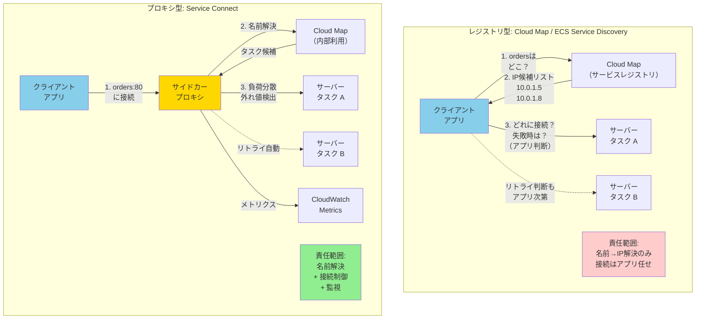

## 要約（Summary）

- サービスディスカバリには「レジストリ型」と「プロキシ型」の2つのアプローチがあり、接続の責任範囲が大きく異なる
- レジストリ型（Cloud Map）は「住所録」を提供するのみで、接続制御はクライアント側の責任
- プロキシ型（Service Connect）はレジストリに加えて接続・負荷分散・リトライ・監視までを統合管理する
- 使い分けの基準は「名前解決だけで十分か、接続の信頼性・可観測性まで必要か」

## 本文（Body）

### 背景・問題意識

**混乱しやすい理由**：

ECS Service ConnectとAWS Cloud Mapは、どちらもサービスディスカバリに関わる機能である。しかも、Service Connectは内部でCloud Mapを使っているため、「何が違うのか」が分かりにくい。

この混乱は、サービスディスカバリに**2つの異なるアプローチ**があることを理解していないために起こる。

### アイデア・主張

**接続の責任範囲で分類する**：

サービスディスカバリの仕組みは、「誰が接続の責任を持つか」で2つに分類できる：

1. **レジストリ型（Registry-based）**: サービスの所在情報を提供するだけ。接続の実行・負荷分散・リトライはクライアント（アプリやライブラリ）の責任
2. **プロキシ型（Proxy-based）**: 所在情報の提供に加えて、接続の実行・負荷分散・リトライ・監視までを統合的に管理

AWS Cloud MapとECS Service Connectの関係は、この分類に対応している：

- **Cloud Map** = レジストリ型（サービスレジストリ＋サービス発見）
- **Service Connect** = プロキシ型（レジストリ＋接続制御＋監視）

### 内容を視覚化するMermaid図

### Cloud Map（レジストリ型）の責任範囲

**Cloud Mapが提供するもの**：

1. **サービスレジストリ**: 論理名（例: `orders`）に対して到達先（IP、IP:port、URL、ARNなど）を登録
2. **サービス発見**: DNSクエリまたはAPIで登録情報を取得

ECSの「Service Discovery」機能は、このCloud MapをECSが代わりに操作して、タスクの起動・停止時に自動登録・削除する仕組み。

**重要な制約**：

Cloud Map自体は**通信を中継しない**。返ってくるのは「どこにいるか（候補リスト）」だけで、以下はクライアント側の責任：

- どのIPに接続するか（負荷分散ロジック）
- 接続失敗時にどうするか（リトライ、タイムアウト）
- DNS TTLの影響（キャッシュされたIPが古い可能性）
- 障害タスクの回避（アプリやライブラリで実装）

### Service Connect（プロキシ型）の責任範囲

**Service Connectが提供するもの**：

Cloud Mapの機能に加えて、**管理されたサイドカープロキシ**を各タスクに注入し、以下を実行：

1. **名前解決**: Cloud Mapから候補タスクリストを取得
2. **負荷分散**: ラウンドロビンでどのタスクに流すかを決定
3. **外れ値検出（Outlier Detection）**: 実トラフィックに基づいて異常タスクを一時的に除外
4. **リトライ**: 失敗した接続を別タスクに自動振り直し
5. **メトリクス収集**: HTTP/gRPC/TCP接続のパフォーマンスをCloudWatchに出力

アプリケーションから見ると、単に`mysql:3306`に接続するだけで、上記すべてがプロキシ層で自動的に処理される。

**公式の位置付け**：

> Service Connect は Cloud Map をサービスレジストリとして使う

つまり、Cloud Mapを基盤としながら、その上に**接続の責任を持つプロキシ層**を追加した構造。

### いちばん大事な違い：接続の責任範囲

同じ`orders`という名前を使っても：

**Cloud Map（レジストリ型）**：
- `orders` → IP候補リスト（例: `[10.0.1.5, 10.0.1.8]`）が返る
- どれに繋ぐか、失敗時にどうするかは**アプリ（やライブラリ）の実装次第**
- DNS TTLの影響で、古いIPにアクセスしてしまう可能性
- 接続性能のメトリクスは自前で実装

**Service Connect（プロキシ型）**：
- `orders`への接続を**ローカルのプロキシに吸わせる**
- プロキシが「どのタスクへ流すか」「失敗したらどう避けるか」まで実行
- 負荷分散・外れ値検出・リトライ・可観測性を統合提供
- DNS TTL問題を回避（プロキシが直接Cloud Mapから最新情報を取得）

### 具体例・ケース

**ケース1: シンプルな構成で名前解決だけ欲しい**

- 要件: ECS内部サービス間で名前で呼べれば十分
- 接続制御は既存のアプリケーションロジックで実装済み
- 推奨: **Cloud Map / ECS Service Discovery**
- 理由: プロキシのオーバーヘッドが不要、設定がシンプル

**ケース2: マイクロサービスで信頼性・運用性を高めたい**

- 要件: 名前で呼びたい＋障害タスクを自動回避＋メトリクス可視化
- リトライ・負荷分散をアプリ側で実装したくない
- 推奨: **Service Connect**
- 理由: 接続の信頼性・可観測性を統合的に提供

**ケース3: ECS外（Lambda、EC2）からも接続したい**

- 要件: ECSタスクに外部から接続する必要がある
- Service Connectの名前は同じnamespace内のタスクからしか解決できない
- 推奨: **Cloud Map + 内部LB併用**、または**Cloud Mapのみ**
- 理由: Service ConnectはECS内部通信に特化

**ケース4: ECS内外が混在する環境**

- 要件: ECS内部の通信はService Connect、外部との通信は別の手段
- 推奨: **Service Connect（内部）+ Cloud Map または ALB（外部接続）の併用**
- 理由: それぞれの強みを活かした設計

### 使い分けの判断基準

**Cloud Map（レジストリ型）を選ぶ場合**：
- 名前で見つけられれば十分（接続制御はアプリや既存の仕組みで対応）
- ECS外からも接続する必要がある
- プロキシのオーバーヘッドを避けたい
- 既にアプリ側でリトライ・負荷分散を実装している

**Service Connect（プロキシ型）を選ぶ場合**：
- 名前で呼びたい＋障害タスクを避けたい＋運用でメトリクスも見たい
- ECS内部のマイクロサービス間通信を統合管理したい
- アプリ改修を最小限にして信頼性を高めたい
- デプロイと整合した接続切り替えが必要

### 反論・限界・条件

**「プロキシ型なら常に優れている」は誤解**：

プロキシ型（Service Connect）には以下のトレードオフがある：
- すべての通信がプロキシ経由になるため、わずかなレイテンシが追加
- 設定の複雑さが増す（port name、client alias、namespaceなど）
- ECS内部通信にしか使えない（外部接続は別手段が必要）

**「Cloud Mapは古い」は誤解**：

Cloud Mapは汎用的なサービスレジストリとして、以下の場面で今も有用：
- ECS以外（Lambda、EC2、コンテナ外）からの接続
- シンプルな構成で名前解決だけが必要な場合
- 他のAWSサービス（App Mesh、API Gatewayなど）との統合

**ハイブリッドアプローチ**：

実際のシステムでは、両方を組み合わせることも多い：
- ECS内部: Service Connectで統合管理
- 外部接続: Cloud Map + 内部ALB、または通常のCloud Map

**Service Connectの内部実装**：

Service Connectのサイドカープロキシは、EnvoyベースのAWS管理プロキシと推測されるが、AWS公式には詳細を公開していない。カスタマイズの余地は限定的。

### レジストリ型とプロキシ型の一般的な設計パターン

この分類は、AWS以外のサービスディスカバリでも共通：

**レジストリ型の例**：
- Consul（Service Catalogとして使う場合）
- etcd / ZooKeeper（サービス情報の登録・取得）
- Eureka（Netflix OSS）

**プロキシ型の例**：
- Service Mesh（Istio、Linkerd、AWS App Mesh）
- Envoy（サイドカープロキシ）
- Kubernetes Service（kube-proxyによるルーティング）

## 関連ノート（Links）

- [[20251223133456-ecs-service-connect-unified-service-communication|ECS Service Connectによるマイクロサービス通信の統合管理]] - Service Connectの詳細
- [[202511291440-load-balancing-exporter|OpenTelemetry Collector Load Balancing Exporterの概要]] - 負荷分散の仕組み
- [[20251221154500-loadbalancing-exporter-routing-key-streamid|loadbalancingexporter の routing_key:streamID は時系列単位でルーティングする]] - ルーティング戦略
- [[20251221152245-virtual-nodes|仮想ノード（Virtual Nodes）による負荷分散の均一化]] - 負荷分散アルゴリズム
- [[20251215171249-ecs-container-health-check-pattern|ECS Container Health Check設計パターン]] - ECSの信頼性設計

## To-Do / 次に考えること

- [ ] 既存システムでCloud Mapを使っている箇所を洗い出し、Service Connect移行のメリット・デメリットを評価
- [ ] レジストリ型とプロキシ型のパフォーマンス比較（レイテンシ、CPU使用率）を実測
- [ ] Service MeshとService Connectの比較表を作成
- [ ] 外部接続が必要な箇所のアーキテクチャパターンを整理
