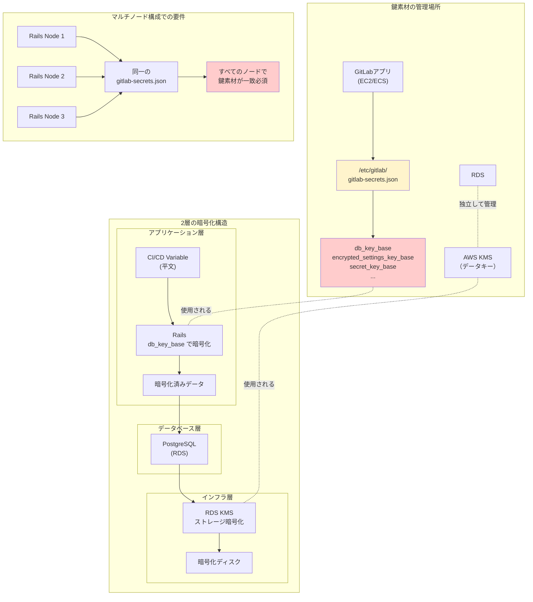

## 要約（Summary）

- GitLabは機密データ（CI変数、トークン等）をDBに保存する際、アプリケーション層で暗号化する
- 暗号化に使う鍵素材（db_key_base、encrypted_settings_key_base等）は`/etc/gitlab/gitlab-secrets.json`に保持される
- この鍵素材はRDS側ではなくGitLabアプリ側で管理され、紛失すると暗号化データが復号不能になる

## 本文（Body）

### 背景・問題意識

GitLabは、CI/CD Variables、各種トークン、統合設定などの機密データをデータベースに保存する。これらをそのまま平文で保存すると、DBへの不正アクセス時に機密情報が流出するリスクがある。

一方で、GitLabをRDS（外部PostgreSQL）と組み合わせて運用する場合、「暗号化はRDS側のKMSで行われているから安全」と誤解されることがあるが、**RDSのKMSはストレージ暗号化（at-rest）であり、GitLabのアプリケーション層暗号化とは別物**である。

GitLabが内部で扱う機密データの保護には、GitLabアプリ自身が管理する暗号化鍵が必要となる。

### アイデア・主張

**GitLabは「アプリケーション層暗号化」を採用しており、機密データをDBに保存する前にRails側で暗号化する。この暗号化に使用する鍵素材（db_key_base等）は、RDS側ではなくGitLabアプリケーション側（gitlab-secrets.json）で管理される。この鍵素材を失うと、過去に暗号化して保存した値が復号できなくなるため、バックアップ対象として扱う必要がある。**

#### 2つの暗号化層の違い

**1. インフラ層暗号化（RDS KMS）**
- 役割: ストレージ全体の暗号化（at-rest）
- 管理者: AWS（KMS）
- 対象: ディスク、スナップショット
- 効果: 物理ディスクの盗難やスナップショットの不正取得を防ぐ

**2. アプリケーション層暗号化（GitLab）**
- 役割: 特定のDBカラムの暗号化（application-layer）
- 管理者: GitLabアプリケーション（Rails）
- 対象: CI変数、トークン、統合設定など
- 効果: DBへの不正SQLクエリやダンプファイルからの情報漏洩を防ぐ

#### GitLabの主要な鍵素材

**gitlab-secrets.json に含まれる主要キー（gitlab_rails セクション）:**

1. **db_key_base**
   - attr_encrypted（DBカラムのアプリ側暗号化）で使用
   - CI/CD Variables、統合設定トークンなどの暗号化に使用

2. **encrypted_settings_key_base**
   - Encrypted configuration（暗号化設定）で使用

3. **secret_key_base**
   - Railsセッションの署名・暗号化

4. **otp_key_base**
   - OTP（ワンタイムパスワード）の暗号化

5. **openid_connect_signing_key**
   - OpenID Connect の署名鍵

6. **active_record_encryption_***
   - Rails 7 以降の ActiveRecord Encryption 用

#### デプロイ形態別の保存場所

**1. Omnibus（Linux package）インストール**
```bash
/etc/gitlab/gitlab-secrets.json
```

**2. ソースインストール**
```bash
/home/git/gitlab/config/secrets.yml
```

**3. Helm chart（Kubernetes）**
```yaml
Kubernetes Secret として保持
（secrets.yml の内容をSecretとして渡す）
```

#### gitlab-secrets.json の構造

```json
{
  "gitlab_rails": {
    "secret_key_base": "...",
    "db_key_base": "...",
    "otp_key_base": "...",
    "encrypted_settings_key_base": "...",
    "openid_connect_signing_key": "...",
    "active_record_encryption_primary_key": "...",
    "active_record_encryption_deterministic_key": "...",
    "active_record_encryption_key_derivation_salt": "..."
  },
  "gitlab_shell": {
    "secret_token": "..."
  },
  "registry": {
    "...": "..."
  }
}
```

### 内容を視覚化するMermaid図



### 具体例・ケース

**ケース1: RDS使用時の誤解**
```
状況: GitLabをEC2にOmnibusでインストール、DBはRDS（KMS暗号化あり）
誤解: 「RDSが暗号化されているから、GitLabの鍵素材は不要」
現実: db_key_baseはGitLab側（/etc/gitlab/gitlab-secrets.json）で管理
結果: RDSバックアップだけでは不十分。gitlab-secrets.jsonも別途バックアップ必須
```

**ケース2: マルチノード構成での同期不足**
```
状況: Rails を 3 ノードで負荷分散
問題: ノード1だけ gitlab-secrets.json を再生成してしまった
結果: ノード2/3 で暗号化されたデータが復号できず、CI変数が読めない
対策: Geo構成ドキュメントでも「すべてのノードで同一のgitlab-secrets.jsonが必要」と明記
```

**ケース3: バックアップ戦略の不備**
```
状況: RDSの自動スナップショットのみ有効化
問題: gitlab-secrets.json をバックアップしていなかった
事故: EC2インスタンス障害で /etc/gitlab/ が消失
結果: RDSは復旧できたが、暗号化されたCI変数・トークンが全て復号不能に
影響: 全プロジェクトのCI/CDが停止、トークン再発行が必要
```

**ケース4: Container Registry の鍵素材**
```
状況: Container Registry を有効化
動作: gitlab-secrets.json に registry セクションが自動生成される
注意点: このセクションを削除して reconfigure すると新しいペアが生成
影響: 既存のレジストリデータとの整合性が失われる可能性
```

### 反論・限界・条件

**「RDS暗号化があれば十分」は誤り**
- RDS KMSはディスク盗難対策であり、DBへのSQLアクセスからは守れない
- 不正なSQLクエリでダンプを取得された場合、アプリ層暗号化がないと平文で見える

**鍵素材の紛失は致命的**
- db_key_base を失うと、過去に暗号化したデータが永久に復号不能
- セッション無効化、トークン復号不能、CI変数の読み取り不能などが発生

**バックアップの複雑性**
- DBバックアップと鍵素材バックアップを別々に管理する必要がある
- 復旧時には両方が必要（片方だけでは不十分）

**外部KMS統合の選択肢**
- HashiCorp Vault や AWS Secrets Manager と統合することで、GitLab単体での鍵管理を避けることも可能
- ただし、導入コストと複雑性が増す

**マルチノード構成の運用負荷**
- すべてのRailsノードで鍵素材を同期する必要がある
- Kubernetes環境では Secret として一元管理できるが、EC2クラスタでは別途同期メカニズムが必要

## 関連ノート（Links）

- [[20251223134949-gitlab-encryption-key-rotation-risk|GitLabの暗号化鍵素材をローテートすべきでない理由]] - 鍵素材のライフサイクル管理
- [[20251215100648-claude-mem-privacy-security|Claude-Memのプライバシーとセキュリティ考慮事項]] - シークレット管理の一般的考慮事項
- [[20251215090824-migration-operation-safety-pattern|マイグレーション操作の安全化パターン]] - バックアップの重要性
- [[20251220074211-aws-sdk-credential-chain|AWS SDK Credential Chainの動作メカニズム]] - 認証情報の管理手法

## To-Do / 次に考えること

- [ ] 自社GitLab環境のgitlab-secrets.jsonバックアップ体制を確認
- [ ] RDSバックアップと鍵素材バックアップの復旧手順を文書化
- [ ] マルチノード構成での鍵素材同期メカニズムを検証
- [ ] HashiCorp Vault 統合の導入可否を検討
- [ ] 災害復旧訓練でgitlab-secrets.jsonの復元を含める
