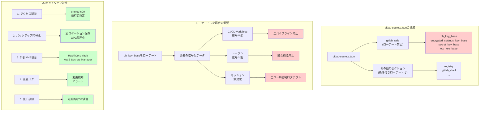

## 要約（Summary）

- gitlab-secrets.json の gitlab_rails セクション（db_key_base等）は、ローテートすると過去の暗号化データが復号不能になる
- GitLab公式ドキュメントでも「DB暗号化キーを含むのでローテートしない」と明記されている
- 鍵素材は「設定ファイル」ではなく「永続シークレット」として扱い、厳格にバックアップ・保護する必要がある

## 本文（Body）

### 背景・問題意識

一般的なセキュリティのベストプラクティスでは、「暗号化鍵は定期的にローテートすべき」とされることが多い。そのため、GitLabの運用担当者が「gitlab-secrets.jsonの鍵もローテートすべきでは？」と考えるのは自然な流れである。

しかし、GitLabの暗号化鍵素材（特にdb_key_base）は、**既にDBに保存された暗号化データを復号するために必須**であり、ローテートすると過去のデータが読めなくなる。これは「鍵を紛失した」のと同じ状態を引き起こす。

### アイデア・主張

**GitLabのgitlab-secrets.json内のgitlab_railsセクション（db_key_base等）は、「ローテート可能な鍵」ではなく「データの一部」として扱うべきである。これらをローテートすると、過去に暗号化したCI変数・トークン等が全て復号不能になり、GitLabの機能が広範囲で停止する。GitLab公式も「これらはローテートしない」と明示している。**

#### 鍵素材がローテートされる（変更される）ケース

**1. ファイルを退避/削除してreconfigureしたとき**
```bash
# 危険な操作例
mv /etc/gitlab/gitlab-secrets.json /etc/gitlab/gitlab-secrets.json.bak
gitlab-ctl reconfigure
# → 新しいシークレット値で新ファイルが生成される
# → 過去のCI変数等が復号不能に
```

GitLabのメンテナンスドキュメントでも、この操作でシークレット値が新規生成されると記載されている。

**2. "Rotate the secrets file" を実施したとき**

Omnibusのメンテナンスドキュメントに secrets ファイルのローテーション手順が存在するが、**同じ箇所で「gitlab_railsのシークレットはDB暗号化キーを含むのでローテートしない」と強く注意**されている。

これを変えると「secrets ファイルを失ったのと同様の挙動」になると明記されている。

**3. 特定セクションだけ意図的に再生成したとき**

例: Container Registry は、gitlab-secrets.json 内の registry セクションを消してから reconfigure すると新しいペアを生成する、逆にセクションが残っていれば既存値を使う。

このように、セクション単位で「書き変わり得る」設計になっている。

#### ローテートした場合の影響

**即座に発生する問題:**
- CI/CD Variables が復号できず、パイプラインが実行不能に
- 各種トークン（統合設定、Personal Access Token等）が復号不能に
- セッションが無効化され、ユーザが強制ログアウト
- OTPが無効化され、2FAが機能しなくなる

**復旧の難しさ:**
- 鍵素材を元に戻せば復旧可能（バックアップから復元）
- しかし、新旧の鍵が混在すると、どのデータがどの鍵で暗号化されているか不明に
- 最悪の場合、全てのCI変数・トークンを手動で再設定する必要がある

#### 正しいセキュリティ対策

**「ローテートしない」≠「セキュリティを無視する」**

ローテートの代わりに、以下の対策を実施する：

**1. アクセス制御の厳格化**
```bash
# gitlab-secrets.json のパーミッション
chmod 600 /etc/gitlab/gitlab-secrets.json
chown root:root /etc/gitlab/gitlab-secrets.json
```

**2. バックアップの暗号化・分離**
```bash
# バックアップを暗号化して別の場所に保存
gpg --encrypt /etc/gitlab/gitlab-secrets.json
aws s3 cp gitlab-secrets.json.gpg s3://secure-backup/
```

**3. 外部KMSの利用**
- HashiCorp Vault などの外部シークレット管理と統合
- GitLab側には暗号化されたシークレットのみ保持

**4. 監査ログの有効化**
- gitlab-secrets.json への変更を監視
- 不正な変更を検出するアラート設定

**5. 定期的なバックアップ検証**
- バックアップから復元できることを定期的にテスト
- DR訓練でgitlab-secrets.jsonの復元を含める

### 内容を視覚化するMermaid図



### 具体例・ケース

**ケース1: 誤ってローテートして全CI停止**
```
状況: セキュリティ監査で「鍵のローテート」を推奨された
対応: gitlab-secrets.json をバックアップして新規生成
結果:
  - 全プロジェクトのCI/CD Variables が復号不能に
  - 1000+ のパイプラインが実行不能
  - AWS認証情報、DBパスワード等を全て手動再設定
復旧時間: 2日間（全変数の再設定）
教訓: gitlab_rails セクションは「永続シークレット」として扱うべき
```

**ケース2: バックアップから復元成功**
```
状況: EC2インスタンス障害で /etc/gitlab/ が消失
準備: 毎日 gitlab-secrets.json を S3 にバックアップしていた
対応:
  1. 新しいEC2インスタンスを起動
  2. gitlab-secrets.json をS3から復元
  3. RDSスナップショットから復元
  4. gitlab-ctl reconfigure
結果: 全機能が正常に復旧（CI変数も全て復号可能）
復旧時間: 1時間
```

**ケース3: Container Registry セクションの再生成**
```
状況: Container Registry の設定を初期化したい
操作:
  1. gitlab-secrets.json の registry セクションのみ削除
  2. gitlab-ctl reconfigure
結果: registry セクションだけ新規生成、gitlab_rails は維持
影響: 既存のレジストリデータは再ログインが必要だが、CI変数は無事
```

**ケース4: マルチノード環境での鍵不一致**
```
状況: 3ノードのRailsクラスタで、ノード1だけ鍵素材を更新
症状:
  - ノード1: 新しい鍵でCI変数を暗号化
  - ノード2/3: 古い鍵で復号を試みて失敗
  - ロードバランサ経由でアクセスすると、成功/失敗がランダムに
対策:
  - 全ノードで gitlab-secrets.json を同一内容に同期
  - Ansible/Chef等で自動同期を実装
```

### 反論・限界・条件

**「ローテートしないのはセキュリティリスク」への反論**
- 鍵の漏洩が疑われる場合は、外部KMSへの移行を検討すべき
- 単純なローテートでは、過去のデータが読めなくなるだけでセキュリティ向上にならない

**「鍵が永久に変わらないのは問題」への反論**
- 鍵自体は変えないが、アクセス制御・監査・暗号化保存で保護する
- これは「データベースのマスターキー」と同じ扱い（ローテートではなく保護）

**将来的なローテート対応の可能性**
- GitLabが「透過的な鍵ローテート」機能を実装すれば可能になる
- 例: 旧鍵で復号→新鍵で再暗号化を自動実行
- ただし現時点（2025年12月）では未実装

**外部KMS統合でのローテート**
- HashiCorp Vault 等と統合すれば、Vault側で鍵ローテート可能
- GitLab側は「Vault APIで復号」するだけなので、鍵素材を直接持たない
- これが長期的な推奨アーキテクチャ

**Container Registry等の限定的ローテート**
- gitlab_rails 以外のセクション（registry, gitlab_shell等）は、影響範囲を理解した上でローテート可能
- ただし、影響を事前に確認すること

## 関連ノート（Links）

- [[20251223134937-gitlab-application-layer-encryption-secrets-json|GitLabのアプリケーション層暗号化とgitlab-secrets.json]] - 鍵素材の役割と構造
- [[20251215090824-migration-operation-safety-pattern|マイグレーション操作の安全化パターン]] - バックアップの重要性
- [[20251215100648-claude-mem-privacy-security|Claude-Memのプライバシーとセキュリティ考慮事項]] - シークレット管理のベストプラクティス
- [[20251220074211-aws-sdk-credential-chain|AWS SDK Credential Chainの動作メカニズム]] - 認証情報の安全な管理手法

## To-Do / 次に考えること

- [ ] gitlab-secrets.json のバックアップ自動化スクリプトを作成
- [ ] 復旧手順書にgitlab-secrets.json復元手順を追加
- [ ] HashiCorp Vault統合の導入可否を検討（長期的な鍵管理戦略）
- [ ] マルチノード環境での鍵素材同期メカニズムを実装
- [ ] セキュリティ監査での「鍵ローテート不要」の根拠資料を準備
- [ ] DR訓練でgitlab-secrets.json紛失シナリオを実施
