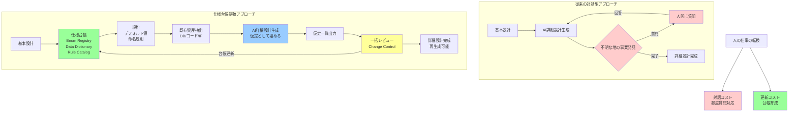

## 要約（Summary）

- 生成AIが詳細設計を作成する際、「地の事実」（区分値、桁数、制約など）が基本設計に存在しないと正しく生成できない
- 解消策は「AIを賢くする」ではなく、「地の事実の置き場を設計し直す」こと
- 仕様台帳（Enum Registry、Data Dictionary、Rule Catalog）を構築し、人の介在を「対話」から「台帳育成」に移すことで大規模開発がスケールする

## 本文（Body）

### 背景・問題意識

生成AIを使った詳細設計自動化では、「基本設計に詳細が書いてない場合、AIはどうやって正しい詳細設計を生成するのか」というジレンマに直面する。AIに都度質問されると対話コストが爆発し、かえって生産性が低下する。

このジレンマの本質は、**詳細設計に必要な"地の事実"（区分値、桁数、制約、例外コードなど）が、基本設計の入力として存在しない限り、生成AIは"正しくは"生成できない** という点にある。

### アイデア・主張

**AIの対話を減らすには、"地の事実の置き場"を設計し直し、人の介在を"対話"から"仕組み"に移すことが本筋である。**

大規模開発でスケールするのは、以下の3つの転換である：

1. **対話コストから更新コストへ**: 都度質問対応する代わりに、台帳を更新する運用に変える
2. **質問型から仮定型へ**: AIに不明点を質問させず、仮定として埋めさせ、後で一括レビューする
3. **成果物から再生成可能なプロダクトへ**: 詳細設計を「一回書いて終わり」ではなく、台帳と規約から毎回再生成できるものにする

### 具体的な解決アプローチ

#### 1) 詳細の前提を"台帳化"する

基本設計に全部書くと破綻する。代わりに、組織共通の「仕様台帳」を別立てで持ち、「AIが聞いてくるやつ」を集約する。

**仕様台帳の3要素：**

- **Enum Registry（コード体系・区分値台帳）**: ステータス、種別、フラグ、エラーコード、権限などをシステム横断で管理
  - 例: `order_status = {10:受注, 20:確定, 90:取消}`
- **Data Dictionary（データ辞書）**: 物理型、桁、NULL可、制約、命名規約、監査列、論理削除、日付の扱い（TZ/丸め）などの既定ルール
- **Rule Catalog（業務ルール台帳）**: バリデーション、遷移条件、例外時の扱い、外部IFの必須条件

台帳を一回作るのは人だが、以後は都度質問対応する代わりに、台帳を更新するだけになる。

#### 2) 不明点を"規約で埋める"

大規模開発で強いのは、未知を「問い合わせ」で解決する運用ではなく、**未知を"規約（デフォルト）"で潰す運用** である。

**規約化の例：**

- 区分値は数値2桁/3桁で、00は未設定予約、90-99は例外領域
- 表示名は別テーブル（多言語対応）または固定Enum（変更不許可）
- 状態遷移はステートマシン（状態機械）として定義し、未定義遷移はエラー

AIは「区分値を教えて」ではなく「規約に従って生成」できるようになる。重要なのは、**"正解が1つ"になるように規約を作る** こと。選択肢が残ると、結局人が決める羽目になる。

#### 3) "地の事実"を既存資産から吸い上げる

既存システムやDBがあるなら、人を介さずに埋められる領域が大きい。

**抽出元：**

- **DBスキーマ・マイグレーション（DDL）**: 桁、制約、外部キー、ユニーク、インデックス
- **ソースコード**: Enum定義、バリデーション、エラーコード、状態遷移
- **ログ/監査**: 実際に出ているエラー、実運用の状態分布
- **外部IF仕様**: コード体系や必須項目（相手が決めている場合が多い）

この抽出は、生成AIよりも **静的解析（ソースを読んで機械的に取り出す）** に寄せた方が堅い。AIは「文章化と整形」に使い、事実の抽出は機械に寄せる。

#### 4) 生成を「質問→回答」型から「仮定→一括レビュー」型へ変える

**対話型の問題**: 都度割り込みが発生し、生産性が低下する

**仮定型への転換**:
- AIは不明点を質問しない
- 代わりに **仮定（Assumption）** として埋める
- その仮定を差分として列挙し、後工程で一括承認する（もしくは"承認不要な範囲"を規約で決める）

人が介在するとしても「都度チャット対応」ではなく、**変更管理（Change Control）** に寄せる。これなら割り込みが消え、生産性が出る。

仮定が無秩序だと破綻するので、仮定の出し方も規約化する（例：区分値は必ず台帳に起票、起票されるまで暫定コード帯を使う、など）。

#### 5) 詳細設計を「成果物」ではなく「生成可能なプロダクト」にする

詳細設計の成功条件を、文書の出来ではなく次に置く：

**詳細設計 = (基本設計) + (仕様台帳) + (規約) + (既存資産抽出) を入力に、再生成できるもの**

詳細設計は「一回書いて終わり」ではなく、**コンパイル可能（ビルド可能）な成果物** になる。

### 内容を視覚化するMermaid図

### 具体例・ケース

**実装の最小セット（効果が高い順）**

1. **規約（Defaults）を決める**: 命名、型、桁、監査列、状態遷移、コード帯、エラー体系
2. **仕様台帳（Registry）をGitで管理**: 区分値・エラーコード・用語・データ辞書
3. **抽出パイプラインを作る**: DB/コード/IF仕様→台帳に取り込み（可能な範囲だけでOK）
4. **生成AIは「不明点を聞く」禁止**: 規約＋台帳＋抽出結果だけで詳細設計を生成
5. **生成物には"仮定一覧"を必ず出力**: 台帳へ反映する運用に繋げる

**運用例：**

- プロジェクト開始時に、既存システムのDBスキーマから区分値とテーブル定義を抽出
- Git管理された`spec-registry/enums.yaml`に区分値を台帳化
- 基本設計作成時には台帳を参照し、新規区分値は台帳に追加
- AI生成時は台帳と規約を入力に含め、不明な場合は仮定として埋める
- 生成物の仮定一覧をレビューし、必要なら台帳に反映

### 反論・限界・条件

**台帳構築の初期コスト**

台帳を最初から完璧に作るのは現実的ではない。段階的に育てる運用が必要。

**対応**:
- 最初は「AIが頻繁に聞いてくる項目」だけを台帳化
- プロジェクトを進めながら、質問が発生するたびに台帳に追加
- 3〜5プロジェクト経験すると、台帳がかなり充実する

**規約の硬直性**

規約を厳格にしすぎると、柔軟性が失われ、特殊ケースに対応できなくなる。

**対応**:
- 規約には「原則」と「例外の扱い方」の両方を記載
- 例外が発生した場合は、台帳に例外ケースとして記録
- 規約自体も定期的に見直し、実態に合わせて更新

**既存資産がない新規プロジェクト**

既存システムがない場合、抽出による台帳構築ができない。

**対応**:
- 業界標準や他社事例を参考に、初期台帳を構築
- プロトタイプ開発を先行し、そこから台帳を逆生成
- 外部IFやSaaS連携がある場合、それらの仕様から抽出

## 関連ノート（Links）

- [[20251129160321-ai-delegation-failure-patterns|AI丸投げの失敗パターン]] AIが暗黙的なルールを理解できない問題
- [[20251129160317-ai-role-division-what-why-how|AI連携開発における役割分担の原則]] What/Why/Howの分担と仕様の一次成果物化
- [[20251206000002-sdd-tools-review-burden|SDDツールのレビュー負荷問題]] 設計ツールと仕様管理の課題
- [[20251215004321-ai-output-quality-check-responsibility|AI生成コンテンツの品質チェック責任]] AI出力の品質責任と検証の必要性
- [[20251214135546-llm-stateless-configuration-implication|LLMのステートレス性が設定ファイルに与える影響]] AIに情報を明示的に与える必要性

## To-Do / 次に考えること

- [ ] 自プロジェクトで「AIが頻繁に聞いてくる項目」をリストアップする
- [ ] 最小限の仕様台帳（Enum Registry）を試作する
- [ ] 既存DBやコードから区分値・制約を抽出するスクリプトを作る
- [ ] 「質問禁止・仮定として埋める」運用を小規模に試す
- [ ] 台帳更新のワークフローを設計する
