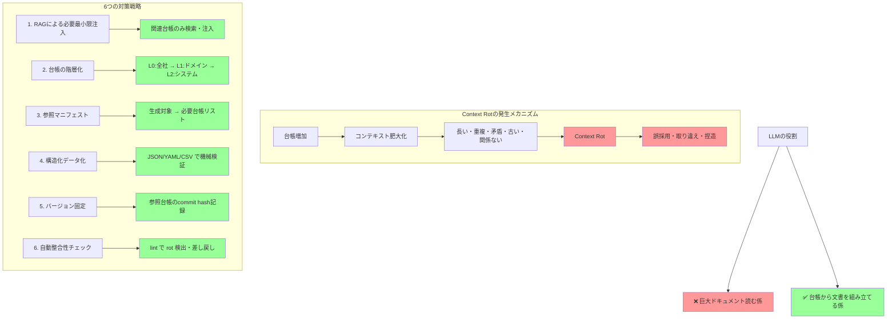

## 要約（Summary）

AI詳細設計において仕様台帳が増えると、LLMが抱える情報に「長い」「重複」「矛盾」「古い」「関係ない」が混在し、Context Rot（コンテキストの劣化）が発生する。対策の核心は「全部をコンテキストに入れない」こと。台帳を外部ソース・オブ・トゥルースとし、必要最小限の情報だけをRAGで注入し、階層化・構造化・バージョン管理・自動検証で整合性を保つ。

## 本文（Body）

### 背景・問題意識

AI詳細設計では、画面定義、インターフェース仕様、区分値、状態遷移、エラーコードなど多数の仕様台帳を参照する。台帳が10個、100個と増えると、LLMのコンテキストに大量の情報が注入され、以下の問題が発生する：

- **情報量の爆発**：全台帳をコンテキストに入れると、無関係な情報が大半を占める
- **矛盾の混在**：異なる台帳間で同じ概念が異なる定義で存在
- **古い情報の残留**：更新された台帳と古い台帳が混在
- **重複の増加**：同じ情報が複数の台帳に記載される

これが**Context Rot（コンテキストの劣化）**となり、誤った値の採用、取り違え、"それっぽい捏造"が増える。

### アイデア・主張

**Context Rotへの対策は「全部を読ませる」から「必要な断片だけを、優先順位付きで、構造化して渡す」へのパラダイムシフトである。**

LLMを"巨大なドキュメントを読む係"ではなく、**台帳スナップショットから"文書を組み立てる係"**として位置づけ、以下の6つの戦略で台帳管理を設計する：

### 内容を視覚化するMermaid図



### 具体例・ケース

**戦略1: RAG（検索拡張生成）による必要分だけの取り出し**
- 台帳をGit管理の構造化データ（JSON/YAML/CSV/DB）として保持
- 詳細設計対象（画面A、API B、テーブルC）に応じて関連台帳エントリだけを検索
- 例：order_statusの区分値が必要なら、全コード体系ではなくorder_status定義だけ注入

**戦略2: 台帳の階層化と優先順位の固定**
- L0: 全社共通規約（Defaults）
- L1: ドメイン規約（販売/会計/認証など）
- L2: システム規約（このシステム固有）
- L3: コンポーネント規約（この画面/このAPI固有）
- 下位が上位を上書き（L2優先 > L1優先 > L0）のルールを明示

**戦略3: 台帳カタログ（参照マニフェスト）**
```yaml
# 画面A → 必要台帳
screen_A:
  registries:
    - customer_type
    - prefecture_code
    - error_code_set_X

# API B → 必要台帳
api_B:
  registries:
    - auth_scope
    - status_transition_order
    - idempotency_rule
```
生成対象と必要台帳の対応を機械化し、コンテキスト注入を最小化

**戦略4: 構造化データ化**
```json
{
  "code": "ORDER_PENDING",
  "label": "注文保留中",
  "meaning": "決済待ちの状態",
  "valid_from": "2024-01-01",
  "valid_to": null,
  "deprecated": false,
  "notes": "決済完了でORDER_CONFIRMEDへ遷移"
}
```
文章ではなく機械検証可能な構造で台帳を管理

**戦略5: バージョン固定（ピニング）**
- 生成物ごとに「参照した台帳のバージョン（commit hash）」を記録
- 生成再実行時も同じ参照で再現可能（差分の原因追跡）
- 台帳更新で影響を受けた成果物だけ再生成

**戦略6: 自動整合性チェック（lint）**
```python
# lintチェック例
- 参照したenumが台帳に存在するか
- enumのcodeが重複していないか
- 遷移に孤立状態がないか
- DB桁とバリデーションが矛盾していないか
- 暫定コード帯が残っていないか
```
rotを「発生させない」より「検出して止める」アプローチ

### 反論・限界・条件

**潜在的な問題：**
- RAGによる検索精度が低いと、必要な台帳を取りこぼす可能性がある
- 階層化ルールが複雑になると、優先順位の判断が困難になる
- 構造化データへの移行コストが高い（既存の文章ベース台帳からの移行）
- バージョン固定により、台帳更新の影響範囲が見えにくくなる可能性

**成立条件：**
- 台帳がGit等で構造化データとして管理されている
- 台帳検索・注入の仕組み（RAG）が実装されている
- 自動検証（lint）の仕組みが整備されている
- チームが構造化データによる台帳管理に合意している

**限界：**
- 小規模プロジェクト（台帳数が少ない）では過剰設計になる
- 台帳間の参照関係が複雑な場合、階層化だけでは解決しない
- 自然言語による柔軟な記述が必要な台帳（設計思想など）には不向き

**推奨導入順序：**
初期段階では、(1) 参照マニフェスト + (2) 階層優先順位 + (6) lintの3点を入れるだけで、体感の誤り率がかなり下がる。その後、RAG、構造化、バージョン固定を段階的に導入。

## 関連ノート（Links）

- [[20251214140010-progressive-disclosure-agent-context|Progressive Disclosureによる段階的コンテキスト開示]] 必要な情報を必要なときにのみ提供する設計パターン
- [[20251214140142-ai-as-linter-antipattern|AI-as-Linterアンチパターンと決定的ツールの優位性]] lintによる自動検証の重要性と関連
- [[20251129165837-long-running-agent-context-window-problem|長時間実行AIエージェントのコンテキストウィンドウ問題]] Context Rotの根本原因であるコンテキストウィンドウ制約
- [[20251206000001-sdd-maturity-levels|仕様駆動開発の成熟度レベル]] 仕様（台帳）を継続的に更新するSpec-Anchoredアプローチとの関連
- [[20251201000200-tool-use-examples-overview|Tool Use Examplesによるツール使用パターンの学習]] RAGツールの使用パターン学習との関連

## To-Do / 次に考えること

- [ ] 現在の台帳管理方法を評価し、Context Rotのリスクを特定する
- [ ] 台帳カタログ（参照マニフェスト）のフォーマットを設計する
- [ ] 台帳の階層化ルール（L0/L1/L2/L3）を定義する
- [ ] 構造化データへの移行優先順位（影響度・頻度の高い台帳から）を決定する
- [ ] 自動整合性チェック（lint）の実装可能性を調査する
- [ ] RAG実装のツール選定（Embedding、ベクトルDB等）を検討する
