## 要約（Summary）

RAG（検索拡張生成）はベクトル埋め込みによる意味的類似性検索であり、区分値・コード値・IDなど厳密な値の検索には不向きである。これらの検索には完全一致検索（RDBMS、key-value store、インデックス検索等）が必須。台帳の性質によって検索手法を使い分けることで、検索精度と効率を最大化できる。

## 本文（Body）

### 背景・問題意識

RAG（Retrieval-Augmented Generation）は、大規模コーパスから関連情報を検索してLLMのコンテキストに注入する技術として注目されている。しかし、RAGの本質は**ベクトル埋め込みによる意味的類似性検索**であり、すべての検索タスクに適しているわけではない。

特に仕様台帳管理では、以下の2種類の検索ニーズが混在する：
1. **概念的検索**：「認証の設計方針」「エラーハンドリングのベストプラクティス」など
2. **厳密な値検索**：「区分値 `ORDER_PENDING` の定義」「都道府県コード `13` の名称」など

RAGを後者に適用すると、検索失敗や誤った値の取得が発生しやすい。

### アイデア・主張

**RAGは意味検索に特化した技術であり、厳密な値検索には構造的に不適である。台帳の性質によって検索手法を明確に使い分けるべきである。**

核心的な原則：
1. **意味検索（RAG）の適用範囲**：概念、思想、パターン、ガイドラインなど、文脈理解が必要な情報
2. **完全一致検索の適用範囲**：コード値、ID、区分値、制約など、厳密性が要求される情報
3. **ハイブリッド検索**：台帳カタログの検索にはRAG、特定台帳内の値検索には完全一致を組み合わせる

### 内容を視覚化するMermaid図

```mermaid
graph TD
    subgraph "RAG（意味検索）の仕組み"
        A["クエリ: order_statusとは"] --> B["ベクトル埋め込み"]
        B --> C["類似度計算<br/>cos similarity"]
        C --> D["上位K件取得"]
        D --> E["概念的に近い文書"]
    end

    style E fill:#99ff99

    subgraph "RAGの問題：厳密な値検索"
        F["クエリ: ORDER_PENDING"] --> G["ベクトル埋め込み"]
        G --> H["類似度計算"]
        H --> I["ORDER_PROCESSING<br/>ORDER_COMPLETED<br/>PENDING_REVIEW"]
        I --> J["❌ 欲しい値と違う"]
    end

    style J fill:#ff9999

    subgraph "完全一致検索の適用"
        K["クエリ: ORDER_PENDING"] --> L["インデックス検索<br/>hash/B-tree"]
        L --> M["完全一致"]
        M --> N["✅ ORDER_PENDING<br/>の定義"]
    end

    style N fill:#99ff99

    subgraph "台帳種類と検索手法の対応"
        O["概念的台帳"] --> P["意味検索（RAG）"]
        Q["厳密な値台帳"] --> R["完全一致検索"]

        P --> S["設計思想<br/>アーキテクチャパターン<br/>実装ガイドライン"]
        R --> T["区分値<br/>コード値<br/>ID<br/>制約"]
    end

    style P fill:#99ff99
    style R fill:#99ff99

    subgraph "ハイブリッド検索の設計"
        U["ユーザークエリ:<br/>認証の設計方針"] --> V["RAGで台帳カタログ検索"]
        V --> W["認証設計台帳 特定"]
        W --> X["完全一致で台帳内検索"]
        X --> Y["必要な定義・制約 取得"]
    end

    style Y fill:#99ff99
```



### 具体例・ケース

**ケース1: 区分値検索での失敗例**

クエリ：「ORDER_PENDING の定義を教えて」

RAG（ベクトル検索）の結果：
```
1. ORDER_PROCESSING (cos_sim: 0.85)
2. PENDING_REVIEW (cos_sim: 0.82)
3. ORDER_COMPLETED (cos_sim: 0.78)
4. ORDER_PENDING (cos_sim: 0.76)  ← 欲しい結果が4位
```

完全一致検索（RDBMS）の結果：
```sql
SELECT * FROM order_status_registry
WHERE code = 'ORDER_PENDING';
-- 即座に正確な定義を取得
```

**ケース2: 都道府県コード検索**

クエリ：「都道府県コード 13 の名称」

RAG（ベクトル検索）の問題：
- 数値 `13` のベクトル表現が不安定
- "13", "十三", "13番", "code 13" など表記ゆれで類似度が変動
- 無関係な文書（「13個の要素」など）がヒットする可能性

完全一致検索（key-value store）：
```python
prefecture_map = {"13": "東京都", "14": "神奈川県", ...}
result = prefecture_map.get("13")  # → "東京都"
```

**ケース3: ハイブリッド検索の実装例**

```python
# ステップ1: 台帳カタログからRAGで関連台帳を検索
query = "認証に関する設計方針と使用可能なスコープ"
relevant_registries = rag_search(
    query,
    corpus="registry_catalog",
    top_k=3
)
# → ["auth_design_policy", "auth_scope_definitions", "idp_integration_guide"]

# ステップ2: 特定台帳内では完全一致で値を検索
auth_scopes = db.query(
    "SELECT * FROM auth_scope_definitions WHERE deprecated = false"
)
# → 正確な現行スコープ一覧を取得
```

**台帳種類による検索手法の使い分け表**

| 台帳種類 | 検索手法 | 理由 | 実装技術 |
|---------|---------|------|---------|
| 設計思想・方針 | RAG | 概念理解が必要 | ベクトルDB |
| アーキテクチャパターン | RAG | 文脈依存 | Embedding + Pinecone |
| 区分値・コード値 | 完全一致 | 厳密性必須 | RDBMS, KVS |
| ID体系・命名規則 | 完全一致 | 一致判定 | インデックス検索 |
| 状態遷移ルール | 完全一致 | 遷移元・先の厳密性 | グラフDB |
| エラーメッセージテンプレート | 完全一致 | メッセージID | KVS, RDBMS |
| ベストプラクティス集 | RAG | 類似事例検索 | ベクトルDB |

### 反論・限界・条件

**潜在的な反論：**
- 「RAGでも完全一致フィルタを組み合わせれば解決するのでは？」
  - → 可能だが、最初から完全一致検索を使う方が単純で高速。RAGを迂回する設計は複雑性を増す
- 「コード値にも説明文があれば、RAGで検索できるのでは？」
  - → 説明文の検索は可能だが、コード値自体の検索には向かない。併用が現実的

**限界：**
- **表記ゆれへの対応**：完全一致検索は表記ゆれに弱い（"ORDER_PENDING" vs "order_pending"）。正規化が必要
- **台帳分類の境界**：一部の台帳は「概念的」と「厳密」の両方の性質を持つ（例：状態遷移の定義＋遷移の設計意図）
- **検索インフラの複雑化**：2つの検索システムを維持するコストと複雑性

**成立条件：**
- 台帳が構造化データとして整備されている
- 完全一致検索用のインデックス（RDBMS、KVS等）が利用可能
- RAG用のベクトルDBインフラが構築されている
- 台帳カタログが整備され、どの台帳にどの検索手法を使うかが明確

**ベストプラクティス：**
1. **台帳設計時に検索手法を決定**：台帳作成時に「意味検索 or 完全一致」をメタデータとして記録
2. **ハイブリッドクエリプランナー**：クエリの性質を分析し、適切な検索手法を自動選択
3. **フォールバック戦略**：完全一致で見つからない場合のみRAGにフォールバック

## 関連ノート（Links）

- [[20251223231528-ai-detailed-design-context-rot-specification-registry|AI詳細設計生成におけるContext Rot問題と仕様台帳アプローチ]] 台帳管理における検索手法の使い分け
- [[20251214140010-progressive-disclosure-agent-context|Progressive Disclosureによる段階的コンテキスト開示]] 必要な情報を必要なときに検索して注入する設計
- [[20251214140142-ai-as-linter-antipattern|AI-as-Linterアンチパターンと決定的ツールの優位性]] 決定的ツール（完全一致検索）の優位性
- [[20251201000200-tool-use-examples-overview|Tool Use Examplesによるツール使用パターンの学習]] RAGツールの適切な使用パターン
- [[20251129165837-long-running-agent-context-window-problem|長時間実行AIエージェントのコンテキストウィンドウ問題]] 検索による情報注入の最小化の必要性

## To-Do / 次に考えること

- [ ] 現在の台帳を「意味検索向き」「完全一致向き」に分類する
- [ ] ハイブリッド検索のクエリプランナーを設計する
- [ ] 完全一致検索用のインデックス戦略（RDBMS vs KVS vs Elasticsearch）を検討する
- [ ] RAGと完全一致のフォールバック戦略を定義する
- [ ] 台帳メタデータに `search_method: exact | semantic | hybrid` を追加する
