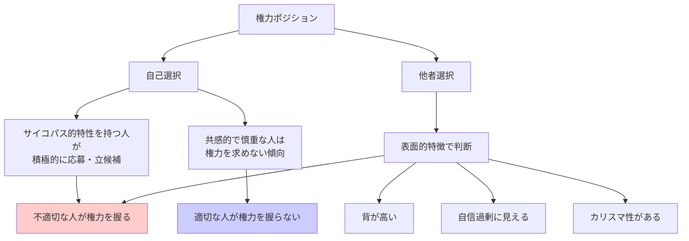

## 要約（Summary）

- 権力を**求める人**と権力に**適した人**は異なるが、選抜プロセスでは前者が選ばれやすい
- サイコパス的特性を持つ人や自信過剰な人ほど権力を求めがちで、背の高さや自信といった**表面的特徴**で選ばれる
- この自己選択バイアスが、組織・政治において不適切なリーダーを生み出す根本原因の一つ

## 本文（Body）

### 背景・問題意識

なぜ「支配させるべきでない人」が権力を握るのか？この問いに対する一つの答えが、権力への**自己選択バイアス**である。権力を求める動機と、権力を適切に行使する能力は、必ずしも一致しない。むしろ、権力を強く求める人ほど、他者への共感や倫理的配慮が低い傾向がある。

### アイデア・主張

権力を握る人の選抜には、少なくとも2つのバイアスが働く：

1. **自己選択バイアス**: サイコパス的特性（共感の欠如、操作性、自己中心性）を持つ人ほど、権力ポジションを積極的に求める
2. **表面的特徴バイアス**: 選ぶ側は、背の高さ・自信・カリスマ性といった**それらしさ**を実際の能力と誤認しやすい

結果として、「権力を求めない有能な人」よりも「権力を求める不適切な人」が選ばれやすい構造が生まれる。

### 内容を視覚化するMermaid図

### 具体例・ケース

**企業の昇進プロセス**:
- 自己アピールが強く、上司への印象管理が巧みな人が昇進しやすい
- 実務能力は高いが控えめな人は、リーダーシップ候補から漏れやすい
- 結果として、部下への共感が低いマネージャーが生まれる

**政治家の選抜**:
- 自信に満ちた演説や強いメッセージを発する候補者が選ばれやすい
- 背の高い候補者が選挙で有利という研究結果がある
- 実際の政策能力や倫理性は、選挙キャンペーンでは評価されにくい

### 反論・限界・条件

- すべての権力者がサイコパスというわけではない（誠実なリーダーも存在する）
- 自信やカリスマ性が必ずしも悪いわけではなく、組織を動かす上で重要な場合もある
- 文化や組織によって、選抜基準は異なる（協調性を重視する文化では、この傾向は弱まる可能性）
- このバイアスは**制度設計で緩和可能**（匿名評価、多面評価、試用期間など）

## 関連ノート（Links）

- [[20251223233911-power-corrupts-mechanism|権力による腐敗メカニズム：権力が人の共感と行動を変える理由]] - 権力獲得後に起こる腐敗メカニズム（このzettelの後続問題）
- [[20251223234018-system-design-prevent-power-corruption|権力腐敗を防ぐシステム設計の3要素：選抜・責任・監視]] - このバイアスへの対策（選抜・責任・監視の設計）
- [[20251215095358-tag-enforcement-governance|作成時タグ強制によるガバナンス戦略]] - ガバナンス戦略と権力の制約
- [[20251220050826-manual-and-automated-testing-two-step-verification|マニュアルテストと自動テストによる二段階検証]] - チェック機構の設計（権力の監視にも応用可能）
- [[20251214140010-progressive-disclosure-agent-context|Progressive Disclosureによる段階的コンテキスト開示]] - 段階的な情報開示と評価プロセスの改善

## To-Do / 次に考えること

- [ ] 自社の昇進プロセスに、このバイアスがどの程度働いているか分析する
- [ ] 表面的特徴に頼らない選抜方法（構造化面接、実務シミュレーション等）を調査
- [ ] 権力を求めない有能な人を発掘する仕組み（推薦制度、360度評価等）を検討
