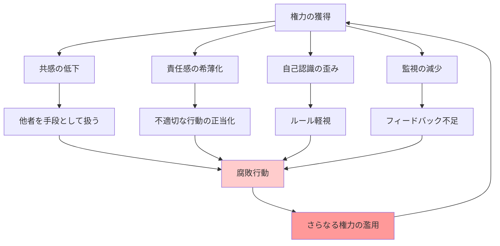

## 要約（Summary）

- 権力を得ると、人は**共感能力が低下**し、他者を手段として扱いやすくなる
- これは心理学・神経科学で実証されており、「権力それ自体が人を腐敗させる」という命題は真
- 権力による腐敗は、個人の資質だけでなく、権力がもたらす**環境と心理的変化**によって引き起こされる

## 本文（Body）

### 背景・問題意識

「権力は腐敗する、絶対的権力は絶対に腐敗する（Power corrupts, absolute power corrupts absolutely）」という格言は真実か？ブライアン・クラースは、心理学・神経科学の研究を引用し、**権力を得ること自体が人の認知・行動を変える**と主張する。

つまり、腐敗するのは「もともと悪い人」だけでなく、**権力が人を悪くする**側面がある。

### アイデア・主張

権力が人を腐敗させるメカニズムは、以下の心理的・神経科学的変化による：

1. **共感の低下**: 権力を持つと、他者の感情や立場を理解する能力（共感）が低下する
   - 神経科学的には、ミラーニューロンの活動が抑制される
   - 他者を「個人」としてではなく「手段」として見るようになる

2. **結果への責任感の希薄化**: 権力者は、自分の行動の結果を他者（部下、制度）のせいにしやすい
   - 「組織の判断」「仕方なかった」といった正当化が増える

3. **自己認識の歪み**: 成功を自分の能力に帰属させ、失敗を外部要因のせいにする（帰属バイアス）
   - 「自分は特別だ」という認識が強まり、ルールを守る意識が低下する

4. **監視の減少**: 権力者は監視されにくく、不適切な行動をしても咎められにくい
   - フィードバックループが断たれ、自己修正が効かなくなる

### 内容を視覚化するMermaid図

### 具体例・ケース

**スタンフォード監獄実験**:
- 普通の学生を「看守」役にしただけで、わずか数日で暴力的・支配的行動が増加
- 権力という**役割**が人の行動を劇的に変えることを示した（実験は倫理的問題で中止）

**企業経営者の行動変化**:
- 昇進前は協調的だったマネージャーが、権力を得ると部下への共感が減り、ハラスメント的行動が増える
- 経営トップになるほど、現場の声が聞こえなくなる（情報の非対称性＋共感の低下）

**政治家の汚職**:
- 選挙で選ばれた当初は理想主義的だった政治家が、権力を握ると利益誘導や汚職に手を染める
- 「目的のためには手段を選ばない」という思考が正当化される

### 反論・限界・条件

- すべての権力者が腐敗するわけではない（誠実なリーダーも存在する）
- **個人差**がある：もともと高い共感能力や倫理観を持つ人は、権力を得ても腐敗しにくい
- **制度設計で緩和可能**：透明性の確保、定期的な監査、任期制限、権力の分散などで、権力による腐敗を抑制できる
- 権力の種類（強制的権力 vs 影響力）によっても、腐敗の程度は異なる

## 関連ノート（Links）

- [[20251223233758-power-seeking-self-selection-bias|権力への自己選択バイアス：不適切な人がリーダーになる構造]] - 権力への自己選択バイアス（前段階の問題）
- [[20251223234018-system-design-prevent-power-corruption|権力腐敗を防ぐシステム設計の3要素：選抜・責任・監視]] - この腐敗メカニズムへの対策（責任・監視の設計）
- [[20251215095358-tag-enforcement-governance|作成時タグ強制によるガバナンス戦略]] - ガバナンス戦略と権力の制約
- [[20251220050826-manual-and-automated-testing-two-step-verification|マニュアルテストと自動テストによる二段階検証]] - チェック機構の設計（権力の監視）
- [[20251214140010-progressive-disclosure-agent-context|Progressive Disclosureによる段階的コンテキスト開示]] - 段階的な情報開示と透明性の確保

## To-Do / 次に考えること

- [ ] 自社の経営層・管理職に対する360度フィードバックの仕組みを検討
- [ ] 権力者への監視・チェック機能（内部監査、外部取締役等）が機能しているか評価
- [ ] リーダー育成プログラムに「権力による腐敗」への自覚を促すコンテンツを追加できるか検討
