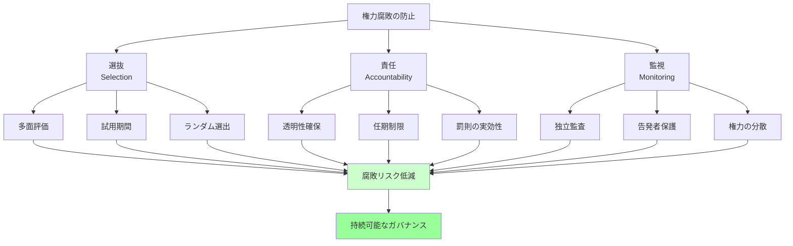

## 要約（Summary）

- 権力腐敗は個人の資質だけでなく、**システム設計の問題**として扱うべき
- 腐敗を防ぐには、①腐敗しにくい人を**選抜**する、②権力者に**責任を自覚**させる、③**監視の目**を効かせる、という3つの介入ポイントがある
- これらを組み合わせることで、権力による腐敗を大幅に抑制できる

## 本文（Body）

### 背景・問題意識

権力への自己選択バイアスと権力による腐敗メカニズムの2つの問題に対し、「個人の倫理観に頼る」だけでは不十分である。ブライアン・クラースは、**制度設計によって権力の腐敗を防ぐ**ことが可能だと主張する。

鍵となるのは、権力者を「性善説」で信頼するのではなく、**構造的に腐敗しにくい仕組み**を作ることだ。

### アイデア・主張

権力腐敗を防ぐシステム設計には、3つの主要な介入ポイントがある：

#### 1. **選抜（Selection）**: 腐敗しにくい人を権力の座に就ける

- **表面的特徴に頼らない選抜**：背の高さや自信ではなく、実績・共感能力・倫理観を評価
- **多面評価**：360度フィードバック、複数の評価者による構造化面接
- **試用期間と段階的昇進**：小さな権力で適性を確認してから大きな権力を与える
- **ランダム選出の活用**：くじ引きや抽選で権力者を選ぶ（古代アテネの民主制）

#### 2. **責任（Accountability）**: 権力者に責任を自覚させる

- **透明性の確保**：意思決定プロセスを公開し、記録を残す
- **説明責任の明確化**：誰が何の責任を負うかを明文化する
- **任期制限**：長期政権・長期在任を防ぎ、権力の固定化を避ける
- **罰則の実効性**：不正行為に対する処罰を確実に執行する

#### 3. **監視（Monitoring）**: 権力の濫用を検知し抑止する

- **独立した監査機関**：内部監査だけでなく、外部の第三者による監視
- **告発者保護制度**：内部告発を奨励し、報復を防ぐ
- **権力の分散**：チェック&バランス、権力の分立（立法・行政・司法）
- **定期的な評価**：360度評価、業績評価、倫理監査を定期実施

### 内容を視覚化するMermaid図

### 具体例・ケース

**企業ガバナンス**:
- **選抜**：CEO候補を複数年かけて育成し、小規模事業部での実績を評価してから昇進
- **責任**：取締役会での議事録公開、任期制限（最大10年など）
- **監視**：外部取締役の導入、内部告発ホットライン、定期的な倫理監査

**政治制度**:
- **選抜**：予備選挙での多様な候補者選出、討論会での政策能力評価
- **責任**：政治資金の透明化、任期制限（大統領2期まで等）
- **監視**：議会による行政監視、独立検察、メディアの調査報道

**オープンソースプロジェクト**:
- **選抜**：メリトクラシー（貢献実績に基づく権限付与）
- **責任**：すべての意思決定がGitHubで公開、議論が透明
- **監視**：コミュニティ全体が監視、問題があればフォークで離脱可能

### 反論・限界・条件

- **完璧な制度は存在しない**：どんな仕組みも抜け穴や悪用の余地がある
- **コストと効果のトレードオフ**：過度な監視や評価は、組織の機動性を損なう
- **文化的差異**：透明性や説明責任の受容度は、文化によって異なる
- **小規模組織では実装困難**：スタートアップや小規模チームでは、複雑なガバナンス構造は非現実的
- **信頼との両立**：過度な監視は、リーダーへの信頼を損ね、モチベーションを下げる可能性

## 関連ノート（Links）

- [[20251223233758-power-seeking-self-selection-bias|権力への自己選択バイアス：不適切な人がリーダーになる構造]] - 選抜段階での問題（このzettelの「選抜」で対処）
- [[20251223233911-power-corrupts-mechanism|権力による腐敗メカニズム：権力が人の共感と行動を変える理由]] - 権力獲得後の問題（このzettelの「責任」「監視」で対処）
- [[20251215095358-tag-enforcement-governance|作成時タグ強制によるガバナンス戦略]] - ガバナンス戦略の具体例
- [[20251220050826-manual-and-automated-testing-two-step-verification|マニュアルテストと自動テストによる二段階検証]] - 二段階検証の考え方（監視の設計に応用可能）
- [[20251215001119-claude-code-github-actions-automation|Claude Code GitHub Actions による運用自動化]] - 自動化による透明性確保の事例

## To-Do / 次に考えること

- [ ] 自社の経営層選抜プロセスに、3要素（選抜・責任・監視）がどの程度組み込まれているか評価
- [ ] 新しいリーダー選抜基準（共感能力、倫理観の評価方法）を設計できるか検討
- [ ] 内部告発制度や外部監査の実効性を高める方法を調査
- [ ] チーム規模や組織文化に応じた、適切なガバナンスのレベルを考える
