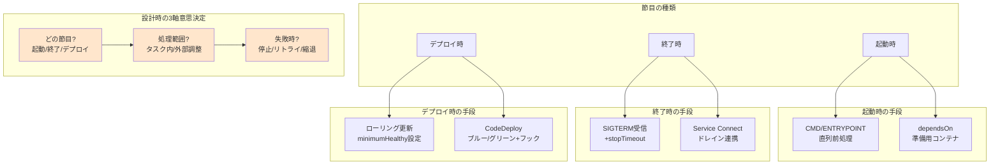

## 要約（Summary）

- ECSには「Lifecycle Hook」という単一機能は存在せず、起動/終了/デプロイの各節目で異なる手段を組み合わせて実現する
- ライフサイクル制御の設計では「どの節目か」「処理範囲（タスク内/外部）」「失敗時の対応」の3軸で意思決定する
- 目的に応じてCMD/ENTRYPOINT、dependsOn、SIGTERM+stopTimeout、CodeDeployフックを使い分ける必要がある

## 本文（Body）

### 背景・問題意識

コンテナオーケストレーションツールを使う際、「起動前の準備」「終了前の後処理」「デプロイ時の安全な切替」といったライフサイクル制御が必要になる。KubernetesのInit ContainersやpreStop hooksのような統一的なAPIを期待してECSに臨むと、「Lifecycle Hook機能がない」と混乱する。

実際には、ECSは**機能の組み合わせでライフサイクル制御を実現する思想**を採用している。この設計思想を理解せずに実装すると、適切でない手段を選んでしまい、デプロイの失敗や予期しないダウンタイムを引き起こす。

### アイデア・主張

**ECSのライフサイクル制御は「単一のHook API」ではなく、目的（起動/終了/デプロイ）と範囲（タスク内/外部）に応じて異なる機能を組み合わせる設計思想である。設計時には「どの節目で」「何の範囲を」「失敗時にどうするか」の3軸で意思決定する。**

ECSで利用できるライフサイクル制御の主要手段：

#### 1. CMD/ENTRYPOINTによる前処理の直列化（起動時）

コンテナのエントリポイントで前処理を実行してからアプリケーションを起動する。

**適用場面：**
- DBマイグレーション
- 設定ファイルの生成
- 依存サービスの疎通確認

**トレードオフ：**
- ✅ シンプルで理解しやすい
- ❌ 前処理が長いとヘルスチェックや起動タイムアウトに影響

#### 2. dependsOn（コンテナ依存）による準備用コンテナ（起動時）

同一タスク内で初期化専用コンテナを定義し、成功後にアプリコンテナを起動する。

**適用場面：**
- 準備処理とアプリケーションを分離したい場合
- 準備失敗時にタスク全体を停止させたい場合

**トレードオフ：**
- ✅ 関心の分離（init処理とアプリ本体）
- ❌ 準備コンテナの失敗でタスク全体が起動しない

#### 3. SIGTERM + stopTimeoutによるグレースフルシャットダウン（終了時）

ECSはタスク停止時にSIGTERMシグナルを送信し、stopTimeout（デフォルト30秒）後にSIGKILLで強制終了する。

**適用場面：**
- 処理中リクエストの完了待ち
- キューからのメッセージ処理停止
- ログやメトリクスのフラッシュ

**トレードオフ：**
- ✅ 標準的で強力なパターン
- ❌ ロードバランサやService Connectのドレインタイミングと整合が必要

#### 4. CodeDeploy（ブルー/グリーン）+ Lambda/ECSフック（デプロイ時）

CodeDeployを使ったブルー/グリーンデプロイメントで、トラフィック切替前後にLambda関数やECSタスクでカスタム処理を実行する。

**適用場面：**
- 新バージョンへの切替前にスモークテスト
- 切替後に旧バージョンのクリーンアップ
- カナリアデプロイメント

**トレードオフ：**
- ✅ デプロイ制御が強力
- ❌ 構成とオペレーションが複雑化

### 内容を視覚化するMermaid図

### 具体例・ケース

**ケース1：起動時にDBマイグレーションを実行したい**

- **選択肢1**: CMD/ENTRYPOINTで直列化
  - シンプルだが、マイグレーションが遅いとヘルスチェックタイムアウトのリスク
- **選択肢2**: 初期化専用コンテナをdependsOnで定義
  - マイグレーションとアプリを分離、失敗時の挙動が明確
- **設計判断**: マイグレーション時間が10秒以内なら選択肢1、それ以上なら選択肢2

**ケース2：終了時に処理中のリクエストを完了させたい**

- **手段**: SIGTERMをハンドルしてグレースフルシャットダウン
  - 新規リクエスト受付停止
  - 処理中リクエスト完了待ち（最大stopTimeout秒）
  - ロードバランサのderegistration_delayと整合
- **stopTimeout設定**: 通常のリクエスト処理時間の3〜5倍

**ケース3：デプロイ時に新バージョンをスモークテストしてから切り替えたい**

- **手段**: CodeDeployのブルー/グリーンデプロイ + BeforeAllowTrafficフック
  - 新タスク群（グリーン）起動後、フックでヘルスチェック
  - 成功したらトラフィック切替
  - 失敗したら自動ロールバック
- **設計判断**: デプロイ頻度が高く、本番影響を最小化したい場合に適用

### 反論・限界・条件

**「KubernetesのようなInit Containersが欲しい」**

dependsOnで同等の機能は実現できるが、Kubernetesほど洗練されていない。特に以下の制約がある：
- 複数の初期化コンテナの順次実行はタスク定義で明示的に定義が必要
- 初期化コンテナのログがCloudWatch Logsに出力されるまでタイムラグがある

**「全ての節目を統一的なHook APIで扱いたい」**

ECSの設計思想は「機能の組み合わせ」であり、統一APIは提供されていない。この思想に慣れるまでは認知負荷が高い。

**「失敗時の挙動が複雑で予測しづらい」**

- 起動時の失敗: タスク停止 or リトライ（essential設定に依存）
- 終了時の失敗: stopTimeout後に強制終了
- デプロイ時の失敗: CodeDeployならロールバック、ローリング更新なら新タスク起動停止

事前に各手段の失敗時挙動を理解し、テスト環境で検証することが必須。

**前提条件：**
- ヘルスチェックの設計が適切であること（起動時間との整合）
- ロードバランサやService Connectのドレイン設定との整合
- アプリケーション側でのシグナルハンドリング実装

## 関連ノート（Links）

- [[20251220130053-ecs-dual-health-check-structure|ECS ヘルスチェックの二重構造]] - ライフサイクル制御に関わるヘルスチェックの仕組み
- [[20251215171249-ecs-container-health-check-pattern|ECS Container Health Check設計パターン]] - 起動時の猶予設定とstartPeriod
- [[20251215090820-declarative-vs-imperative-migration|宣言型マイグレーションと手続き型マイグレーションの比較]] - 起動時DBマイグレーションの手法選択
- [[20251223133637-service-discovery-registry-vs-proxy-responsibility|Service DiscoveryにおけるRegistryとProxyの責任分離]] - 終了時のドレイン連携の設計
- [[20251220130119-ecs-container-health-check-mechanism|ECS コンテナヘルスチェックの動作メカニズム]] - ヘルスチェックの詳細動作

## To-Do / 次に考えること

- [ ] CodeDeployのブルー/グリーンデプロイのフック実装パターンを調査
- [ ] dependsOnの具体的な設定例とベストプラクティスをまとめる
- [ ] SIGTERM以外のシグナル（SIGUSR1等）を使ったカスタムシャットダウンの事例を調査
- [ ] 起動時間が長いアプリケーション（数分）でのstartPeriod設計を検証
