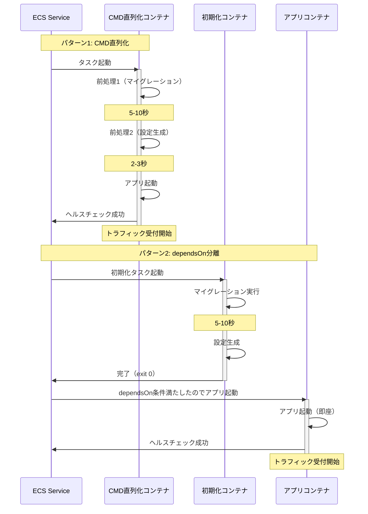

## 要約（Summary）

- コンテナ起動前の前処理（DBマイグレーション、設定生成等）は、CMD/ENTRYPOINTでの直列化とdependsOnによる分離の2パターンで実装できる
- CMD直列化はシンプルだが起動時間が延びてヘルスチェックに影響、dependsOn分離は関心の分離ができるが準備失敗時にタスク全体が停止する
- 前処理の所要時間、失敗時の許容度、デバッグのしやすさでパターンを選択する

## 本文（Body）

### 背景・問題意識

コンテナ化されたアプリケーションでは、起動前に以下のような前処理が必要になることが多い：
- データベースマイグレーション
- 設定ファイルや秘密情報の生成・取得
- 依存サービスへの疎通確認
- キャッシュの暖機運転
- 監視エージェントの起動確認

これらの前処理を「アプリケーション本体と同じコンテナで実行するか」「別コンテナに分離するか」は、起動時間、デバッグ性、失敗時の挙動に大きく影響する。ECSではCMD/ENTRYPOINTとdependsOnという2つの主要パターンがある。

### アイデア・主張

**コンテナ起動時前処理は、シンプルさを優先するならCMD直列化、関心の分離と失敗時の明確性を優先するならdependsOn分離を選ぶ。前処理の所要時間とヘルスチェックの整合が設計の鍵となる。**

### パターン1: CMD/ENTRYPOINTによる直列化

#### 実装方法

エントリポイントスクリプトで前処理を実行してからアプリケーションを起動する。

```bash
#!/bin/bash
# entrypoint.sh

# 前処理1: DBマイグレーション
echo "Running DB migrations..."
./migrate up

# 前処理2: 設定ファイル生成
echo "Generating config..."
./generate-config.sh

# 前処理3: 依存サービス疎通確認
echo "Checking dependencies..."
./wait-for-it.sh db:5432 -- echo "DB is ready"

# アプリケーション起動
echo "Starting application..."
exec ./app
```

Dockerfile:
```dockerfile
COPY entrypoint.sh /entrypoint.sh
RUN chmod +x /entrypoint.sh
ENTRYPOINT ["/entrypoint.sh"]
```

#### 長所

- ✅ **シンプル**: 理解しやすく、実装が容易
- ✅ **単一コンテナ**: タスク定義が複雑にならない
- ✅ **ログ集約**: 前処理とアプリのログが同じストリームに出力される

#### 短所

- ❌ **起動時間延長**: 前処理の時間だけアプリ起動が遅れる
- ❌ **ヘルスチェック影響**: 前処理中はヘルスチェックが失敗し、startPeriodの調整が必要
- ❌ **前処理失敗時の挙動**: 前処理失敗でコンテナ全体が停止（意図的かバグか判別しづらい）

#### 適用場面

- 前処理が10秒以内で完了する
- 前処理とアプリの境界が曖昧（例：設定読み込みの一部）
- デプロイ頻度が低く、起動時間の影響が小さい

### パターン2: dependsOnによる準備用コンテナ分離

#### 実装方法

タスク定義で初期化専用コンテナを定義し、成功後にアプリコンテナを起動する。

```json
{
  "family": "my-app",
  "containerDefinitions": [
    {
      "name": "init",
      "image": "my-app:init",
      "essential": false,
      "command": ["/scripts/init.sh"]
    },
    {
      "name": "app",
      "image": "my-app:latest",
      "essential": true,
      "dependsOn": [
        {
          "containerName": "init",
          "condition": "SUCCESS"
        }
      ]
    }
  ]
}
```

init.sh:
```bash
#!/bin/bash
echo "Running DB migrations..."
./migrate up
echo "Initialization complete"
exit 0
```

#### 長所

- ✅ **関心の分離**: 初期化処理とアプリケーションロジックが明確に分かれる
- ✅ **失敗時の挙動が明確**: 初期化失敗時はタスク全体が停止（意図的な設計）
- ✅ **再利用性**: 初期化コンテナを複数のアプリで共有できる
- ✅ **デバッグしやすい**: 初期化コンテナのログだけを追跡できる

#### 短所

- ❌ **構成の複雑化**: タスク定義が複雑になる
- ❌ **タスク全体停止**: 初期化失敗で essential なコンテナも起動しない
- ❌ **ログの分散**: 初期化とアプリのログが別ストリームになる

#### 適用場面

- 前処理が10秒以上かかる（特に数分）
- 前処理の成功が必須で、失敗時はタスク起動を中止したい
- 初期化処理を複数のアプリケーションで共有したい
- デバッグ時に初期化ログだけを見たい

### 内容を視覚化するMermaid図



### 具体例・ケース

**ケース1: DBマイグレーション（5秒）+ アプリ起動（3秒）**

**CMD直列化の場合：**
- 総起動時間: 8秒
- startPeriod: 20秒（余裕を持たせる）
- シンプルで管理しやすい

**dependsOn分離の場合：**
- 初期化コンテナ: 5秒
- アプリコンテナ: 3秒（並列ではなく直列）
- 総起動時間: 8秒（同じ）
- 構成が複雑になるメリットが薄い
- **判定**: CMD直列化を推奨

**ケース2: 大規模DBマイグレーション（60秒）+ アプリ起動（5秒）**

**CMD直列化の場合：**
- 総起動時間: 65秒
- startPeriod: 100秒（余裕を持たせる）
- ヘルスチェック失敗のリスクが高い
- デプロイタイムアウトのリスク

**dependsOn分離の場合：**
- 初期化コンテナ: 60秒（失敗したらタスク停止、明確）
- アプリコンテナ: 5秒（初期化成功後すぐ起動）
- 総起動時間: 65秒（同じ）だが、アプリの startPeriod は10秒で済む
- **判定**: dependsOn分離を推奨

**ケース3: 依存サービス疎通確認（最大30秒のリトライ）**

**CMD直列化の場合：**
- 依存サービスが遅延していると起動がブロック
- 30秒待ってもNGなら失敗

**dependsOn分離の場合：**
- 初期化コンテナで疎通確認
- 失敗したらタスク全体停止（意図的な設計）
- ECS Serviceの再起動ポリシーで自動リトライ
- **判定**: dependsOn分離で「依存サービスが準備できるまで起動しない」を明示

**ケース4: 設定ファイル生成（AWS Systems Manager Parameter Storeから取得）**

**CMD直列化の場合：**
- エントリポイントでParameter Store取得→設定生成→アプリ起動
- IAM権限がコンテナに必要

**dependsOn分離の場合：**
- 初期化コンテナで取得→共有ボリュームに書き込み
- アプリコンテナは共有ボリュームから読み取り
- 初期化とアプリでIAM権限を分離可能
- **判定**: セキュリティ分離したい場合は dependsOn

### 反論・限界・条件

**「dependsOnはKubernetesのInit Containersと同じか？」**

似ているが、以下の違いがある：
- Kubernetesは複数のInit Containersを順次実行できるが、ECSは明示的にdependsOnチェーンを定義する必要がある
- KubernetesはInit Container失敗時のリトライポリシーが柔軟だが、ECSはタスク定義レベルでの制御が限定的

**「前処理失敗時にリトライしたい場合は？」**

- CMD直列化: スクリプト内でリトライロジックを実装
- dependsOn分離: ECS Serviceの `desiredCount` により、タスク失敗で自動的に新タスクが起動（暗黙のリトライ）

**「ヘルスチェックとの整合はどう取る？」**

- CMD直列化: startPeriod を前処理時間 + バッファで設定
- dependsOn分離: アプリコンテナの startPeriod は短くてOK（初期化は別コンテナ）

**「初期化コンテナのログが CloudWatch Logs に即座に出ない問題**

ECSは初期化コンテナ終了後にログをフラッシュするため、リアルタイムでログを見たい場合は CMD直列化のほうが便利。

**前提条件：**
- タスク定義の `essential` 設定を理解している
- dependsOn の `condition` (START, COMPLETE, SUCCESS, HEALTHY) を使い分けられる
- ヘルスチェックの startPeriod 設計ができる

## 関連ノート（Links）

- [[20251224095733-ecs-lifecycle-control-design-philosophy|ECSライフサイクル制御の設計思想：目的別手段の選択と意思決定観点]] - ライフサイクル制御の全体像
- [[20251215171249-ecs-container-health-check-pattern|ECS Container Health Check設計パターン]] - startPeriodとヘルスチェックの整合
- [[20251215090820-declarative-vs-imperative-migration|宣言型マイグレーションと手続き型マイグレーションの比較]] - マイグレーション実装の選択肢
- [[20251220130053-ecs-dual-health-check-structure|ECS ヘルスチェックの二重構造]] - ヘルスチェックの仕組み
- [[20251215171154-otel-collector-health-check-extension|OpenTelemetry Collector Health Check Extension]] - 起動確認の具体例

## To-Do / 次に考えること

- [ ] dependsOnの `condition: HEALTHY` を使った初期化完了判定の実装例を調査
- [ ] 複数の初期化コンテナを順次実行する場合のdependsOnチェーン設計パターンをまとめる
- [ ] 初期化失敗時のリトライポリシー（ECS Service vs. スクリプト内リトライ）のベストプラクティスを整理
- [ ] 共有ボリュームを使った初期化データの受け渡しパターンを検証
