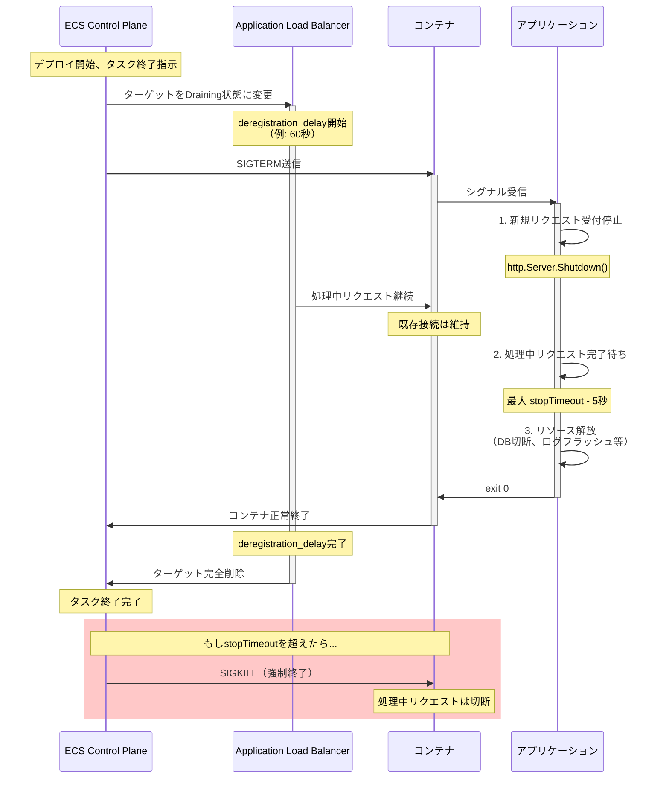

## 要約（Summary）

- ECSタスク終了時、ECSはSIGTERMシグナルを送信し、stopTimeout（デフォルト30秒）後にSIGKILLで強制終了する
- グレースフルシャットダウンでは、SIGTERM受信後に「新規受付停止→処理中リクエスト完了→リソース解放→終了」を実行する
- ロードバランサのderegistration_delayやService Connectのドレイン設定とstopTimeoutを整合させることが設計の鍵

## 本文（Body）

### 背景・問題意識

コンテナオーケストレーション環境では、タスクの終了は予告なく発生する：
- デプロイによる新バージョンへの置き換え
- スケールイン
- ノード障害による再配置
- ヘルスチェック失敗による置換

終了時に処理中のリクエストやメッセージを途中で打ち切ると、ユーザーエラー、データ不整合、トランザクション失敗が発生する。「安全に終了する」設計はシステムの信頼性の基礎である。

ECSはUnix標準のシグナル処理（SIGTERM → SIGKILL）を採用しており、アプリケーション側でSIGTERMをハンドルしてグレースフルシャットダウンを実装する必要がある。

### アイデア・主張

**ECSタスクのグレースフルシャットダウンは、SIGTERM受信時に「新規受付停止→処理中の完了→終了」を実装し、stopTimeoutをロードバランサのderegistration_delayやService Connectドレインと整合させることで実現する。stopTimeoutは処理時間の3〜5倍を目安とする。**

### SIGTERMベースのシャットダウンフロー

#### 1. ECSの終了シーケンス

ECSがタスクを停止する際の標準フロー：

1. **t=0**: ECS が SIGTERM をコンテナに送信
2. **t=0〜stopTimeout**: アプリケーションがグレースフルシャットダウンを実行
3. **t=stopTimeout**: タイムアウト到達、ECS が SIGKILL を送信（強制終了）

stopTimeoutのデフォルトは30秒。タスク定義で変更可能（最大120秒）。

#### 2. アプリケーション側の実装パターン

グレースフルシャットダウンの標準的な実装：

```go
// Go言語の例
package main

import (
    "context"
    "net/http"
    "os"
    "os/signal"
    "syscall"
    "time"
)

func main() {
    server := &http.Server{Addr: ":8080"}

    // SIGTERMをキャッチ
    sigChan := make(chan os.Signal, 1)
    signal.Notify(sigChan, syscall.SIGTERM, syscall.SIGINT)

    go func() {
        <-sigChan
        log.Println("Received SIGTERM, starting graceful shutdown...")

        // 1. 新規リクエストの受付停止（Listenerを閉じる）
        ctx, cancel := context.WithTimeout(context.Background(), 25*time.Second)
        defer cancel()

        // 2. 処理中のリクエストが完了するまで待機
        if err := server.Shutdown(ctx); err != nil {
            log.Printf("Shutdown error: %v", err)
        }

        // 3. その他のリソース解放（DB接続、キュー等）
        cleanupResources()

        log.Println("Graceful shutdown complete")
        os.Exit(0)
    }()

    // 通常のサーバー起動
    if err := server.ListenAndServe(); err != http.ErrServerClosed {
        log.Fatalf("Server error: %v", err)
    }
}
```

#### 3. ロードバランサとの連携

ECSタスクがALB/NLB配下にある場合、以下の2つのタイムラインが並行する：

**ECS側：**
- SIGTERM送信 → stopTimeout → SIGKILL

**ALB側：**
- ターゲットをDraining状態に変更
- deregistration_delay（デフォルト300秒）の間、新規接続を送らないが既存接続は維持
- deregistration_delay後、強制切断

**設計原則：**
```
stopTimeout ≤ deregistration_delay
```

理由：
- ALBがまだドレイン中なのにECSがSIGKILLすると、ALB経由のリクエストが切断される
- stopTimeoutをderegistration_delay以下にすることで、アプリ側のグレースフルシャットダウンが先に完了する

#### 4. Service Connectとの連携

ECS Service Connectを使う場合、プロキシ（Envoy）が自動的にドレインを管理する。

- タスク終了開始時、Service Connect プロキシが「このタスクは終了予定」を他タスクに通知
- 新規リクエストは他タスクにルーティング
- 既存接続は維持（ドレイン期間）

**設計原則：**
- stopTimeoutをService Connectのドレイン時間（設定可能）と整合させる
- 通常、Service Connectのドレインは15〜30秒程度

### 内容を視覚化するMermaid図



### 具体例・ケース

**ケース1: Web APIサーバー（平均レスポンス時間 200ms）**

**設計：**
- stopTimeout: 30秒
- deregistration_delay: 60秒
- アプリ側のShutdownタイムアウト: 25秒（stopTimeoutより5秒短く）

**理由：**
- 200msのリクエストなら、25秒あれば十分完了できる
- deregistration_delayが60秒なので、ALBはまだ接続を維持している
- stopTimeoutの5秒前にアプリが終了するので、余裕を持って終了できる

**ケース2: バッチ処理ワーカー（1タスクあたり最大60秒）**

**設計：**
- stopTimeout: 120秒（最大値）
- アプリ側のShutdownタイムアウト: 115秒
- 新規タスク受付停止後、処理中タスクを完了

**実装：**
```python
import signal
import time

shutdown_requested = False

def handle_sigterm(signum, frame):
    global shutdown_requested
    print("SIGTERM received, stopping new task processing...")
    shutdown_requested = True

signal.signal(signal.SIGTERM, handle_sigterm)

while True:
    if shutdown_requested:
        print("Waiting for current task to complete...")
        # 処理中タスクを完了させる
        time.sleep(5)  # 例: 処理完了待ち
        print("Graceful shutdown complete")
        break

    # 新規タスク処理
    process_task()
```

**ケース3: Service Connect経由のマイクロサービス**

**設計：**
- Service Connectドレイン時間: 20秒
- stopTimeout: 30秒
- アプリ側のShutdownタイムアウト: 25秒

**タイムライン：**
1. t=0: ECS → SIGTERM送信、Service ConnectがDraining開始
2. t=0〜20秒: Service Connectが新規リクエストを他タスクにルーティング、既存接続は維持
3. t=20秒: Service Connectドレイン完了、新規リクエストなし
4. t=25秒: アプリがGraceful Shutdown完了
5. t=30秒: stopTimeout到達（が、既に終了済み）

### 反論・限界・条件

**「stopTimeoutを長くすればよいのでは？」**

長すぎるstopTimeoutの問題：
- デプロイ時間が延びる（旧タスクの終了を待つ時間）
- スケールイン時の応答性が悪化
- 推奨: 通常のリクエスト処理時間の3〜5倍

**「SIGTERMをハンドルしないとどうなるか？」**

デフォルト動作：
- SIGTERMでプロセスが即座に終了（gracefulではない）
- 処理中リクエストが切断される
- DBトランザクションがロールバックされる可能性

**「deregistration_delayとstopTimeoutの関係を逆にしたら？」**

もし `stopTimeout > deregistration_delay` の場合：
- ALBがターゲットを削除した後もコンテナが動いている
- 問題なさそうだが、ALBが削除後に新規リクエストは来ないので無駄
- ただし、Service Connect等で直接アクセスされる場合は問題ない

**「言語ランタイムによるシグナルハンドリングの違い」**

- **Go**: `signal.Notify()` で明示的にハンドル
- **Node.js**: `process.on('SIGTERM', ...)` でハンドル
- **Python**: `signal.signal(signal.SIGTERM, handler)` でハンドル
- **Java**: `Runtime.getRuntime().addShutdownHook()` でハンドル

言語ごとに実装パターンが異なるため、チーム内でテンプレートを整備すべき。

**「Dockerのstop動作との違い」**

`docker stop` も同様にSIGTERM → SIGKILL の流れだが、デフォルトタイムアウトは10秒。ECSのstopTimeout（デフォルト30秒）とは異なるので注意。

**前提条件：**
- アプリケーションがSIGTERMをハンドルできる実装になっている
- ヘルスチェックが「処理中だがシャットダウン準備中」を検出しない（falseでシャットダウンを加速させない）
- ロードバランサやService Connectの設定を理解している

## 関連ノート（Links）

- [[20251224095733-ecs-lifecycle-control-design-philosophy|ECSライフサイクル制御の設計思想：目的別手段の選択と意思決定観点]] - ライフサイクル制御の全体像
- [[20251220130053-ecs-dual-health-check-structure|ECS ヘルスチェックの二重構造]] - ヘルスチェックとシャットダウンの関係
- [[20251223133637-service-discovery-registry-vs-proxy-responsibility|Service DiscoveryにおけるRegistryとProxyの責任分離]] - Service Connectのドレイン処理
- [[20251215171249-ecs-container-health-check-pattern|ECS Container Health Check設計パターン]] - ヘルスチェックとstopTimeoutの整合
- [[20251224095920-container-startup-preprocessing-patterns|コンテナ起動時前処理の実装パターン：CMD直列化とdependsOn分離]] - 起動時の対となる設計

## To-Do / 次に考えること

- [ ] 各言語（Go、Node.js、Python、Java）のグレースフルシャットダウン実装テンプレートを作成
- [ ] deregistration_delayとstopTimeoutの最適値を、リクエスト処理時間の分布から算出する方法を調査
- [ ] Service Connectのドレイン設定とstopTimeoutの推奨値をパターン化
- [ ] SIGTERMハンドル中にヘルスチェックを失敗させるべきか（早期ドレイン）を検証
