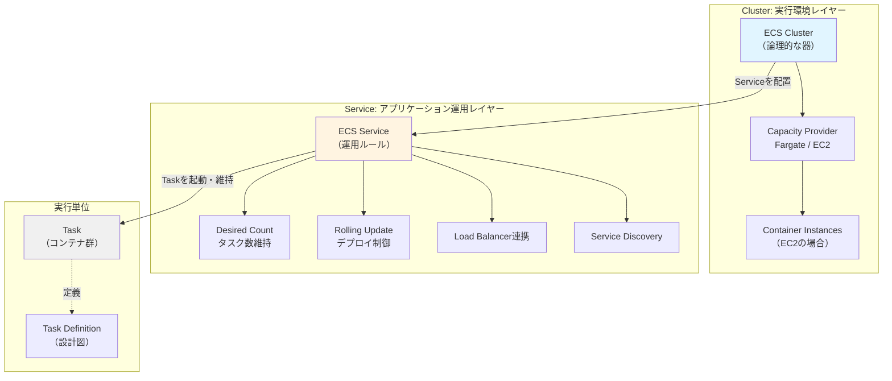

## 要約（Summary）

- ECS の Cluster と Service は異なるレイヤーの概念である
- Cluster は「どこで動かすか」を定義する論理的な器（実行環境）
- Service は「何を何個、どう更新し、どう配信するか」を定義する運用ルール（アプリケーション制御）

## 本文（Body）

AWS ECS におけるアーキテクチャは、インフラストラクチャレイヤー（Cluster）とアプリケーション運用レイヤー（Service）を明確に分離している。この分離により、実行環境の管理とアプリケーションのデプロイ・運用を独立して扱うことができる。

### 背景・問題意識

コンテナオーケストレーションシステムでは、「どこで実行するか」と「何をどう実行するか」を混同すると、設定の責任範囲が曖昧になり、運用が複雑化する。ECS はこの2つの責務を Cluster と Service という異なる概念に明確に分割している。

### アイデア・主張

**Cluster（クラスター）= 実行環境の論理的な器**

- 役割：タスクを動かすための論理的なまとまり
- 責務：
  - 実行基盤の選択（Fargate または EC2）
  - Capacity Provider の設定
  - EC2 の場合はコンテナインスタンス群の管理
  - 実行環境側の設定の集約
- イメージ：「工場の敷地」「Kubernetes の Namespace に近い器（ただし完全一致ではない）」

**Service（サービス）= アプリケーション運用の制御ルール**

- 役割：特定のタスク定義を、指定数だけ安定稼働させ続けるコントローラ
- 責務：
  - desired count に基づくタスク数の維持（タスクが落ちたら自動起動）
  - ローリング更新の管理（新しいタスク定義への置き換え）
  - Load Balancer（ALB/NLB）連携
  - Service Discovery / Service Connect 連携
  - トラフィック受信に関わる運用設定
- イメージ：「敷地内で稼働する生産ライン（を維持する監督役）」

### 内容を視覚化するMermaid図

### 具体例・ケース

**階層構造の例**：

1. **Cluster レイヤー**：`production-cluster` という名前で Fargate を使う環境を作成
2. **Service レイヤー**：`web-api-service` という Service を作成し、desired count = 3、ALB 連携を設定
3. **実行レイヤー**：Service が 3 つの Task を起動し、各 Task がコンテナを実行

**設定の使い分け**：

- Cluster に設定：Capacity Provider 戦略、Container Insights の有効化
- Service に設定：タスク定義、desired count、デプロイ設定、ロードバランサーターゲットグループ、Service Connect の名前空間

### 反論・限界・条件

**Kubernetes との比較における注意点**：

- Cluster は Kubernetes の Namespace に似ているが完全には一致しない
- ECS の Service は Kubernetes の Deployment に近いが、トラフィック管理も含む点で責務が広い
- Kubernetes ではクラスタ = 物理/論理的な計算リソースの集合だが、ECS の Cluster はより抽象的な論理グループ

**単純なケースでの過剰性**：

- 単一アプリケーション・単一環境の場合、Cluster と Service のレイヤー分離は過剰に感じられることがある
- しかし、複数の Service や環境（dev/staging/prod）を扱う場合には、この分離が明確な境界を提供する

## 関連ノート（Links）

- [[20251220130053-ecs-dual-health-check-structure]] - ECS における別のレイヤー分離の例（ヘルスチェックの二重構造）
- [[20251223133637-service-discovery-registry-vs-proxy-responsibility]] - サービス間通信における責任範囲の分離
- [[20251215085324-knowledge-creation-reading]] - 概念の明確な分類が理解を助ける例
- [[20251214235033-claude-md-strategic-design-principles]] - 責務の明確化による設計原則
- [[20251129160317-ai-role-division-what-why-how]] - 役割分担の原則（What/Why/How の分離）

## To-Do / 次に考えること

- [ ] Fargate と EC2 それぞれでの Cluster 設定の違いを整理する
- [ ] Service Connect と Service Discovery の使い分けを別 zettel にする
- [ ] Task Definition の設計原則について別途まとめる
- [ ] 実際のプロジェクトで Cluster/Service 構成を見直す
