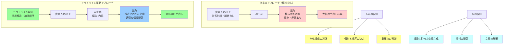

## 要約（Summary）

- 人間が事前にアウトライン（全体構成）を設計し、それをAIに渡すことで、AI生成文章の精度と品質が向上する
- アウトラインは文書の設計図として機能し、AIは構造化された文章を生成しやすくなる
- 全体構成を人間が考え、詳細な文章生成をAIに任せる役割分担が、効率的で質の高いドキュメントを生み出す

## 本文（Body）

### 背景・問題意識

AI（特にLLM）は長文を生成できるが、音声入力や断片的な情報をそのまま渡すと、時系列順や脈絡のない構成になりがちである。読者に伝えるべき論理的な順序と、話し手が話す順序は必ずしも一致しない。

また、AIに「良い文章を書いて」と丸投げしても、何を強調し、どの順序で説明するかは人間が決めるべき戦略的判断である。構造を与えずにAIに生成させると、冗長で焦点が定まらない文章になる。

### アイデア・主張

**アウトラインを事前に設計してAIに渡すことで、AI生成文章の精度が劇的に向上する**

人間が全体の構成を設計し、各セクションで何を書くかを指定することで、AIは以下のメリットを得る：

1. **構造化された出力**: 大見出し・中見出し・小見出しの階層構造に沿って、論理的に整理された文章を生成できる
2. **情報の適切な配置**: 音声入力やメモの内容を、アウトラインの適切なセクションに配置できる
3. **一貫性の確保**: 全体の流れが明確になり、重複や矛盾を避けやすくなる
4. **編集作業の効率化**: 構造が既に整っているため、後の手直し作業が楽になる

#### 効果的なアウトライン作成のポイント

1. **階層構造の明確化**
   - H1（大見出し）: 主要なテーマや章
   - H2（中見出し）: 具体的なトピック
   - H3（小見出し）: 詳細な項目
   - 箇条書き: 各セクションのポイント

2. **完璧を求めない**
   - 最初は大まかな構成でOK
   - 執筆を進めながら調整可能
   - 重要なのは「方向性」を明確にすること

3. **思考整理の副次効果**
   - アウトライン作成自体が思考整理の機会になる
   - 何を伝えたいのか、どの順序が理解しやすいかを考えることで、文書全体の質が向上する

#### AIへの入力構成

効果的なAI執筆では、以下の情報を組み合わせて渡す：

1. **アウトライン**: 見出し構造と各セクションで触れるべきポイント
2. **音声入力/メモ**: 書きたい内容の生の情報（文章として整っていなくてもOK）
3. **メタ情報**: 文書の目的、想定読者、トーン

この組み合わせにより、AIは人間が意図した構成に沿って、音声入力の内容を適切に配置した叩き台を作成できる。

### 内容を視覚化するMermaid図



### 具体例・ケース

**記事執筆の実例（元記事より）**

1. **音声入力**: AIを活用したドキュメント執筆について、思いついたことを話す（「えっと」「あの」などの間投詞が入っても構わない）

2. **アウトライン作成**:
   ```
   # AIを活用したドキュメント執筆技術
   ## 心構え
   - AIの限界を理解する
   - 全体構成は人間が考える

   ## ドキュメントの書き方
   ### 1. 音声入力で書きたい内容を入力する
   ### 2. 記事のアウトラインを書く
   ### 3. 1と2の内容をAIに渡し叩きを作ってもらう
   ### 4. AIによるlint-fixの実行
   ### 5. 人間による手直し

   ## さいごに
   ```

3. **AIへの指示**: アウトラインと音声入力を渡し、「このアウトラインに沿って、音声入力の内容を配置した記事を作成してください」

4. **結果**: 構造化された記事の叩き台が生成され、手直し作業が効率化される

**他の応用例**

- **技術文書**: アーキテクチャ図の各コンポーネントをH2として、詳細をAIに生成させる
- **報告書**: 背景・現状・課題・提案・次のアクションという構造を先に作る
- **プレゼン資料**: スライドのタイトルとキーメッセージを先に決め、詳細をAIに書かせる

### 反論・限界・条件

**アウトライン作成の初期コスト**

アウトラインを作成する時間が必要であり、短い文書では逆に効率が悪い場合がある。

**対応**:
- 長文（3セクション以上）や重要な文書に限定して使用
- 簡単な文書では音声入力のみでも十分

**アウトライン自体の質に依存**

不適切なアウトラインでは、AIが良い文章を生成しても全体の質は低い。

**対応**:
- アウトライン作成のスキルを磨く
- 既存の良い文書の構成を参考にする
- アウトライン自体もAIに叩き台を作らせ、人間が洗練させる

**柔軟性の欠如**

アウトラインを先に決めると、執筆中に新しいアイデアが出た際に構成を変えにくい。

**対応**:
- アウトラインは固定ではなく、必要に応じて調整する
- 「大まかな流れ」を決める程度にとどめ、詳細は柔軟に変更可能にする

**成立条件**

- 文書の目的と読者が明確である
- 一定以上の長さ（複数セクション）がある
- 論理的な流れが重要な文書である

## 関連ノート（Links）

- [[20251223230257-ai-design-generation-spec-registry|AI詳細設計生成における地の事実問題と仕様台帳アプローチ]] 構造（仕様台帳）を事前に与えることでAI生成の精度が向上する
- [[20251129160317-ai-role-division-what-why-how|AI連携開発における役割分担の原則]] 人間がWhat/Whyを定義し、AIがHowを実装する分業モデル
- [[20251214140418-effective-agent-config-design-principles|効果的なAIエージェント設定ファイル設計の原則]] 設定ファイルで構造を与える重要性
- [[20251215004321-ai-output-quality-check-responsibility|AI生成コンテンツの品質チェック責任]] AI出力の品質は人間が担保する必要がある
- [[20251214140010-progressive-disclosure-agent-context|Progressive Disclosureによる段階的コンテキスト開示]] 構造化された情報提供の重要性

## To-Do / 次に考えること

- [ ] 自分がよく書く文書タイプ（報告書、提案書など）のアウトラインテンプレートを作成する
- [ ] アウトライン作成からAI生成までのワークフローを自動化できないか検討する
- [ ] アウトラインの質が最終成果物に与える影響を定量的に測定する
- [ ] 音声入力とアウトラインの組み合わせで、執筆時間がどれだけ短縮されるか検証する
