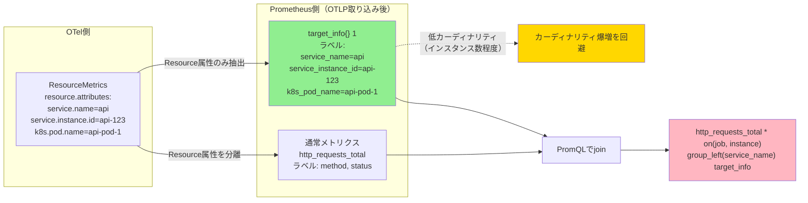

## 要約（Summary）

- `target_info` は、OpenTelemetryのResource属性をPrometheus側で扱いやすくするために別メトリクスとして表現したinfo系メトリクス
- 値は常に1で、ラベルにResource属性（service.name、k8s関連ラベル等）が詰まる
- 全メトリクスにResource属性を付与するとカーディナリティが爆増するため、target_infoに分離し、必要時にjoinして使う設計パターン

## 本文（Body）

### 背景・問題意識

OpenTelemetry（OTel）のメトリクスには、Resource attributes（発生源のメタデータ）とData point attributes（時系列を区別するラベル）の2階層がある。Prometheus側でOTLPメトリクスを取り込む際、すべてのResource属性を各メトリクスのラベルとして付与すると、ラベルの組み合わせ（カーディナリティ）が爆発的に増加し、パフォーマンスやストレージに深刻な影響を与える。

この問題を解決するために、Resource属性を専用の`target_info`メトリクスに分離し、必要な時だけPromQL側でjoinして使う設計パターンが生まれた。

### アイデア・主張

**target_infoの構造**:
- **メトリクス名**: `target_info`
- **値**: 常に `1`
- **ラベル**: Resource属性のみが含まれる（`service.name`, `service.instance.id`, `k8s.namespace.name`, `k8s.pod.name`等）
- **カーディナリティ**: 最大でも「リソース（サービスインスタンス）数」程度

**生成される場所**:
- Prometheus の OTLP Receiver（OTLP経由の取り込み時）
- OpenTelemetry Collector の Prometheus Exporter
- Grafana Alloy / Grafana Agent

**カーディナリティ管理の仕組み**:

```
通常のメトリクス（例: http_requests_total）
└── ラベル: method, status（Data point attributes のみ）

target_info
└── ラベル: service_name, k8s_pod_name, environment（Resource attributes のみ）

必要時にPromQLでjoin:
http_requests_total * on(job, instance) group_left(service_name, k8s_pod_name) target_info
```

この分離により：
- 各メトリクスのカーディナリティは時系列を区別するラベルのみに依存
- Resource属性はtarget_info側に集約され、低カーディナリティで管理
- Resource属性が必要な場合のみ動的にjoinで取得

**生成条件（重要な制約）**:

OpenTelemetry仕様およびPrometheusの実装では、以下の条件を満たさない場合、target_infoは生成されない：

- **必須属性**: `service.name` と `service.instance.id` の両方が存在する必要がある
- Resource属性が空の場合も生成されない

この条件を満たさない場合、ユーザーは「target_infoが見えない」という問題に直面する。

### 内容を視覚化するMermaid図



### 具体例・ケース

**例1: target_infoの実際の出力**

```promql
# target_info メトリクス
target_info{
  job="otel-collector",
  instance="10.0.1.5:8080",
  service_name="payment-api",
  service_instance_id="payment-api-7f8d9c-abcd",
  k8s_namespace_name="production",
  k8s_pod_name="payment-api-7f8d9c-abcd",
  deployment_environment="prod"
} 1

# 通常のメトリクス（Resource属性は含まれない）
http_requests_total{
  job="otel-collector",
  instance="10.0.1.5:8080",
  method="GET",
  status="200"
} 1543
```

**例2: target_infoが生成されない失敗ケース**

```yaml
# NG: service.instance.id がない
resource.attributes:
  service.name: my-service
  # service.instance.id が欠落 → target_info 生成されない
```

**例3: カーディナリティの比較**

仮に以下の環境があるとする：
- サービスインスタンス数: 10
- HTTPメソッド: 5種類
- ステータスコード: 10種類

Resource属性を全メトリクスに付与した場合の時系列数：
```
10（インスタンス） × 5（メソッド） × 10（ステータス） = 500 時系列
```

target_infoで分離した場合：
```
http_requests_total: 5（メソッド） × 10（ステータス） = 50 時系列
target_info: 10（インスタンス） = 10 時系列
合計: 60 時系列（88%削減）
```

### 反論・限界・条件

**target_infoが適切に機能する条件**:
- Resource属性に `service.name` と `service.instance.id` が設定されている
- OpenTelemetry SDKまたはCollectorでResource Detectorが正しく動作している
- PrometheusのOTLP ReceiverまたはOTel CollectorのPrometheus Exporterが使われている

**target_infoのデメリット**:
- PromQLクエリが複雑になる（joinが必要）
- Prometheus 3.0以前では`group_left`の構文が冗長
- 初見のユーザーには「なぜtarget_infoがあるのか」が分かりにくい

**カーディナリティ削減の限界**:
- target_infoによる分離は、Resource属性とData point attributesが明確に分離されている場合のみ有効
- Data point attributes自体が高カーディナリティ（例: user_id、session_id）の場合、target_infoでは解決できない

**代替アプローチ**:
- Resource属性を完全に削除する（ただし、マルチテナント環境では識別不可能になる）
- Metric Relabeling でResource属性の一部のみ保持
- Remote Write Relabeling で後段フィルタリング

## 関連ノート（Links）

- [[20251224110845-promql-info-metric-join-pattern|PromQLにおけるinfo系メトリクスのjoinパターン]] - target_infoの実践的な使い方
- [[20251221154501-otel-resource-attributes-vs-datapoint-attributes|OpenTelemetry メトリクスの Resource attributes と Data point attributes の違い]] - target_infoの前提となる2階層構造
- [[20251220123656-otel-collector-pipeline-architecture|OpenTelemetry Collector のパイプラインアーキテクチャ]] - target_info生成の処理フロー
- [[20251221154502-otel-attribute-promotion-pattern|OpenTelemetry における属性昇格パターン]] - Resource属性の操作パターン
- [[202511291440-load-balancing-exporter|OpenTelemetry Collector Load Balancing Exporterの概要]] - Resource属性ベースのルーティング

## To-Do / 次に考えること

- [ ] 実際のPrometheusインスタンスでtarget_info生成を検証（service.nameとservice.instance.idの有無で比較）
- [ ] Prometheus 3.0の`info()`関数を使ったより簡潔なクエリパターンを調査
- [ ] target_infoのカーディナリティがどの程度スケールするか実測（数千インスタンス規模）
- [ ] OTel Collector の Resource Detection Processor による自動設定を検証
