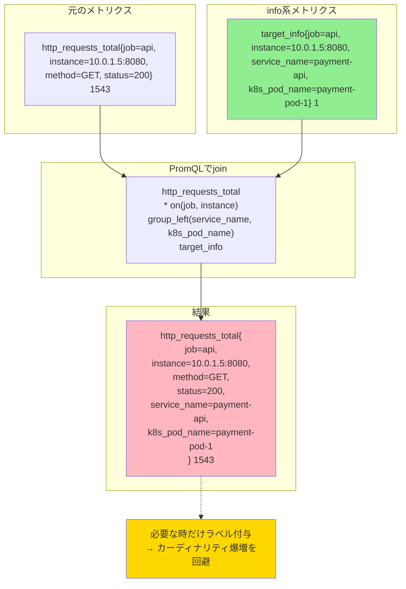

## 要約（Summary）

- info系メトリクス（`target_info`, `node_info`等）は、値が常に1でラベルにメタデータを持つ特殊なメトリクス
- PromQLで他のメトリクスとjoinすることで、必要な時だけメタデータラベルを付与できる
- 従来は`group_left`構文を使うが、Prometheus 3.0では`info()`関数でより簡潔に記述可能

## 本文（Body）

### 背景・問題意識

Prometheusでは、すべてのメトリクスに大量のメタデータラベル（環境情報、Kubernetes情報等）を付与すると、時系列数（カーディナリティ）が爆発的に増加し、メモリ使用量やクエリ性能に深刻な影響を与える。

この問題を解決するため、メタデータを専用のinfo系メトリクスに分離し、PromQLで必要な時だけjoin（結合）してラベルを取得する設計パターンが確立された。

### アイデア・主張

**info系メトリクスの特徴**:
- メトリクス名: `*_info` という命名規則（例: `target_info`, `node_info`, `machine_info`）
- 値: 常に `1`（情報そのものを表現するため、値に意味はない）
- ラベル: メタデータ属性のみ（例: `service_name`, `version`, `k8s_pod_name`等）

**joinパターンの基本構造**:

```promql
# 基本形: group_leftによるラベル付与
<metric> * on(<join_key>) group_left(<label1>, <label2>, ...) <info_metric>
```

- `<join_key>`: joinするための共通ラベル（通常は `job`, `instance`）
- `group_left(<labels>)`: 右側（info_metric）のラベルを左側（metric）に付与
- `* on(...)`: 掛け算によるjoin（info_metricの値が1なので、元の値を維持）

**Prometheus 3.0の新しいアプローチ**:

```promql
# info()関数による簡潔な記述
<metric> * info(<info_metric>)
```

`info()`関数は、info系メトリクスからのラベル付与を自動化し、`group_left`の冗長な構文を不要にする。

### 内容を視覚化するMermaid図



### 具体例・ケース

**例1: 基本的なtarget_infoのjoin**

```promql
# サービス名とPod名を付与してリクエスト数を集計
http_requests_total
  * on(job, instance) group_left(service_name, k8s_pod_name)
  target_info

# 結果例:
# http_requests_total{
#   job="api",
#   instance="10.0.1.5:8080",
#   method="GET",
#   status="200",
#   service_name="payment-api",        # ← target_infoから付与
#   k8s_pod_name="payment-pod-1"       # ← target_infoから付与
# } 1543
```

**例2: サービスごとの集計**

```promql
# サービス名でグループ化してリクエスト数を合計
sum by(service_name) (
  rate(http_requests_total[5m])
    * on(job, instance) group_left(service_name)
    target_info
)

# 結果例:
# {service_name="payment-api"} 245.3
# {service_name="user-api"} 187.6
```

**例3: 複数のinfo系メトリクスを組み合わせる**

```promql
# target_infoとnode_infoの両方からラベルを付与
http_requests_total
  * on(job, instance) group_left(service_name)
  target_info
  * on(job, instance) group_left(node_name, datacenter)
  node_info
```

**例4: Prometheus 3.0のinfo()関数**

```promql
# 従来の書き方（冗長）
http_requests_total
  * on(job, instance) group_left(service_name, k8s_pod_name)
  target_info

# Prometheus 3.0（簡潔）
http_requests_total * info(target_info)
```

**例5: フィルタリングと組み合わせる**

```promql
# productionサービスのみを集計
sum by(service_name) (
  rate(http_requests_total[5m])
    * on(job, instance) group_left(service_name, environment)
    target_info{environment="production"}
)
```

### 反論・限界・条件

**group_leftが適切に機能する条件**:
- 左側（メトリクス）と右側（info_metric）が`on()`で指定したラベルで1:1または多:1の関係にある
- 1:多の関係（1つのメトリクスに複数のinfo_metricがマッチ）では`group_left`は失敗する

**パフォーマンスへの影響**:
- joinはクエリ時に動的に実行されるため、大量の時系列をjoinするとクエリが遅くなる
- join後の時系列数が爆増する場合、結局カーディナリティ問題は解決しない

**info()関数の制約（Prometheus 3.0）**:
- Prometheus 3.0以降でのみ利用可能
- 古いバージョンでは`group_left`構文を使う必要がある
- info系メトリクスの命名規則（`*_info`）を前提とする

**joinキーの選択**:
- `job`と`instance`が標準的なjoinキーだが、環境によっては異なるラベルが必要
- OpenTelemetry環境では`service.name`や`service.instance.id`がjoinキーになることもある

**代替アプローチ**:
- Recording Rules でjoin済みの時系列を事前計算（クエリ時のオーバーヘッドを削減）
- Metric Relabeling でラベルを直接付与（joinを不要にするが、カーディナリティは増加）

## 関連ノート（Links）

- [[20251224110733-otel-target-info-resource-attribute-management|OpenTelemetryのtarget_infoメトリクスによるResource属性管理]] - target_infoの生成と構造
- [[20251221154501-otel-resource-attributes-vs-datapoint-attributes|OpenTelemetry メトリクスの Resource attributes と Data point attributes の違い]] - Resource属性の2階層構造
- [[20251220123656-otel-collector-pipeline-architecture|OpenTelemetry Collector のパイプラインアーキテクチャ]] - メトリクス処理の全体像
- [[202511291440-load-balancing-exporter|OpenTelemetry Collector Load Balancing Exporterの概要]] - Resource属性ベースのルーティング
- [[20251221154502-otel-attribute-promotion-pattern|OpenTelemetry における属性昇格パターン]] - Resource属性の操作

## To-Do / 次に考えること

- [ ] Prometheus 3.0の`info()`関数の実際の挙動を検証（group_leftとの性能比較）
- [ ] Recording Rulesでjoin済み時系列を事前計算した場合のトレードオフを測定
- [ ] 1:多のjoin失敗ケースを実際に再現し、エラーメッセージを確認
- [ ] 大規模環境（数千インスタンス）でのjoinクエリのパフォーマンスを実測
