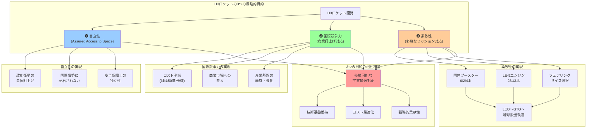

## 要約（Summary）

- H3ロケットは、自立性（Assured Access to Space）、国際競争力、柔軟性という3つの戦略的目的を掲げた日本の次世代基幹ロケットである
- H-IIA/H-IIBの後継として、信頼性を維持しつつコストを半減（目標50億円/機）し、多様な軌道・衛星サイズに対応する設計を採用
- これら3つの目的は互いに補完し合い、宇宙輸送手段の持続可能性と産業基盤の維持を実現する

## 本文（Body）

### 背景・問題意識

H3ロケットは、日本が運用してきたH-IIA/H-IIBロケットの後継として開発された次世代の大型基幹ロケットである。宇宙開発における基幹ロケットは、単なる輸送手段ではなく、国家の宇宙アクセス能力と産業基盤を支える戦略的資産である。

H3の開発においては、前世代の信頼性を維持しつつ、変化する市場環境と技術動向に対応するため、明確な3つの戦略的目的が設定された。これらの目的は、技術設計の指針となり、開発優先順位の判断基準となる。

### アイデア・主張

**H3ロケットの開発は、「自立性」「国際競争力」「柔軟性」という3つの戦略的目的を同時に追求する設計思想に基づいている。これらは単独の目的ではなく、相互に補強し合うことで宇宙輸送手段の持続可能性を実現する。**

#### 1. 自立性（Assured Access to Space）

政府衛星や基幹インフラ衛星を、必要なときに国内の手段で打ち上げられる状態を保つことを指す。

**重要性：**
- 安全保障上の重要衛星（偵察衛星、通信衛星等）を他国に依存せず打ち上げられる
- 商業打上げ市場の変動や国際情勢に左右されない
- 国家の宇宙政策の実行可能性を担保する基盤

この目的は、[[20251215104528-switching-cost-vendor-lockin|スイッチングコストとベンダーロックイン]]と同様の構造を持つ。他国のロケットに依存すると、価格交渉力を失い、打上げタイミングや軌道選択の自由度が制約される。

#### 2. 国際競争力（商業打上げへの対応）

H-IIA/H-IIBで培った信頼性をベースに、打上げ価格を下げて商業需要にも対応し、産業基盤を維持・強化する狙いがある。

**具体的な目標：**
- 打上げコストをH-IIAの半分程度（目標として約50億円/機）に削減
- 国際商業市場で競争できる価格帯への到達
- 打上げ頻度の向上による産業基盤の維持

**経済的な意義：**
- 国内ロケット産業の雇用と技術基盤の維持
- 打上げサービスの輸出による経済効果
- 開発コストの回収と次世代技術への再投資

#### 3. 柔軟な打上げ能力（幅広い軌道・衛星サイズへの対応）

低軌道（LEO）から静止トランスファー軌道（GTO）、さらには地球脱出軌道まで、さまざまな軌道へ多様な衛星を投入できるように設計されている。

**実現手段：**
- 固体ブースター（SRB-3）の本数選択（0本、2本、4本）
- 1段エンジン（LE-9）の基数選択（2基または3基）
- フェアリング（衛星を覆うカバー）のサイズ選択

この「バリエーション設計」により、ミッションの要求に応じて最適な構成を選択し、過剰スペックによるコスト増を避けることができる。

### 内容を視覚化するMermaid図

### 具体例・ケース

**ケース1：政府衛星（自立性の実現）**
- 偵察衛星「情報収集衛星（IGS）」の打上げ
- 国家安全保障上の機密性が高く、他国のロケットでは打ち上げられない
- H3により、必要なタイミングで確実に打ち上げられる能力を維持

**ケース2：商業衛星（国際競争力の実現）**
- 海外の通信衛星事業者からの受注を目指す
- SpaceXのFalcon 9（約7,000万ドル≒100億円）と競合
- H3の目標50億円が実現すれば、一定の価格競争力を持つ

**ケース3：多様なミッション（柔軟性の実現）**
- 小型衛星コンステレーション（LEO）: ブースター0本、エンジン2基
- 静止通信衛星（GTO）: ブースター4本、エンジン3基
- 月・惑星探査機: 最大構成で地球脱出軌道へ

**3つの目的の相互作用：**
- 自立性により政府需要が確保され、打上げ頻度が維持される
- 打上げ頻度の維持により、コスト削減と品質向上が進む（習熟効果）
- 柔軟な構成により、政府・商業の両方のニーズに対応できる
- これらが産業基盤を維持し、次世代技術への投資を可能にする

### 反論・限界・条件

**「3つの目的は矛盾しないか？」**
- 自立性重視なら高コストでも確実性優先になるはず
- 国際競争力重視ならコスト削減優先で信頼性が犠牲になるリスク
- 実際には、H-IIA/H-IIBの信頼性実績を「資産」として活用し、新技術（LE-9エンジン等）で低コスト化を図るバランス設計

**「目標50億円は実現できるか？」**
- 報道される目標値であり、実績値とは別
- 初期の試験打上げでは開発コストが上乗せされる
- 量産効果と習熟効果が出るまでには時間がかかる

**「商業市場での競争力は十分か？」**
- SpaceXの再使用ロケットは更に低コスト（約7,000万ドル、しかも再使用で更に低減）
- H3は使い捨てロケットのため、価格面では不利
- 「信頼性」「柔軟性」「日本政府との関係」といった非価格要素での差別化が必要

**成立条件：**
- 政府による継続的な需要（自立性の維持に必要な打上げ頻度）
- 技術開発の成功（LE-9エンジンの信頼性確立等）
- 国際商業市場での一定のシェア獲得

## 関連ノート（Links）

- [[20251215104528-switching-cost-vendor-lockin|スイッチングコストとベンダーロックイン]] 自立性とベンダーロックインの関係
- [[20251224095733-ecs-lifecycle-control-design-philosophy|ECSライフサイクル制御の設計思想：目的別手段の選択と意思決定観点]] 目的に応じた設計手段の選択
- [[20251221152241-consistent-hashing-design-goal|Consistent Hashingの設計目的とキー移動最小化]] 設計目的を明確にすることの重要性
- [[20251214140418-effective-agent-config-design-principles|効果的なAIエージェント設定ファイル設計の原則]] 設計原則とトレードオフ

## To-Do / 次に考えること

- [ ] H3の実際の打上げコスト実績を追跡し、目標との乖離を確認
- [ ] 他国の基幹ロケット（Ariane 6、Vulcan等）との比較分析
- [ ] 日本の宇宙政策における自立性の位置づけを調査
- [ ] 商業打上げ市場でのH3の競争戦略を分析
