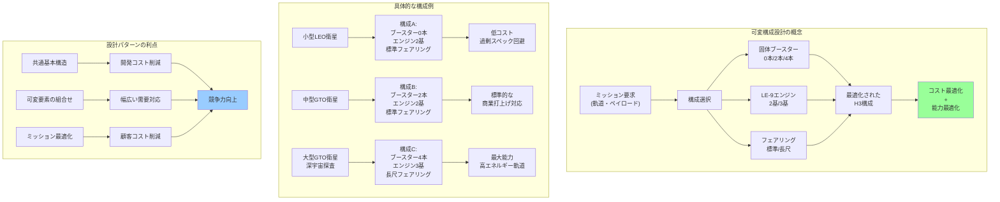

## 要約（Summary）

- 可変構成設計（Variable Configuration Design）は、ロケットの基本構造を共通化しつつ、ミッション要求に応じてブースター数・エンジン数・フェアリングサイズを選択できる設計手法である
- H3ロケットでは、固体ブースター（SRB-3）0/2/4本、1段エンジン（LE-9）2基/3基、フェアリングサイズの組み合わせにより、多様な軌道・ペイロードに対応する
- この設計により、ミッションごとに最適な構成を選択でき、過剰スペックによるコスト増を回避しつつ、幅広い需要に対応できる

## 本文（Body）

### 背景・問題意識

従来の固定構成ロケットでは、小型衛星を打ち上げる際にも大型ロケットの能力全体のコストを負担する必要があり、ミッションによっては過剰スペックとなる問題があった。逆に、大型衛星や高エネルギー軌道へのミッションには、別の大型ロケットを開発する必要があった。

また、商業打上げ市場では、顧客ごとに衛星の質量・サイズ・目標軌道が異なるため、柔軟な対応能力が競争力に直結する。「一つのロケットで全てのミッションに対応」という理想と、「各ミッションに最適化されたコスト」という現実のバランスをどう取るかが課題となる。

### アイデア・主張

**可変構成設計は、「モジュラー化による共通化」と「ミッション最適化」を両立させる設計パターンである。基本構造を共通化することで開発・製造コストを抑えつつ、可変要素の組み合わせで幅広い性能レンジをカバーし、ミッションごとのコスト最適化を実現する。**

#### H3ロケットにおける可変構成の3要素

**1. 固体ブースター（SRB-3）の本数選択**

- **選択肢**: 0本、2本、4本
- **効果**: 打上げ能力の増強（特に初期加速）
- **適用**: 重量級ペイロードや高エネルギー軌道への打上げ

**2. 1段エンジン（LE-9）の基数選択**

- **選択肢**: 2基、3基
- **効果**: 推力と冗長性の向上
- **適用**: 大型衛星や安全マージンが必要なミッション

**3. フェアリング（衛星カバー）のサイズ選択**

- **選択肢**: 標準型（4m級）、長尺型（5m級）
- **効果**: 搭載可能な衛星サイズの拡大
- **適用**: 大型通信衛星や複数衛星の同時打上げ

#### 構成例と対応ミッション

| 構成 | ブースター | エンジン | フェアリング | 主な用途 | GTO能力 |
|------|-----------|---------|-------------|---------|---------|
| 最小構成 | 0本 | 2基 | 標準 | 小型衛星（LEO） | 約2.5t |
| 標準構成 | 2本 | 2基 | 標準 | 中型衛星（GTO） | 約4t |
| 最大構成 | 4本 | 3基 | 長尺 | 大型衛星（GTO）、深宇宙探査 | 6.5t以上 |

### 内容を視覚化するMermaid図

### 具体例・ケース

**ケース1：小型衛星コンステレーション打上げ（LEO）**

- **ミッション**: 地球観測用小型衛星群（各500kg、計10基）をLEOに投入
- **構成選択**: ブースター0本、エンジン2基、標準フェアリング
- **理由**: LEOは低エネルギー軌道のため、最小構成で十分
- **メリット**: 過剰な推力を避け、打上げコストを最小化

**ケース2：静止通信衛星打上げ（GTO）**

- **ミッション**: 6トン級の大型通信衛星をGTOに投入
- **構成選択**: ブースター4本、エンジン3基、長尺フェアリング
- **理由**: GTOは高エネルギー軌道、かつ衛星が大型
- **メリット**: 最大能力構成により、競合ロケット（Ariane 6、Falcon 9 Heavy等）と同等の能力を確保

**ケース3：月探査機打上げ**

- **ミッション**: 月周回軌道への探査機投入（地球脱出軌道）
- **構成選択**: ブースター4本、エンジン3基、標準フェアリング
- **理由**: 地球脱出に必要な高エネルギー（ΔV）を確保
- **メリット**: 国家宇宙探査プロジェクトに対応可能な能力

**コスト最適化の具体例：**
- 最小構成（ブースター0本）: 推定コスト約40億円
- 標準構成（ブースター2本）: 推定コスト約50億円
- 最大構成（ブースター4本+エンジン3基）: 推定コスト約65億円

顧客は自分のミッションに必要な構成だけを選択できるため、無駄なコストを負担しない。

### 反論・限界・条件

**「多様な構成を用意すると、逆に複雑になりコスト増にならないか？」**

- **リスク**: 構成バリエーションが増えると、品質管理・試験・文書化のコストが増加
- **対策**: 共通基本構造を徹底的に標準化し、可変要素を限定する（H3は3つの要素のみ）
- **実績**: 航空機や自動車のプラットフォーム戦略と同様、量産効果で相殺可能

**「最適構成の選択判断は誰が行うか？」**

- 顧客とロケット事業者の協議により決定
- 軌道力学の計算（ΔV要求等）に基づく技術的判断が必要
- 誤った構成選択は打上げ失敗につながるため、専門知識が必須

**「固定構成の専用ロケットの方が最適化されるのでは？」**

- 特定ミッションに特化すれば、確かに最適化の余地はある
- しかし、開発コストと需要の不確実性を考えると、可変構成の方が経済合理性が高い
- SpaceXも同様に、Falcon 9でブースター回収の有無、フェアリングサイズ等を可変化している

**成立条件：**
- 基本構造の共通化が技術的に可能であること
- 可変要素の組み合わせでカバーできる性能レンジが市場需要と一致すること
- 量産規模（打上げ頻度）が一定以上あり、複数構成のコストを吸収できること

**類似の設計パターン：**
- [[20251224095733-ecs-lifecycle-control-design-philosophy|ECSの目的別手段選択]]：目的に応じて異なる機能を組み合わせる設計思想
- ソフトウェアのモジュラー設計：共通基盤+可変プラグイン
- 自動車のプラットフォーム戦略：共通シャーシ+異なるボディ/エンジン

## 関連ノート（Links）

- [[20251224125727-h3-rocket-three-strategic-goals|H3ロケットの3つの戦略的目的：自立性・国際競争力・柔軟性]] 可変構成設計が「柔軟性」目的を実現する手段
- [[20251224095733-ecs-lifecycle-control-design-philosophy|ECSライフサイクル制御の設計思想：目的別手段の選択と意思決定観点]] 目的に応じた手段の組み合わせという共通設計思想
- [[20251221152241-consistent-hashing-design-goal|Consistent Hashingの設計目的とキー移動最小化]] 明確な設計目的に基づく構造の選択
- [[20251214140418-effective-agent-config-design-principles|効果的なAIエージェント設定ファイル設計の原則]] 共通基盤+可変要素という構造の類似性

## To-Do / 次に考えること

- [ ] H3の各構成バリエーションの実際の打上げ実績を追跡
- [ ] 他国の可変構成ロケット（Ariane 6、Vulcan等）との比較分析
- [ ] 製造・運用面での可変構成のコスト影響を定量化
- [ ] ソフトウェア設計のモジュラー化パターンとの類似点・相違点を整理
