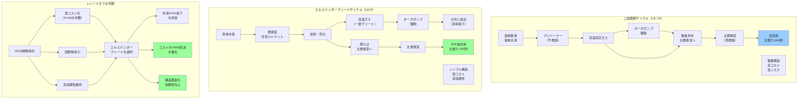

## 要約（Summary）

- H3ロケットの1段エンジンLE-9は、H-IIAのLE-7Aが採用していた高効率な「二段燃焼サイクル」ではなく、「エキスパンダーブリードサイクル」を採用している
- この選択は、効率を一部犠牲にする代わりに、構造の簡素化・部品点数削減・信頼性向上・低コスト化を優先した戦略的判断である
- H3の開発目的である「低コスト」「国際競争力」を実現するための、効率と簡素化のトレードオフの具体例

## 本文（Body）

### 背景・問題意識

ロケットエンジンの燃焼サイクルは、エンジンの性能・コスト・信頼性を左右する最も重要な設計選択の一つである。H-IIAのLE-7Aエンジンは「二段燃焼サイクル（Staged Combustion Cycle）」を採用し、高い効率を実現していたが、複雑な構造により製造コストと開発リスクが高かった。

H3の開発では、[[20251224125727-h3-rocket-three-strategic-goals|国際競争力（低コスト化）]]を重要目的の一つとしており、エンジン設計においてもこの目的を達成する技術選択が求められた。LE-9エンジンの燃焼サイクル選択は、まさにこの戦略的判断を体現している。

### アイデア・主張

**LE-9エンジンのエキスパンダーブリードサイクル採用は、「最高効率の追求」から「効率・コスト・信頼性のバランス最適化」への設計思想の転換を示している。高効率よりも、構造簡素化による低コスト・高信頼性を優先することで、H3の戦略的目的である国際競争力を実現する。**

#### LE-7A（H-IIA）とLE-9（H3）の比較

| 項目 | LE-7A（H-IIA） | LE-9（H3） |
|------|---------------|-----------|
| 燃焼サイクル | 二段燃焼サイクル | エキスパンダーブリードサイクル |
| 比推力（効率） | 高い（約440秒） | やや低い（約425秒） |
| 構造複雑さ | 高い（プリバーナー必要） | 低い（プリバーナー不要） |
| 部品点数 | 多い | 少ない |
| 製造コスト | 高い | 低い |
| 開発リスク | 高い | 低い |
| 信頼性 | 実績で高いが初期開発困難 | 構造的に高い |

#### 二段燃焼サイクル（Staged Combustion Cycle）の特徴

**仕組み：**
- 推進剤の一部をプリバーナー（予燃焼器）で燃焼させ、高温高圧ガスを生成
- このガスでターボポンプを駆動し、推進剤を主燃焼室に送る
- プリバーナーで使用したガスも主燃焼室で再燃焼（二段燃焼）

**メリット：**
- 非常に高い比推力（燃料効率）を実現
- 推進剤をほぼ完全に燃焼させる

**デメリット：**
- プリバーナーの追加により構造が複雑化
- 高温高圧に耐える部品が必要（高コスト）
- 開発・製造の難易度が高い

#### エキスパンダーブリードサイクル（Expander Bleed Cycle）の特徴

**仕組み：**
- 燃焼室の冷却に使用する液体水素を、冷却ジャケットで気化・加熱
- 加熱されたガスの一部（ブリード）でターボポンプを駆動
- ターボポンプ駆動後のガスは大気に放出（再利用しない）

**メリット：**
- プリバーナー不要で構造がシンプル
- 部品点数が少なく、製造コストが低い
- 冷却と駆動ガス生成を兼ねるため、信頼性が高い
- 開発リスクが低い

**デメリット：**
- 駆動ガスを捨てるため、効率がやや低い（比推力で約3-5%低下）
- 超大型エンジンへのスケールアップが困難

### 内容を視覚化するMermaid図

### 具体例・ケース

**ケース1：効率低下の実際の影響**

- 比推力の3-5%低下は、ペイロード能力に換算すると約5-7%の減少
- GTOへの打上げ能力が、仮に7トンから6.5トンに減少
- しかし、ブースター数の増加（可変構成設計）で補完可能
- コスト削減効果（推定30-40%）の方がはるかに大きい

**ケース2：開発リスクの低減**

- LE-7Aの開発では、プリバーナーの燃焼不安定性に苦しみ、開発期間が延長
- LE-9では、プリバーナーを排除することで、この種の問題を根本的に回避
- 実際、LE-9の開発も課題はあったが、燃焼サイクル起因の問題は少なかった

**ケース3：製造コストの削減**

- プリバーナー関連部品の削減により、部品点数が約20-30%減少（推定）
- 高温高圧に耐える特殊材料・精密加工が不要になり、製造コスト削減
- 量産時の品質管理・検査工程も簡素化

**比較：SpaceXの選択**

- SpaceXのMerlinエンジン（Falcon 9）は「ガスジェネレーター サイクル」を採用
- 二段燃焼より更にシンプルで低コスト、ただし効率はさらに低い
- 「低コスト+量産+再使用」でトータルのコスト競争力を実現
- H3のLE-9は、効率とコストの中間的なバランスを選択

### 反論・限界・条件

**「効率を犠牲にして競争力を失わないか？」**

- 効率低下は約3-5%であり、他の手段（可変構成、機体軽量化等）で補完可能
- ロケットの総コストに占めるエンジンコストは大きく、エンジンのコスト削減効果が効率低下を上回る
- 実際、SpaceXは更に低効率なエンジンで市場を席巻している（再使用+低コストで）

**「二段燃焼サイクルの技術を失うのでは？」**

- LE-7Aで培った技術は失われるわけではなく、今後の研究開発に活かされる
- H3の目的は「現時点での最適解」であり、将来の技術選択を縛るものではない
- 技術的挑戦よりも、実用的な競争力を優先した判断

**「エキスパンダーブリードは大型化に限界があるのでは？」**

- 冷却ジャケットでの加熱量に限界があるため、超大型エンジンへのスケールは困難
- LE-9は中大型ロケット用として適切なサイズ範囲
- 超大型ロケットが必要になれば、別の燃焼サイクルを検討する可能性

**成立条件：**
- H3の目標ペイロード能力が、エキスパンダーブリードサイクルで達成可能な範囲であること
- 可変構成設計により、効率低下を補完できること
- 低コスト化の市場価値が、効率低下のデメリットを上回ること

**設計判断の一般化：**
- 「理論的最適解」よりも「総合的な最適解」を選ぶ
- トレードオフの明確化：何を得て、何を失うかを定量的に評価
- 戦略目的（この場合は低コスト化）に沿った技術選択

## 関連ノート（Links）

- [[20251224125727-h3-rocket-three-strategic-goals|H3ロケットの3つの戦略的目的：自立性・国際競争力・柔軟性]] LE-9の設計選択が「国際競争力」目的を実現
- [[20251224095733-ecs-lifecycle-control-design-philosophy|ECSライフサイクル制御の設計思想：目的別手段の選択と意思決定観点]] 目的に応じた手段の選択という共通思想
- [[20251224125910-variable-configuration-design-rocket-flexibility|可変構成設計によるロケットの柔軟性向上：モジュラー化とミッション最適化]] 効率低下を可変構成で補完

## To-Do / 次に考えること

- [ ] LE-9の実際の比推力データを確認し、LE-7Aとの定量的比較を行う
- [ ] 他国のロケットエンジンの燃焼サイクル選択を調査（Ariane、Vulcan等）
- [ ] エンジンコストがロケット総コストに占める割合を調査
- [ ] 「理論的最適」vs「総合的最適」の判断フレームワークを一般化
