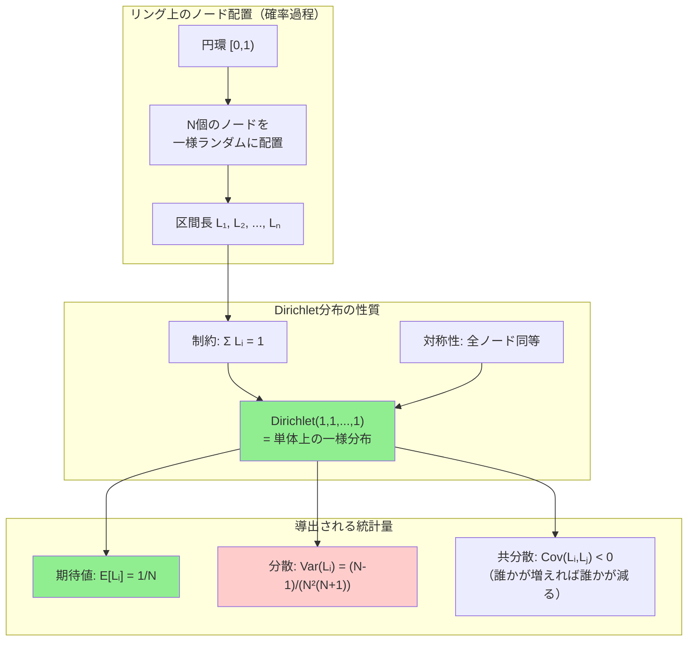

## 要約（Summary）

- Consistent Hashingのリング上で、N個のノードをランダム配置したときの区間長（各ノードの担当範囲）はDirichlet(1,1,...,1)分布に従う。
- Dirichlet分布は「足して1になる確率ベクトル」を生成する分布であり、リングを一周＝1とした時の各区間の割合を自然に表現できる。
- この数理モデルにより、負荷偏り（分散）やキー移動量（期待値）を厳密に計算可能になる。

## 本文（Body）

[[20251221152243-consistent-hash-ring-algorithm|Consistent Hash Ring]]では、ノードとキーをリング上に配置する。このリングを確率空間として数学的にモデル化すると、負荷分散の性質を厳密に解析できる。その鍵となるのがDirichlet分布である。

### 背景・問題意識

[[20251221152245-virtual-nodes|仮想ノード]]の解析では「負荷偏りの標準偏差は $\sigma \propto \frac{1}{\sqrt{v}}$」という関係が知られているが、**なぜそうなるのか**の数学的基盤は明示されていなかった。

また、[[20251221152241-consistent-hashing-design-goal|キー移動が約1/(N+1)になる]]ことも知られているが、これも直感的説明に留まっていた。

これらを**確率論的に厳密に証明**するには、リング上のノード配置を確率過程として扱う必要がある。

### アイデア・主張

**リング上の区間長はDirichlet分布に従う**

ハッシュ空間を円環 $[0,1)$（端点0と1は同一視）とし、N個のノードを一様ランダムに配置する：

$$X_1, X_2, \dots, X_N \stackrel{iid}{\sim} \mathrm{Unif}(0,1)$$

これらを昇順に並べた順序統計量を $X_{(1)} \le X_{(2)} \le \cdots \le X_{(N)}$ とすると、各ノードの担当区間長は：

$$L_i = \begin{cases}
X_{(i)} - X_{(i-1)} & (i=2,\dots,N) \\
1 - X_{(N)} + X_{(1)} & (i=1)
\end{cases}$$

このとき、ベクトル $(L_1, L_2, \dots, L_N)$ は：

$$(L_1, L_2, \dots, L_N) \sim \mathrm{Dirichlet}(1, 1, \dots, 1)$$

に従う。これは「単体（simplex）上の一様分布」であり、次の性質を満たす：

- $L_i \ge 0$ （非負）
- $\sum_{i=1}^N L_i = 1$ （合計が1＝リング一周）
- 全ての $L_i$ が対称（どのノードも同等に扱われる）

### Dirichlet分布の数学的定義

一般にパラメータ $\alpha_1, \dots, \alpha_K > 0$ を持つDirichlet分布の密度関数は：

$$f(x_1,\dots,x_K) = \frac{1}{B(\alpha)} \prod_{i=1}^{K} x_i^{\alpha_i-1}$$

ここで正規化定数（多変量ベータ関数）は：

$$B(\alpha) = \frac{\prod_{i=1}^{K}\Gamma(\alpha_i)}{\Gamma\left(\sum_{i=1}^{K}\alpha_i\right)}$$

$\Gamma(\cdot)$ はガンマ関数（$\Gamma(n) = (n-1)!$ の拡張）。

**Consistent Hashingでは全て $\alpha_i=1$ なので**、これは単体上の一様分布になる。

### 内容を視覚化するMermaid図

### Dirichlet分布から導出される統計量

総和を $\alpha_0 = \sum_{i=1}^N \alpha_i$ とすると、一般のDirichlet分布について：

**期待値**：
$$\mathbb{E}[L_i] = \frac{\alpha_i}{\alpha_0}$$

Consistent Hashingでは $\alpha_i=1$ なので $\alpha_0=N$ より：

$$\mathbb{E}[L_i] = \frac{1}{N}$$

これは「各ノードが均等に担当する」という直感と一致する。

**分散**：
$$\mathrm{Var}(L_i) = \frac{\alpha_i(\alpha_0 - \alpha_i)}{\alpha_0^2(\alpha_0+1)}$$

Consistent Hashingでは：

$$\mathrm{Var}(L_i) = \frac{1 \cdot (N-1)}{N^2(N+1)} = \frac{N-1}{N^2(N+1)} \approx \frac{1}{N^3}$$

標準偏差は：

$$\sqrt{\mathrm{Var}(L_i)} \approx \frac{1}{N^{3/2}}$$

**共分散**（$i \neq j$）：
$$\mathrm{Cov}(L_i, L_j) = -\frac{\alpha_i \alpha_j}{\alpha_0^2(\alpha_0+1)} = -\frac{1}{N^2(N+1)}$$

共分散が負なのは「合計が1固定」という制約から、あるノードの担当が増えれば他が減る相互依存性を表す。

### 具体例：最大ギャップの期待値

実務上重要なのは「最も負荷が大きいノード」＝最大区間長 $L_{\max} = \max_i L_i$ である。

極値理論により：

$$L_{\max} \approx \frac{\log N}{N}$$

つまり、**最悪ノードは平均の $\log N$ 倍程度まで膨らみ得る**。

**数値例**：
- N=10: 平均10%、最大 ≈ 23%（2.3倍）
- N=100: 平均1%、最大 ≈ 4.6%（4.6倍）

これが「ノードが少ないと偏りやすい」の数学的根拠である。

### ガンマ分布による生成法

Dirichlet分布は実装上も重要で、次の手順で生成できる：

1. 独立にガンマ分布からサンプル：$Y_i \sim \mathrm{Gamma}(\alpha_i, 1)$
2. 正規化：$L_i = \frac{Y_i}{\sum_{j=1}^N Y_j}$

すると $(L_1, \dots, L_N) \sim \mathrm{Dirichlet}(\alpha_1, \dots, \alpha_N)$。

これが「Dirichlet = 正規化したガンマ」という理解の鍵である。

### 反論・限界・条件

**理想的なハッシュ関数を前提**：
- 上記の解析は「ハッシュ値が真に一様ランダム」であることを前提とする
- 実際のハッシュ関数（CRC32、MurmurHash等）では微小な偏りがありうる
- ただし実用上は無視できる程度

**サンプル数が十分大きい場合のみ**：
- N が小さい（<10）と、最大ギャップの揺れが大きい
- これが[[20251221152245-virtual-nodes|仮想ノード]]の必要性につながる

**ノード削除・追加時の動的解析**：
- 上記は静的な配置の解析
- ノード追加時のキー移動量は別の確率論的証明が必要（後述のzettelで扱う）

## 関連ノート（Links）

- [[20251221152243-consistent-hash-ring-algorithm|Consistent Hash Ringのアルゴリズム（サーバとキーの配置）]] - この数理モデルの基盤となるアルゴリズム
- [[20251221152245-virtual-nodes|仮想ノード（Virtual Nodes）による負荷分散の均一化]] - Dirichlet分布のパラメータを変えて偏りを減らす手法
- [[20251221152241-consistent-hashing-design-goal|Consistent Hashingの設計目的とキー移動最小化]] - 数理モデルが支える設計目標
- [[20251221152244-consistent-hashing-locality-principle|Consistent Hashingの局所的影響の原理]] - 区間長の分布が局所性を生む

## To-Do / 次に考えること

- [ ] 仮想ノードを導入した場合のDirichlet(V, V, ..., V)への拡張を別zettelで詳述
- [ ] ノード追加時のキー移動量の確率論的証明を別zettelで記述
- [ ] 実際のハッシュ関数（CRC32等）での分布の歪みを実験的に検証
