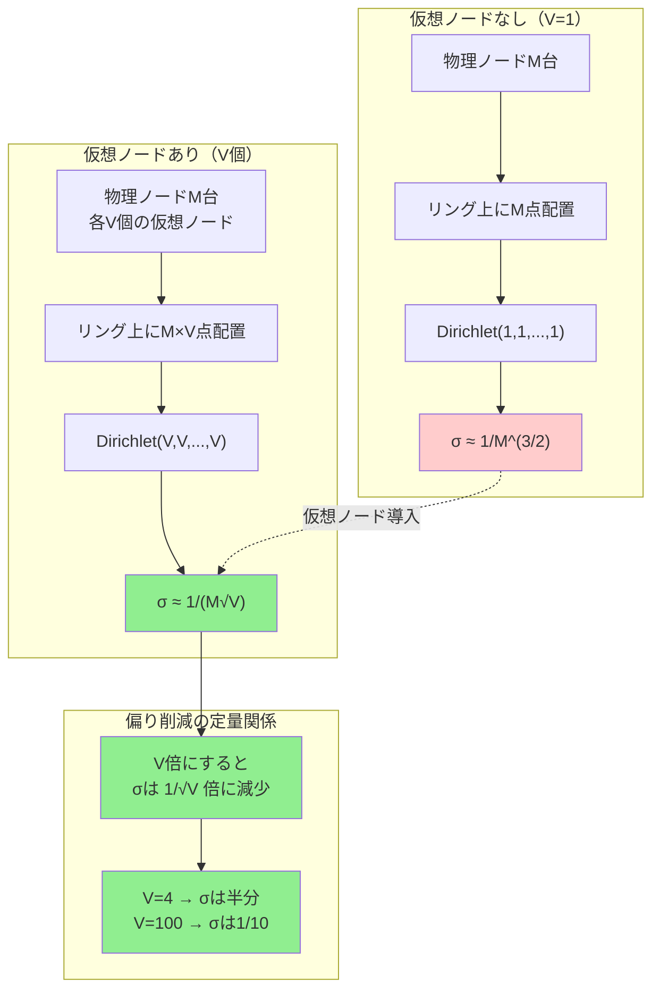

## 要約（Summary）

- 物理ノードM台が各V個の仮想ノードを持つとき、物理ノードの担当率はDirichlet(V, V, ..., V)分布に従う。
- このとき負荷偏りの標準偏差は $\sigma \approx \frac{1}{M\sqrt{V}}$ となり、仮想ノード数Vに対して $1/\sqrt{V}$ で改善する。
- この数学的関係により「偏りを半分にしたいなら仮想ノードを4倍にする」といった定量的な設計が可能になる。

## 本文（Body）

[[20251221152245-virtual-nodes|仮想ノード]]は負荷偏りを減らす手法として知られているが、その効果の大きさを数学的に定量化できる。[[20251226012125-dirichlet-distribution-consistent-hashing|Dirichlet分布モデル]]を仮想ノードに拡張することで、厳密な分散の導出が可能になる。

### 背景・問題意識

[[20251226012125-dirichlet-distribution-consistent-hashing|基本的なConsistent Hashing]]では、各物理ノードをリング上の1点に配置すると、負荷偏りの標準偏差が $\approx 1/N^{3/2}$ となる。

しかし実務上、ノード数Nが小さい（〜10台）場合、この偏りは無視できない。例えばN=5の場合、標準偏差は約9%にもなる。

[[20251221152245-virtual-nodes|仮想ノード]]を使うと「偏りが減る」ことは経験的に知られているが、**どの程度減るのか**を数学的に定量化する必要がある。

### アイデア・主張

**物理ノード担当率はDirichlet(V, V, ..., V)に従う**

設定：
- 物理ノード：M台
- 各物理ノードが持つ仮想ノード数：V個
- リング上の合計点数：$n = M \times V$

**ステップ1：リング上の区間長**

リング上にn個の点（仮想ノード）を一様ランダムに配置すると、n個の区間が生まれる。各区間長を $l_1, l_2, \dots, l_n$ とすると：

$$(l_1, l_2, \dots, l_n) \sim \mathrm{Dirichlet}(1, 1, \dots, 1)$$

**ステップ2：物理ノードごとに集約**

物理ノード$j$の担当率 $S_j$ は、そのノードに属するV個の区間長の和：

$$S_j = \sum_{k=1}^{V} l_{j,k}$$

Dirichlet分布の**加法性**により、物理ノードの担当率ベクトルは：

$$(S_1, S_2, \dots, S_M) \sim \mathrm{Dirichlet}(V, V, \dots, V)$$

つまり、パラメータが1からVに増える。

**ステップ3：分散の計算**

Dirichlet分布の分散公式：

$$\mathrm{Var}(S_j) = \frac{V(MV - V)}{(MV)^2(MV+1)} = \frac{V^2(M-1)}{M^2V^2(MV+1)}$$

$$= \frac{M-1}{M^2(MV+1)} \approx \frac{1}{M^2 V}$$

したがって標準偏差は：

$$\sigma_j = \sqrt{\mathrm{Var}(S_j)} \approx \frac{1}{M\sqrt{V}}$$

### 内容を視覚化するMermaid図

### 具体的な数値例

**設定**：物理ノード M=5 台

| 仮想ノード数V | 標準偏差σ | 相対偏り |
|-------------|---------|---------|
| 1（なし） | 1/(5×1) ≈ 20% | 非常に大きい |
| 10 | 1/(5×√10) ≈ 6.3% | 中程度 |
| 100 | 1/(5×√100) ≈ 2.0% | 小さい |
| 1000 | 1/(5×√1000) ≈ 0.6% | 非常に小さい |

**観察**：
- V=1→100で偏りが**10倍**改善
- V=100が実用的なバランス（メモリと精度のトレードオフ）

**設計指針**：
「偏りを半分にしたい」→ V を4倍にする（$\frac{1}{\sqrt{4}} = \frac{1}{2}$）

### Dirichlet分布のパラメータαの意味

一般に $\mathrm{Dirichlet}(\alpha, \alpha, \dots, \alpha)$ において：

- **α が大きいほど**各成分が期待値の周りに集中（分散が小さい）
- **α が小さいほど**端に寄りやすい（分散が大きい）

仮想ノード数 V = α なので：
- V=1: 各物理ノードの担当率は大きくばらつく
- V=100: 各物理ノードの担当率は 1/M の周りに集中

これが「仮想ノードで均等化される」メカニズムの数理的本質である。

### 重み付き仮想ノードの拡張

物理ノードごとに性能が異なる場合、重み $w_j > 0$ を設定し、仮想ノード数を $V_j \propto w_j$ にする。

このとき：

$$(S_1, \dots, S_M) \sim \mathrm{Dirichlet}(V_1, \dots, V_M)$$

期待担当率は：

$$\mathbb{E}[S_j] = \frac{V_j}{\sum_{k=1}^M V_k} = \frac{w_j}{\sum_{k} w_k}$$

分散は：

$$\mathrm{Var}(S_j) \propto \frac{1}{V_j}$$

つまり、**高性能ノード（大きい$w_j$）ほど多くの仮想ノードを持ち、より多く担当するが、仮想ノード数も多いため相対的な偏りは抑えられる**。

### 実装上のトレードオフ

**メモリコスト**：
- リング上の点の数：$M \times V$
- ルックアップテーブルのサイズに比例
- V=100, M=10 なら1000エントリ（許容範囲）

**計算コスト**：
- ルックアップ：$O(\log(M \times V))$
- V=1とV=100で $\log 10$ → $\log 1000$ ≈ 2倍（実用上無視できる）

**精度向上**：
- 上記の分散公式により、必要なVを事前計算可能
- 目標偏り $\sigma_{\text{target}}$ を決めて逆算：

$$V = \left(\frac{1}{M \sigma_{\text{target}}}\right)^2$$

例：M=5, $\sigma_{\text{target}}=2\%$ なら $V = (1/(5 \times 0.02))^2 = 100$

### 反論・限界・条件

**ハッシュ関数の品質に依存**：
- 上記はハッシュ値が真に一様ランダムであることを前提
- 実際には微小な偏りが残りうる

**最大ギャップはまだ残る**：
- 標準偏差は減るが、最大担当率 $S_{\max}$ は依然として平均より大きい
- 極値理論により $S_{\max} \approx \frac{1}{M} + O(\frac{\log(MV)}{MV})$
- ただし実用上は $V \ge 100$ で十分小さくなる

**動的なノード増減**：
- 上記は静的配置の解析
- ノード追加時の仮想ノードの再配置戦略は別途設計が必要

## 関連ノート（Links）

- [[20251226012125-dirichlet-distribution-consistent-hashing|Dirichlet分布によるConsistent Hashingの区間長モデル]] - この解析の数理的基盤
- [[20251221152245-virtual-nodes|仮想ノード（Virtual Nodes）による負荷分散の均一化]] - 同じテーマの概念的説明
- [[20251221152243-consistent-hash-ring-algorithm|Consistent Hash Ringのアルゴリズム（サーバとキーの配置）]] - 実装の基盤
- [[20251221152241-consistent-hashing-design-goal|Consistent Hashingの設計目的とキー移動最小化]] - 負荷均等化の設計目標

## To-Do / 次に考えること

- [ ] 実際のハッシュ関数（CRC32, MurmurHash）での偏り測定実験
- [ ] 最大ギャップ $S_{\max}$ の分布を極値理論で詳細解析
- [ ] 重み付き仮想ノードの実装例をOpenTelemetry Collectorで検証
