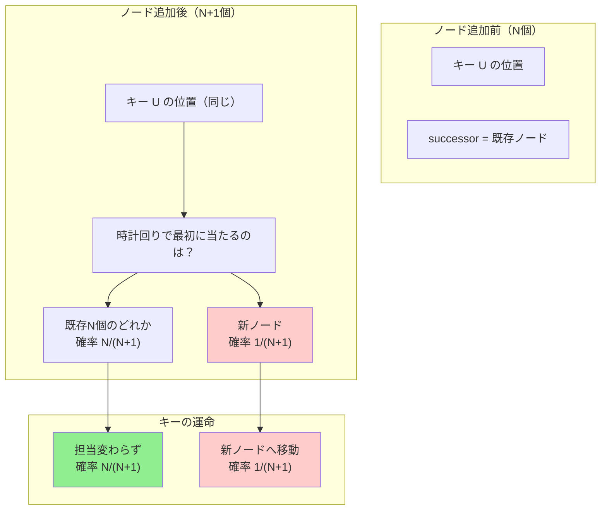

## 要約（Summary）

- Consistent Hashingでノードを1台追加すると、キーの移動率は期待値で正確に $\frac{1}{N+1}$ になる。
- これは「新ノードが任意のキーのsuccessor（時計回りで最初に当たるノード）になる確率」が対称性により $\frac{1}{N+1}$ であることから導出される。
- ノード削除時は、削除ノードが担当していたキーだけが移動し、期待移動率は $\frac{1}{N}$ となる。

## 本文（Body）

[[20251221152241-consistent-hashing-design-goal|Consistent Hashingの設計目的]]は「ノード増減時のキー移動を最小化すること」である。この目的が達成されることを、[[20251226012125-dirichlet-distribution-consistent-hashing|確率論的モデル]]を使って厳密に証明する。

### 背景・問題意識

[[20251221152241-consistent-hashing-design-goal|設計目的のzettel]]では「N台から(N+1)台にすると、約 $\frac{1}{N+1}$ のキーが移動する」と述べられているが、**なぜそうなるのか**の数学的証明は示されていなかった。

単純モジュロ法（$\text{node} = \text{hash}(key) \mod N$）では、Nが変わるとほぼ全キーの割当先が変わる。対照的に、Consistent Hashingでは移動が最小限に抑えられる。この「最小限」を定量的に証明する。

### アイデア・主張

**定理：ノード追加時のキー移動率**

N個のノードが一様ランダムにリング上に配置されているとき、新ノード1台を追加すると：

$$\mathbb{E}[\text{移動するキーの割合}] = \frac{1}{N+1}$$

**証明**

リング $[0,1)$ 上に既存ノード $N$ 個と新ノード1個（合計 $N+1$ 個）が一様独立にランダム配置されているとする。

任意のキー位置 $U \sim \mathrm{Unif}(0,1)$ を固定する。

**キーの割当規則**：キー $U$ は時計回りで最初に遭遇するノード（successor）に割り当てられる。

**移動条件**：キーが移動するのは、「successor が新ノードになる」場合である。

**対称性による確率計算**：
- $N+1$ 個のノード位置は全て一様独立同分布
- キー位置 $U$ から見て、時計回りで最初に当たるノードが「どのノード」であるかは、全ノードに対して等確率
- したがって：

$$\Pr(\text{successor が新ノード}) = \frac{1}{N+1}$$

**期待移動率の計算**：
- 全キーに対して独立に上記の確率が成立
- 大数の法則により、移動するキーの割合は期待値 $\frac{1}{N+1}$ に収束

**証明終わり** □

### 内容を視覚化するMermaid図

### 具体的な数値例

| 既存ノード数N | 追加後 | 期待移動率 | 期待残存率 |
|------------|-------|-----------|-----------|
| 4 | 5 | 1/5 = 20% | 80% |
| 9 | 10 | 1/10 = 10% | 90% |
| 99 | 100 | 1/100 = 1% | 99% |

**観察**：
- ノード数が多いほど、追加時の影響は小さい
- これは $\frac{1}{N+1}$ が単調減少するため

**単純モジュロ法との対比**：
- 単純モジュロ法：N=4→5で約 $(N-1)/N = 80\%$ が移動
- Consistent Hashing：N=4→5で $1/(N+1) = 20\%$ だけが移動
- **4倍の改善**

### ノード削除時のキー移動量

**定理：ノード削除時のキー移動率**

N個のノードからランダムに1台を削除すると：

$$\mathbb{E}[\text{移動するキーの割合}] = \frac{1}{N}$$

**証明**

削除されるノード $j$ の担当率を $L_j$ とする。

[[20251226012125-dirichlet-distribution-consistent-hashing|Dirichlet分布モデル]]により：

$$(L_1, \dots, L_N) \sim \mathrm{Dirichlet}(1, \dots, 1)$$

$$\mathbb{E}[L_j] = \frac{1}{N}$$

ノード $j$ を削除すると、$L_j$ が担当していたキーが次のノードに移動する。

削除ノードがランダム（または対称性により任意）なら：

$$\mathbb{E}[\text{移動率}] = \mathbb{E}[L_j] = \frac{1}{N}$$

**証明終わり** □

### 仮想ノードがある場合の拡張

物理ノードM台、各V個の仮想ノードを持つ場合：

**追加時**：
- 物理ノード1台（＝V個の仮想ノード）を追加
- 各仮想ノードは独立にリング上の位置を占める
- 全体では $M \times V$ → $(M+1) \times V$ 点に増加

期待移動率：

$$\mathbb{E}[\text{移動率}] \approx \frac{V}{(M+1)V} = \frac{1}{M+1}$$

つまり、**物理ノード単位で見れば移動率は仮想ノード数によらず $\frac{1}{M+1}$**。

ただし、移動は複数の小区間に分散される：
- 仮想ノードなし：1箇所の大きな区間から移動
- 仮想ノードあり：V箇所の小さな区間から移動

これにより「キャッシュの温まり直しが分散される」という実務上の利点が生まれる。

### 対称性がない場合（重み付き）

物理ノードに重み $w_j$ がある場合、仮想ノード数 $V_j \propto w_j$ とすると：

新ノード（重み $w_{\text{new}}$）を追加したときの期待移動率：

$$\mathbb{E}[\text{移動率}] = \frac{w_{\text{new}}}{\sum_{k} w_k + w_{\text{new}}}$$

これは重み正規化された担当率に対応する。

### 実装上の注意点

**ハッシュ衝突**：
- 実装では有限のハッシュ空間（例：32bit）を使う
- 衝突が起きると上記の理想モデルから逸脱する
- ただし十分大きなハッシュ空間（64bit以上）では無視できる

**非一様なキー分布**：
- 上記の証明はキーが一様ランダムであることを前提
- 実際のキー（session.id等）が偏っていても、良いハッシュ関数なら一様化される

### 反論・限界・条件

**最悪ケースは $\frac{1}{N+1}$ より大きい**：
- 上記は期待値（平均的な挙動）
- 新ノードがたまたま大きな区間に配置されると、$\frac{1}{N+1}$ より多く移動しうる
- ただし[[20251226012125-dirichlet-distribution-consistent-hashing|Dirichlet分布]]の分散により、大きく外れる確率は低い

**累積的な移動**：
- ノードを連続して複数台追加すると、累積移動率は単純和にならない（一部のキーが複数回移動する可能性）
- ただし各回の移動は独立に近いため、実用上は合算で近似可能

**[[20251221152244-consistent-hashing-locality-principle|局所性]]との関係**：
- 上記の証明は「どのキーが移動するか」までは特定しない
- 実際には新ノードの周辺の区間のキーだけが移動（局所性）
- これは別の解析で示される性質

## 関連ノート（Links）

- [[20251221152241-consistent-hashing-design-goal|Consistent Hashingの設計目的とキー移動最小化]] - この証明が裏付ける設計目標
- [[20251226012125-dirichlet-distribution-consistent-hashing|Dirichlet分布によるConsistent Hashingの区間長モデル]] - 証明の数理的基盤
- [[20251221152244-consistent-hashing-locality-principle|Consistent Hashingの局所的影響の原理]] - どのキーが移動するかの空間的局所性
- [[20251226012250-virtual-nodes-dirichlet-variance-analysis|仮想ノードによる負荷偏り削減のDirichlet分布解析]] - 仮想ノードがある場合の拡張

## To-Do / 次に考えること

- [ ] 複数ノード同時追加時の累積移動率の厳密な解析
- [ ] 最悪ケース移動率の確率分布（信頼区間の計算）
- [ ] 実装（OpenTelemetry Collector等）での移動率の実測と理論値の比較
