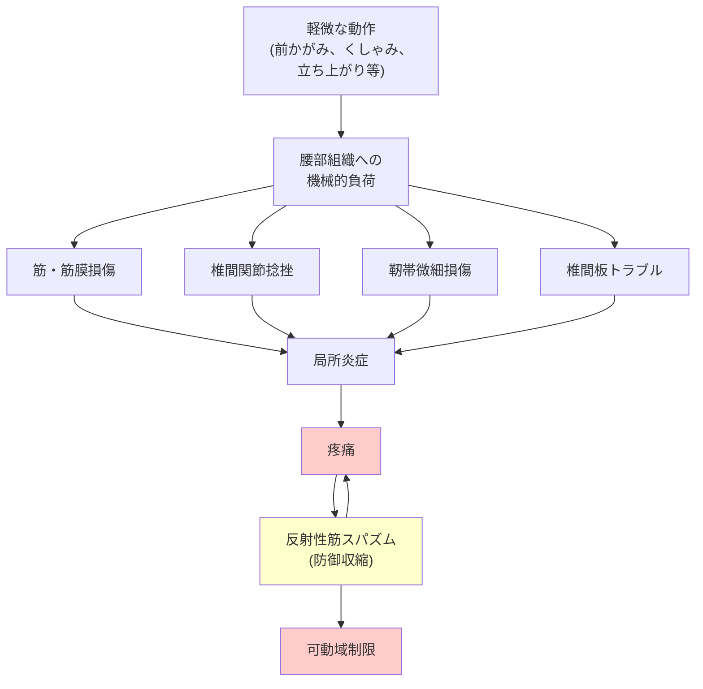

## 要約（Summary）

- ぎっくり腰は「急性腰痛」の俗称で、単一の病名ではなく「腰部組織が急激に破綻した状態」を指す
- 筋肉・筋膜、椎間関節、靭帯、椎間板などのいずれか（または複数）が損傷し、炎症と筋スパズム（防御反応）が起きる
- 重い物を持った時だけでなく、くしゃみ・前かがみなどの軽微な動作でも発症しうる

## 本文（Body）

### 背景・問題意識

ぎっくり腰は「突然起きる強い腰の痛み」として広く知られているが、具体的に何が起きているのか、なぜ軽い動作でも発症するのかは意外と理解されていない。医学的には「急性腰痛症」と呼ばれ、**病名というより"状態の呼び方"**である点が重要である。

### アイデア・主張

**ぎっくり腰は単一の病態ではなく、腰部の複数の構造要素のいずれかが急激に破綻し、それに伴う炎症と筋肉の防御反応（筋スパズム）が組み合わさった急性疼痛状態である。**

腰部は以下の要素で構成されている：
- 骨（腰椎）
- 椎間板
- 関節（椎間関節）
- 靭帯
- 筋肉・筋膜
- 神経

これらのどこか（または複数）が**急に破綻して炎症や筋肉の防御反応（強いこわばり）**が起き、「動けないほど痛い」状態になる。

よくある原因候補：
1. **筋肉・筋膜の損傷**（肉離れ様の損傷、筋膜性の痛み）
2. **椎間関節の捻挫**（背骨の後ろ側の関節）
3. **靭帯や小さな組織の微細損傷**
4. **椎間板由来の痛み**（軽度の椎間板トラブル）
5. **それに伴う筋スパズム**（反射的な筋痙攣）

### 内容を視覚化するMermaid図

### 具体例・ケース

- **重量物挙上時**：腰椎に過度な圧迫が加わり椎間関節や椎間板が損傷
- **くしゃみ時**：腹圧の急激な上昇により腰椎周囲の靭帯・筋膜が微細損傷
- **前かがみからの立ち上がり**：椎間関節に回旋ストレスがかかり関節包の捻挫
- **朝の起床時**：夜間の不動状態から急な動作で筋・筋膜が引き伸ばされて損傷

### 反論・限界・条件

- **画像診断で原因が特定できないことが多い**：MRIやX線では明確な異常を捉えられない場合も多い
- **自然治癒が基本**：多くの場合、具体的な損傷部位が不明でも数日〜数週間で自然軽快する
- **筋スパズムは二次的**：痛みによる反射的な筋収縮は防御反応であり、原因ではなく結果である点を理解する必要がある
- **慢性化リスク**：一部（約10-15%）は慢性腰痛に移行するため、予防的アプローチ（早期活動再開、心理社会的要因の評価）が重要

## 関連ノート（Links）

- [[20251226014700-acute-back-pain-red-flags|急性腰痛のレッドフラグ（危険サイン）識別法]] - レッドフラグで重篤な疾患を除外する必要がある
- [[20251226014715-acute-back-pain-initial-management|急性腰痛の初期対処法と活動性維持の原則]] - 病態理解に基づく初期対処が重要
- [[20251220140610-early-onset-jaundice-clinical-significance|生後24時間以内黄疸の臨床的意義と溶血性疾患の除外]] - 医学的レッドフラグの識別原則（類似の思考プロセス）

## To-Do / 次に考えること

- [ ] 慢性腰痛への移行リスク因子について別zettelを作成
- [ ] 椎間板ヘルニアとの鑑別診断についてまとめる
- [ ] 予防的な体幹トレーニングの効果について調査
