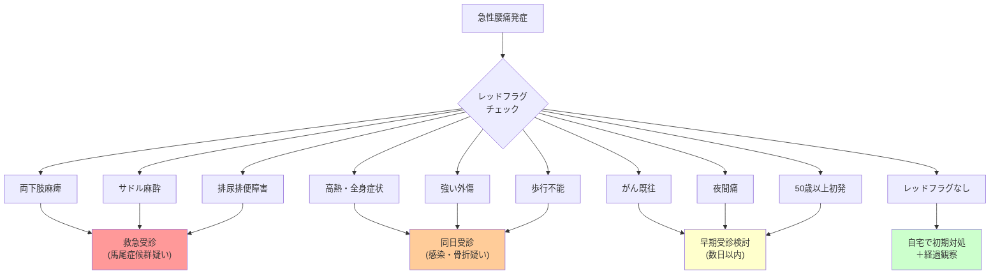

## 要約（Summary）

- 急性腰痛の大半は自然治癒するが、重篤な疾患（馬尾症候群、感染、骨折、悪性腫瘍等）を見逃さないためのレッドフラグ（警告徴候）の評価が必須
- 両下肢の麻痺・サドル麻酔・排尿排便障害は救急受診の絶対適応
- 発熱・外傷・がん既往・夜間痛などがあれば早期（同日）受診を検討

## 本文（Body）

### 背景・問題意識

急性腰痛（ぎっくり腰）の約90%は非特異的腰痛（明確な構造的原因が特定できない）であり、自然経過で改善する。しかし、残りの約10%には**見逃してはならない重篤な疾患**が隠れている可能性がある。

医療現場では、限られた時間で「自宅経過観察可能」と「即座に精査が必要」を切り分けるために、**レッドフラグ（Red Flags）**と呼ばれる警告徴候のチェックリストが広く使われている。

### アイデア・主張

**急性腰痛の初期評価では、まず「レッドフラグ（危険サイン）」の有無を確認し、重篤な疾患（馬尾症候群、脊髄圧迫、感染、骨折、悪性腫瘍等）を除外することが最優先である。**

レッドフラグがあれば、自己判断で経過観察せず、速やかに医療機関を受診する。

### レッドフラグのチェックリスト

#### 救急受診（119/救急外来）の絶対適応

以下の1つでも該当すれば**馬尾症候群・脊髄圧迫を疑い、即座に受診**：

1. **両下肢のしびれ・麻痺**（特に進行性／片脚でも強い麻痺）
2. **サドル麻酔**（股間・肛門周囲のしびれ・感覚低下）
3. **排尿・排便障害**（尿が出ない／出にくい、尿や便が漏れる）

#### 同日受診推奨（整形外科／救急外来）

4. **高熱**（38℃以上）、強い全身倦怠感 → 感染（化膿性脊椎炎等）を疑う
5. **強い外傷後**（転倒、事故等） → 骨折・脱臼を疑う
6. **歩行不能レベルの痛み** → 重症度評価と疼痛コントロールが必要

#### 早期受診検討（数日以内）

7. **がん既往・免疫低下・ステロイド長期使用** → 悪性腫瘍の骨転移、感染リスク
8. **安静でも痛みが非常に強い、夜間痛が強い** → 炎症性疾患・腫瘍を疑う
9. **50歳以上で初発の激しい腰痛** → 悪性腫瘍、圧迫骨折のリスク
10. **体重減少、食欲不振** → 全身疾患・悪性腫瘍の可能性

### 内容を視覚化するMermaid図

### 具体例・ケース

**ケース1：救急受診が必要な例**
- 40代男性、朝起き上がり時に「グギッ」と腰痛発症
- 午後から**両脚がしびれてきて、力が入らない**
- **尿意はあるが出にくい**
→ **馬尾症候群を疑い、即座に救急受診**（48時間以内の減圧手術で予後が大きく変わる）

**ケース2：同日受診推奨の例**
- 30代女性、くしゃみで腰痛発症
- **歩行不能レベルの痛み**で動けない
- 下肢のしびれ・麻痺はなし
→ トリアージと疼痛コントロールのため**同日中に整形外科受診**

**ケース3：自宅経過観察可能な例**
- 20代男性、重い物を持った後に腰痛
- 前かがみ・寝返りで痛むが、ゆっくりなら歩ける
- 下肢症状なし、発熱なし
→ **レッドフラグなし**。姿勢管理・鎮痛・活動性維持で経過観察

### 反論・限界・条件

- **感度は高いが特異度は低い**：レッドフラグがあっても必ず重篤疾患とは限らない（偽陽性が多い）
- **単独では診断できない**：あくまで「精査が必要かどうか」を判断するスクリーニングツール
- **時間経過で変化しうる**：初期評価で陰性でも、症状が悪化すればレッドフラグが出現することがある → **48-72時間経過しても改善しない場合は再評価**
- **文化的・心理的バリア**：「大げさに思われたくない」「忙しい」などで受診を遅らせるケースがあるが、レッドフラグがあれば優先すべき

## 関連ノート（Links）

- [[20251226014643-acute-lumbar-pain-pathophysiology|ぎっくり腰（急性腰痛症）の病態メカニズム]] - 病態メカニズムの理解が前提
- [[20251226014715-acute-back-pain-initial-management|急性腰痛の初期対処法と活動性維持の原則]] - レッドフラグ陰性の場合の対処
- [[20251220140610-early-onset-jaundice-clinical-significance|生後24時間以内黄疸の臨床的意義と溶血性疾患の除外]] - 新生児黄疸のレッドフラグ（医学的スクリーニングの類似構造）

## To-Do / 次に考えること

- [ ] 馬尾症候群の詳細（病態・診断・治療）を別zettelにまとめる
- [ ] レッドフラグの感度・特異度に関するエビデンスを調査
- [ ] 高齢者の腰痛における特有のレッドフラグ（骨粗鬆症性圧迫骨折等）を整理
