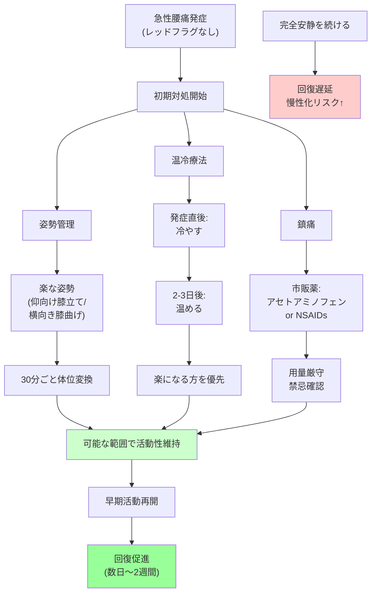

## 要約（Summary）

- 急性腰痛の初期対処は「完全安静」ではなく「可能な範囲で動く」が現代の標準
- 姿勢管理（楽な姿勢の選択）、温冷療法、適切な鎮痛が3本柱
- 長期のベッド安静は回復を遅らせる可能性があり、早期の活動再開が推奨される

## 本文（Body）

### 背景・問題意識

従来、ぎっくり腰（急性腰痛）の治療は「とにかく安静に」が常識だった。しかし、**1990年代以降の複数の臨床研究により、長期の安静臥床は回復を遅らせ、慢性化リスクを高める**ことが明らかになった。

現在の国際的なガイドライン（米国、英国、日本整形外科学会等）では、**「レッドフラグがなければ、可能な範囲で日常活動を維持する」**ことが推奨されている。

### アイデア・主張

**急性腰痛の初期対処は、痛みをゼロにすることではなく、「悪化を防ぎつつ、可能な範囲で動ける状態に保つ」ことが目的である。姿勢管理・温冷療法・鎮痛の3つを組み合わせ、早期に活動性を回復させることが回復を早める。**

### 初期対処の3本柱

#### 1. 姿勢管理（ポジショニング）

**原則：いちばん楽な姿勢でOK**

多くの場合、以下の姿勢が楽になる：
- **仰向けで膝を立てる**（膝下にクッション）
- **横向きで膝を軽く曲げる**（膝の間に枕を挟む）

→ 腰椎の前弯を減らし、椎間関節や筋肉への負荷を軽減

**注意点**：
- 同じ姿勢を長時間続けない（30分〜1時間ごとに体位変換）
- 起き上がる時は「横向き→肘で支えて起き上がる」で腰への負担を減らす

#### 2. 温冷療法

**発症直後〜1-2日**：**冷やす**（アイシング）
- 炎症期には冷却が有効
- 10-15分を1回として、間隔をあけて繰り返す
- 凍傷を防ぐため、直接肌に当てない（タオル越し）

**2-3日以降**：**温める**（温熱療法）
- 筋スパズムが主体になったら温熱で血流改善
- カイロ、ホットパック、入浴など
- ただし、**「楽になる方」を優先**（冷温どちらが正解というエビデンスはない）

#### 3. 鎮痛（薬物療法）

**市販薬の選択肢**：
- **アセトアミノフェン**（カロナール等）：比較的安全、抗炎症作用は弱い
- **NSAIDs**（イブプロフェン、ロキソプロフェン等）：抗炎症作用あり、短期間の使用が基本

**使用上の注意**：
- 胃潰瘍・腎臓病・抗凝固薬内服・喘息・妊娠の可能性がある場合はNSAIDsを避ける
- 説明書の用量を超えない
- 痛みを完全にゼロにする必要はない（活動できる程度に抑えればOK）

**医療機関での選択肢**：
- より強力なNSAIDs、筋弛緩薬、神経障害性疼痛治療薬（プレガバリン等）
- トリガーポイント注射、硬膜外ブロック等

### 活動性維持の原則

**「可能な範囲で動く」が回復を早める**

- **ベッドで完全に固まるより、可能な範囲で立ち上がり・歩行練習をした方が回復が早い**（エビデンスレベル高）
- ただし、「痛みで歩けない」レベルなら無理せず、まず医療機関で疼痛コントロール
- **目安**：
  - 1-2日目：室内での短距離歩行、トイレへの移動
  - 3-5日目：家の中での通常活動
  - 1週間〜：軽い家事、買い物など
  - 2-4週間〜：仕事復帰、軽い運動再開

**重要な注意**：
- 「痛みを我慢して無理に動く」のではなく、「動ける範囲で少しずつ」
- 激痛が走る動作は避ける（が、完全に動かないのも避ける）

### コルセットの使い方

**適応**：
- 痛みで姿勢が崩れる時に「動作を補助する」意味で使用
- 短期間（数日〜2週間程度）の使用に限る

**注意点**：
- 締めすぎは逆効果（呼吸困難、皮膚トラブル）
- 横になる時は緩める
- 長期常用は腰部筋力低下を招く → 依存しない

### 内容を視覚化するMermaid図

### 具体例・ケース

**ケース1：発症当日〜1日目**
- 仰向けで膝下にクッション、10-15分アイシング
- 市販のイブプロフェン服用（用量厳守）
- トイレへの移動は可能なら行う（無理なら家族に補助依頼）

**ケース2：2-3日目**
- 横向きで膝の間に枕、温めて楽になるならカイロ使用
- 室内での短距離歩行を試みる（激痛なら無理しない）
- 家の中での軽い家事（食器洗い程度）を少しずつ

**ケース3：1週間後**
- ほとんどの日常活動が可能
- 軽い散歩を開始
- 重量物の持ち上げは避ける、前かがみ姿勢を長時間続けない

### 反論・限界・条件

- **「動いた方が良い」は万能ではない**：レッドフラグがある場合、重度の神経症状がある場合は即座に受診が優先
- **痛みの個人差は大きい**：「このペースで動くべき」という厳密な基準はなく、個々の痛みと機能に応じて調整
- **心理社会的要因の影響**：恐怖回避思考（「動くと悪化する」という過度な不安）が慢性化を招くことがある → 適切な情報提供と安心感が重要
- **再発予防には体幹強化が有効**：初期対処だけでなく、回復後の予防的トレーニング（コアマッスル強化）が長期的には重要

## 関連ノート（Links）

- [[20251226014643-acute-lumbar-pain-pathophysiology|ぎっくり腰（急性腰痛症）の病態メカニズム]] - 病態理解が対処法の根拠
- [[20251226014700-acute-back-pain-red-flags|急性腰痛のレッドフラグ（危険サイン）識別法]] - 対処前にレッドフラグ除外が必須
- [[20251220050704-code-delivery-with-proof-of-work|エンジニアの責任は動作証明されたコードを届けることである]] - 「動作証明されたもの」を届ける責任（医療では「エビデンスに基づく対処」）
- [[20251220050826-manual-and-automated-testing-two-step-verification|マニュアルテストと自動テストによる二段階検証]] - 二段階検証の思考（初期対処→経過観察→必要なら受診）

## To-Do / 次に考えること

- [ ] 慢性腰痛予防のための体幹トレーニング法を別zettelにまとめる
- [ ] 恐怖回避思考と慢性疼痛の関係について調査
- [ ] NSAIDsの作用機序と副作用プロファイルを整理
- [ ] 急性腰痛のエビデンスに基づくガイドライン（日本整形外科学会、NICE等）を読む
