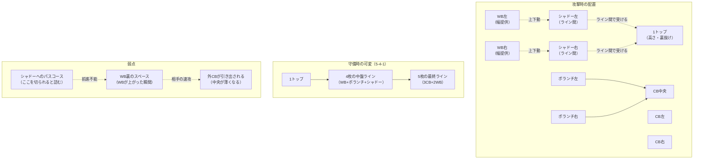

## 要約（Summary）

- 3-4-2-1は「3CB＋2WB＋2ボランチ＋2シャドー＋1トップ」という配置で、WBの上下動とシャドーのライン間取りが成否を決める戦術システム
- 長所は「ライン間の活用」「ボール保持の安定性」「速いカウンター」「5バック化による守備安定」の4点
- 短所は「WBの負荷」「サイド裏の脆弱性」「シャドーが消されると詰む」「噛み合わせの曖昧さ」で、特にWBの質が全体の成否を左右する

## 本文（Body）

### 背景・問題意識

現代サッカーにおいて、フォーメーションは単なる選手配置ではなく、「どこで数的優位を作るか」「どこを捨ててどこを取るか」という戦略的トレードオフの表現である。3-4-2-1は、後方の安定性（3CB）と前線の崩しの選択肢（2シャドー）を両立させようとする設計思想を持つ。

### アイデア・主張

3-4-2-1の強さは「**幅（WB）**」「**間（シャドー）**」「**安定（3CB+2ボランチ）**」という3つの要素が機能的に連動することで生まれる。しかし、この連動は**WBの運動量と質**に依存度が高く、WBが機能しなければ全体が崩れる構造的脆弱性を持つ。

### 内容を視覚化するMermaid図

### 具体例・ケース

#### 成功パターン

1. **ビルドアップ局面**: 相手が2トップで前プレに来る場合、3CB+2ボランチで数的優位（5 vs 2）を作り、簡単に前進できる
2. **崩しの局面**: シャドーが相手ボランチの背中で受ける→1トップが裏に抜ける→WBがクロス、という複数の選択肢を同時に提示
3. **守備の局面**: ボールを奪った瞬間、前線に1トップ+2シャドーがいるため、最短距離でカウンターを開始できる

#### 失敗パターン

1. **WBの疲労**: 後半になりWBの運動量が落ちると、幅が消えて攻撃が単調化、かつ守備時にサイドを使われる
2. **シャドーの無力化**: 相手が「シャドーへの縦パスを切る＋前を向かせない」守備を徹底すると、横パスが増え停滞
3. **噛み合わせミス**: 相手のSBが高く、WGが内に絞るタイプの場合、「WB/外CB/ボランチの誰が対応するか」が不明確だと局所的に数的不利

### 反論・限界・条件

#### 成立条件（必須要件）

このシステムが機能するには、以下の4つが揃う必要がある：

1. **WBの完成度**: 90分走り切れる体力 + 1対1の強さ + クロス/前進の質
2. **シャドーの前向き能力**: ターン技術、ワンタッチプレー、受け方の工夫
3. **外CBの守備範囲**: サイドに引き出されても中央をカバーできる機動力
4. **ボランチの役割分担**: 片方が前進、片方がカバー、のように明確な分業

#### 限界

- **選手の質への依存**: 特にWBとシャドーの個人能力が平均以下だと、システム全体が機能しない
- **相手の適応**: 相手がシステムを理解し「WB裏を狙う」「シャドーを消す」対策を打つと脆弱性が露呈
- **万能ではない**: 相手が5-3-2のような中央密集型の場合、シャドーのスペースが消え、WB頼みになりがち

## 関連ノート（Links）

- [[20251224130048-le9-engine-design-tradeoff-expander-bleed-cycle]] トレードオフの設計思想（性能 vs コスト vs 信頼性）という観点で類似
- [[20251223234018-system-design-prevent-power-corruption]] システム設計における役割分担と監視の原則が、ピッチ上の役割設計と通じる
- [[20251129160317-ai-role-division-what-why-how]] What/Why/Howの役割分担が、「WB=幅、シャドー=崩し、CB=安定」という機能分担と対応
- [[20251221152244-consistent-hashing-locality-principle]] 「局所的影響の原理」がWBの疲労やシャドーの無力化が全体に波及する構造と類似
- [[20251221223638-multidimensional-investment-outcome-evaluation-framework]] 多面的評価の考え方が、フォーメーションの「攻撃/守備/可変性/選手負荷」という多軸評価と通じる

## To-Do / 次に考えること

- [ ] 実際の試合映像で3-4-2-1の成功例/失敗例を観察し、このモデルの妥当性を検証
- [ ] 他のフォーメーション（4-3-3、4-2-3-1など）との噛み合わせパターンを整理
- [ ] 「WBの負荷を下げる設計（3-5-2への可変など）」の可能性を検討
- [ ] このフォーメーションを採用しているチーム（Chelsea、Inter Milan等）の具体的な運用を研究
