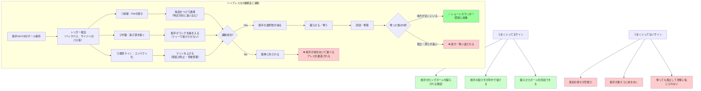

## 要約（Summary）

- ハイプレスは相手陣内の高い位置で守備を開始し、ボールを奪って即座に攻撃に転じる戦術である
- 成否は個人の寄せではなく「前線・中盤・最終ラインの3層での連動」で決まる
- 奪った後の5秒間の展開が、戦術的成功の最終判定基準となる

## 本文（Body）

### 背景・問題意識

サッカーの守備戦術には、高い位置で積極的に奪いに行くハイプレスと、自陣に引いてブロックを作るローブロックがある。ハイプレスは現代サッカーで主流の戦術だが、「うまくいってる/いってない」の判断は難しい。FWが激しく寄せているように見えても、実際には相手に簡単に外されているケースも多い。

ハイプレスの成否を見極めるには、ボール保持者への寄せだけでなく、「チーム全体の連動」と「奪った後の展開」を観察する必要がある。

### アイデア・主張

**ハイプレスは「高い位置での罠づくり」であり、成否は前線・中盤・最終ラインの3層が連動して相手の選択肢を消せるかで決まる。最終的な成功判定は、奪った後の5秒間で攻撃に転じられるかである。**

#### ハイプレスの定義と目的

**ハイプレス（high press）** = 相手が自陣（自分たちのゴールに近いエリア）でボールを持った瞬間から、前線を高い位置まで押し上げて強く奪いに行く守備戦術

**目的**:
1. 相手に落ち着いて前進させない
2. 相手陣内（高い位置）で奪って即チャンスにする
3. 相手のビルドアップ（後方からの組み立て）を壊す

**基本動作**:
- 相手GK（ゴールキーパー）やCB（センターバック）にボールが入ったとき
- FWが寄せてコースを限定する
- その後ろの選手がパス先を捕まえる（人を捕まえる／コースを消す）
- 長いボールを蹴らせて回収する

#### ハイプレス成否の3層評価フレームワーク

ハイプレスの効果を判定するには、以下の3層を観察する：

| 評価層 | 担当ポジション | 観察ポイント | 成功サイン | 失敗サイン |
|-------|-------------|------------|----------|----------|
| **①前線** | FW | 寄せ方が"奪う"ではなく"追い込む"になってるか | FWの寄せる角度が一定で、相手を同じ方向に誘導できている | FWが全力で追うだけで、相手が逆側に簡単に逃げる |
| **②中盤** | MF/ボランチ | 相手の"簡単な逃げ道"を消せてるか | 相手ボランチがフリーで前を向けない、受けても背中で受ける | 相手ボランチがフリーで受けて前を向き、プレスを外される |
| **③最終ライン** | DF | ラインが上がって"間延び"していないか | 最終ラインが上がり、背後はGKも含めてケア | ラインが低く、中盤との間にスペース、裏抜けに慌てて下がる |

#### 成功判定の最終基準：奪った後の5秒

ハイプレスは奪って終わりではなく、**奪った直後が一番おいしい**。成功かどうかは「奪ったあと」に出る：

✅ **成功パターン**:
- 奪った瞬間、近くに味方がいて**すぐ前進（縦パス or ドリブル）**できる
- ショートカウンター（奪ってすぐ攻める）になって得点期待が上がる

❌ **失敗パターン**:
- 奪っても、周りが遠くて結局また戻す
- すぐ奪い返される
- 得点期待が伸びない

### 内容を視覚化するMermaid図

### 具体例・ケース

#### うまくいってるサイン（観戦時の確認ポイント）

相手が嫌がることが起きているか確認する：

1. **相手GK/CBが、横や後ろに逃げるパスばかりになる**（前進できない）
2. **相手がロングボールを蹴らされる頻度が上がる**（しかも味方が回収できる）
3. **相手の受け手が、受けても前を向けず背中で受ける**（次が遅れる）
4. **相手の前進が「サイドの同じルート」に固定される**（誘導できてる）

ここで一番大事なのは「蹴らせた」だけでなく、**蹴らせたボールを回収できているか**。回収できないなら"脅し"で終わる。

#### うまくいってないサイン

プレスが「点」になっていて、相手に逃げ道を渡している：

1. **最初の寄せが空振り**（簡単に外される）
2. **外された瞬間に、相手が前を向いて運べる**（プレスを"裏返される"）
3. **味方が戻りきれず、相手の前線が前向きでボールを受ける回数が増える**

観戦していて「相手が楽そうに前を向く」「最初のプレスを外した瞬間に一気に局面が変わる」なら、連動が崩れている。

#### 具体的な観戦チェックリスト

**前線（①）**:
- FWが相手CBに寄せる角度は一定か？
- 相手を同じ方向（サイド等）に追い込めているか？

**中盤（②）**:
- 相手ボランチ（アンカー）がフリーで前を向けていないか？
- 受けても背中で受けさせることができているか？

**最終ライン（③）**:
- 最終ラインが上がってコンパクトか？
- 上がったうえで背後を管理できているか（GKも含む）？

**奪った後**:
- 奪った瞬間、近くに味方がいるか？
- すぐ前進（縦パス or ドリブル）できるか？

### 反論・限界・条件

#### ハイプレスの短所（リスク）

**裏（最終ラインの背後）にスペースができやすい**:
- 外されると一気にピンチ
- 相手の速いFWに裏抜けされると危険

**走力・連動が必要**:
- 噛み合わないと無駄走りになる
- 個人の寄せだけでは成立しない

**相手のスキルレベルに依存**:
- ボール扱いが上手い相手には外されやすい
- 判断が速い相手にはプレスが間に合わない

#### 成立条件

ハイプレスが効果的に機能するには：

1. **チーム全体の戦術理解と訓練**: 3層の連動が自然にできるまで練習が必要
2. **選手の走力と判断力**: 高い位置まで上がり、素早く切り替えられること
3. **相手の特性に応じた調整**: ビルドアップが得意な相手には効果的だが、ロングボール主体の相手には効きにくい
4. **試合状況**: リードしている後半では、体力消耗を避けてローブロックに切り替える場合もある

#### 観察の限界

**テレビ観戦の制約**:
- カメラがボール周辺しか映さないため、最終ラインや中盤の動きが見えにくい
- 全体の連動を把握するには、スタジアムでの観戦やタクティカルカメラ映像が必要

**因果関係の複雑さ**:
- プレスが効いているのか、相手のミスなのか判別しにくい
- 相手の戦術変更や選手交代で状況が変わる

## 関連ノート（Links）

- [[20251221223638-multidimensional-investment-outcome-evaluation-framework|投資成果の多面的評価フレームワーク]] 3軸での評価という構造の類似性（短期・中期・財務 ⇔ 前線・中盤・最終ライン）
- [[20251221114834-mixed-environment-state-absorption|混在環境の状態吸収パターン]] 状態判定→分岐→処理という思考フレームワークの共通性
- [[20251224102619-outline-driven-ai-writing-accuracy|アウトライン駆動のAI執筆による出力精度向上]] 構造を事前に設計することの重要性
- [[20251215101945-efficiency-policy-combination|効率化政策とリバウンド抑制策の組み合わせ戦略]] 複数要素の組み合わせ戦略によって目的を達成する
- [[20251223233758-power-seeking-self-selection-bias|権力への自己選択バイアス：不適切な人がリーダーになる構造]] 構造的バイアスとシステム思考

## To-Do / 次に考えること

- [ ] 実際の試合（Jリーグ、プレミアリーグ等）でハイプレスのうまいチームを観察し、3層評価フレームワークを検証する
- [ ] ハイプレスと対になる「ローブロック」の評価フレームワークを別zettelとして作成
- [ ] 「トリガー」（プレス開始の合図）の種類と効果的な設定方法を調査
- [ ] チーム戦術の他の要素（ビルドアップ、カウンター等）も同様のフレームワークで分析できるか検討
