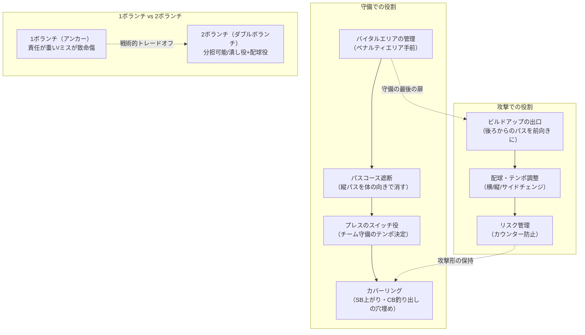

## 要約（Summary）

- ボランチは「中盤の底（自陣寄りの中央）」でプレーし、守備と攻撃の接続役として機能する戦術上の要
- 守備では「バイタルエリアの管理」「パスコース遮断」「プレスのスイッチ」「カバーリング」を担い、チームの最後の扉となる
- 攻撃では「ビルドアップの出口」「配球によるテンポ調整」「リスク管理」を行い、安全に前進するための土台を提供する

##本文（Body）

### 背景・問題意識

現代サッカーにおいて、ボランチは派手さこそないものの、チームの安定性と機能性を決定づける重要なポジションである。ここが崩れると相手が直接センターバック（CB）に到達し、ここが機能しないと後ろからの攻撃がプレスで潰される。ボランチの役割を理解することは、サッカーの戦術的構造そのものを理解することに等しい。

### アイデア・主張

**ボランチの本質は「接続（リンク）」である。** 守備ラインと攻撃ラインの間で、情報を伝達し、危険を遮断し、リスクを管理する。派手な得点よりも、試合全体を安定させ、味方の攻撃を成立させることが仕事の中心となる。この「見えにくい仕事」の質が、チーム全体のパフォーマンスを左右する。

### 内容を視覚化するMermaid図

### 具体例・ケース

#### 守備での具体的な動き

1. **中央のケア（危険地帯の管理）**: 相手のトップ下やFWが「中央で前を向く」状況を減らす。バイタルエリア（ペナルティエリア手前の危険地帯）に相手を入れない
2. **パスコースの遮断**: ボール保持者へ突っ込むだけでなく、相手が入れたい縦パス（CB→ボランチ／CB→トップ下）を体の向きで消す。これで相手のビルドアップが詰まる
3. **プレスのスイッチ役**: 味方が前から寄せたとき、相手の受け手を捕まえたり、逆に一旦待つ判断をして、チーム全体の守備のテンポを決める
4. **カバーリング**: サイドバック（SB）が上がった裏、CBが釣り出されたスペースなど、「穴」を埋める。特にボールの逆サイドまでスライドして穴を消すことが重要

#### 攻撃での具体的な動き

1. **ビルドアップの出口**: 後ろ（CBやGK）からのパスを受けて、前向きに運ぶ／素早く展開する。相手のプレスをはがす最初の中継点
2. **配球（テンポ調整）**: 速く攻めるべきか、いったん落ち着かせるべきかを判断し、横パス・縦パス・サイドチェンジを使い分ける
3. **攻撃の形の保持（リスク管理）**: 味方が前に人数をかけたときに、後ろでリスクを見て「事故」を減らす。いわゆる「カウンターを食らいにくくする」役割

#### 1ボランチと2ボランチの違い

- **1ボランチ（アンカー1枚）**: 責任が極めて重い。中央の守備とビルドアップの両方で「要」になり、ポジショニングのミスが致命傷になりやすい。高度な状況認知と判断力が求められる
- **2ボランチ（ダブルボランチ）**: 分担できる。片方が前に出て潰し、もう片方が後ろでカバー、のような役割分担が可能。互いに補完し合える安定性がある

### 反論・限界・条件

#### ボランチに求められる能力（成立条件）

ボランチが機能するには、以下の能力が必須：

1. **状況認知**: 首を振って周りを見る習慣。360度の視野で味方と相手の位置を把握
2. **体の向き**: 前を向ける位置取り。半身で受けてすぐに前が見える姿勢
3. **予測とカバー**: 危険を先に消す。相手の次のプレーを読んで事前に対処
4. **技術**: 簡単に失わない。ワンタッチ・ターン・パス精度が高水準で必要

#### 限界

- **個人能力への依存**: ボランチの質が低いと、守備ラインが孤立し、攻撃が始まらない。システム全体の成否を左右する
- **守備的 vs 配球型の役割曖昧性**: 「潰し屋（守備的ボランチ）」なのか「配球役（レジスタ＝司令塔）」なのかで求められる能力が異なる。チームの戦術によって最適な選手像が変わる
- **疲労の影響**: 運動量が多く、後半に疲労すると守備の穴が増え、攻撃の選択肢も減る

## 関連ノート（Links）

- [[20251226025657-3-4-2-1-formation-tactical-guide|3-4-2-1フォーメーションの戦術的特徴と成功条件]] 3-4-2-1フォーメーションにおける2ボランチの役割と重要性
- [[20251129160317-ai-role-division-what-why-how|AI連携開発における役割分担の原則]] What/Why/Howの役割分担が、「守備＝What、接続＝How、リスク管理＝Why」という機能分担と対応
- [[20251223234018-system-design-prevent-power-corruption|権力腐敗を防ぐシステム設計の3要素：選抜・責任・監視]] システム設計における役割分担と監視の原則が、ピッチ上のボランチの「監視と調整」機能と類似
- [[20251221152244-consistent-hashing-locality-principle|Consistent Hashingの局所的影響の原理]] 「局所的影響の原理」がボランチの疲労や機能不全が全体に波及する構造と類似
- [[20251224130048-le9-engine-design-tradeoff-expander-bleed-cycle|LE-9エンジンの設計選択：エキスパンダーブリードサイクルによる低コスト化と信頼性のトレードオフ]] トレードオフの設計思想（1ボランチ vs 2ボランチの安定性 vs 攻撃力）という観点で類似

## To-Do / 次に考えること

- [ ] 実際の試合映像で優れたボランチのポジショニングと判断を観察
- [ ] 守備的ボランチ（カゼミーロ、カンテ）と配球型ボランチ（ピルロ、ブスケツ）の具体的な動きの違いを研究
- [ ] ボランチと他のポジション（CB、サイドバック、トップ下）との連携パターンを整理
- [ ] プレスをはがすための「受け方の工夫」（半身、ファーストタッチの方向など）を具体化
