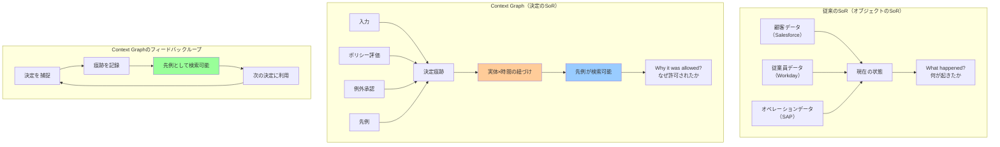

## 要約（Summary）

- Context graphは、決定痕跡（decision traces）を実体と時間を跨いで紐づけた生きた記録である
- 既存のシステム・オブ・レコード（SoR）がオブジェクトのSoRであるのに対し、context graphは**決定のSoR**という新しいカテゴリを作る
- AIエージェント時代において、context graphは自律性の真の情報源となり、次の1兆ドルプラットフォームになる可能性がある

## 本文（Body）

### 背景・問題意識

Salesforce、Workday、SAPなど既存の1兆ドル規模のエンタープライズソフトウェアエコシステムは、「オブジェクトのシステム・オブ・レコード（SoR）」として成功した。顧客、従業員、オペレーションの**現在の状態**を正規データとして保持することで、ワークフローとロックインを獲得した。

しかし、AIエージェントが実際のワークフロー（契約レビュー、見積もり、サポート対応）に組み込まれるにつれ、新しい問題が浮上している：**決定の痕跡（decision traces）が欠落している**。

### アイデア・主張

**Context graphは、「決定のシステム・オブ・レコード」という全く新しいカテゴリのプラットフォームである。**

従来のSoRが「何が起きたか（what happened）」を記録するのに対し、context graphは「なぜそれが許可されたのか（why it was allowed to happen）」を記録する。

**Context graphの定義：**
> 決定痕跡を実体と時間を跨いで紐づけた生きた記録であり、先例が検索可能になる（a living record of decision traces stitched across entities and time so precedent becomes searchable）

**構成要素：**
- **実体（Entities）**: ビジネスが既に扱っているオブジェクト（アカウント、更新、チケット、インシデント、ポリシー、承認者、エージェント実行）
- **決定イベント（Decision Events）**: 重要な意思決定の瞬間
- **"Why"リンク**: どの入力が収集され、どのポリシーが評価され、どの例外が承認され、どの先例が適用されたかを記録

**フィードバックループ：**
決定痕跡が検索可能な先例になり、新しい自動化された決定がさらなる痕跡を追加する。このループによってcontext graphは成長し続け、組織の意思決定の真の情報源になる。

### 内容を視覚化するMermaid図

### 具体例・ケース

**更新時の割引承認プロセス：**

従来のSoR（CRMのみ）では：
- 最終的な記録：「20%割引」
- **失われる情報**：なぜその割引が承認されたのか

Context graphを持つシステムでは：
1. **決定提案**: 更新エージェントが20%割引を提案
2. **ポリシー評価**: ポリシーは更新時の割引を10%までに制限。しかしサービス影響例外が存在
3. **文脈収集**: PagerDutyから3つのSEV-1インシデント、Zendeskから「修正されない限りキャンセル」というエスカレーション、前四半期の類似例外承認VPスレッドを取得
4. **承認ルーティング**: 財務部門にルーティング。財務部門が承認
5. **記録**: CRMには「20%割引」、**context graphには決定痕跡全体**（どの入力、どのポリシー、どの例外、誰が承認、どの先例）が記録される

**結果：**
- CRMは「現在の状態」を持つ
- Context graphは「なぜその決定がなされたか」の監査可能な記録を持つ
- 次回類似のケースが発生したとき、エージェントは先例を検索して一貫した決定を下せる

### 反論・限界・条件

**「既存プレイヤーが進化すれば対応できるのでは？」**

この反論に対し、記事は**構造的理由**で既存プレイヤーには無理だと主張：

1. **オペレーショナルインカンベント（Salesforce、ServiceNow、Workday）の限界：**
   - **現在状態ストレージ**: 決定時の世界の状態を再生できない
   - **サイロ化**: クロスシステムの文脈を見られない（Salesforceはサポートエスカレーション、PagerDutyの障害、Slackのスレッドを見られない）

2. **ウェアハウスプレイヤー（Snowflake、Databricks）の限界：**
   - **読み取りパスのみ**: 決定が下された**後**にETL経由でデータを受け取る。決定時の文脈は既に失われている
   - **書き込みパスにいない**: 決定の実行パスにいないため、リアルタイムで文脈を捕捉できない

**成立条件：**
- Systems of agentsスタートアップが**実行パス（execution path）**に位置する必要がある
- 決定時（commit time）に痕跡を捕捉できる必要がある
- エージェントのオーケストレーション層にいることが構造的優位性

## 関連ノート（Links）

- [[20251226033400-decision-traces-vs-rules|Decision TracesとRulesの本質的違い]] - Context graphの中核概念である決定痕跡の理解
- [[20251226033500-systems-of-agents-three-strategic-paths|Systems of Agentsスタートアップの3つの戦略パス]] - Context graphを構築する具体的な戦略
- [[20251214140318-agent-config-high-leverage-point|エージェント設定ファイルの高レバレッジ特性と慎重な設計の必要性]] - エージェントシステムの設計原則
- [[20251129160318-autonomous-ai-vs-coding-assistant|自律型AIとコーディングアシスタントの使い分け]] - エージェントの役割の理解
- [[20251223234018-system-design-prevent-power-corruption|権力腐敗を防ぐシステム設計の3要素：選抜・責任・監視]] - ガバナンスとシステム設計の原則（透明性と監査可能性）

## To-Do / 次に考えること

- [ ] 自社のビジネスプロセスで、決定痕跡が失われている領域を特定する
- [ ] 既存のSoRに保存されていない「なぜ」の情報をリストアップする
- [ ] Context graph的アプローチを取り入れている製品・サービスを調査する
- [ ] 決定痕跡の捕捉と検索可能性をどう設計するか考える
