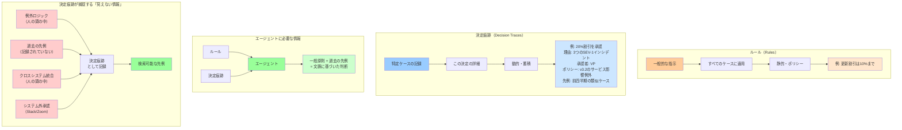

## 要約（Summary）

- **ルール（Rules）**は一般的な指示（「何をすべきか」）、**決定痕跡（Decision Traces）**は特定のケースでの実際の適用記録（「何が実際に行われたか、なぜか」）
- ルールだけでは、人間が日々判断で解決している曖昧さや例外をエージェントに伝えられない
- エージェントには、ルールと過去の決定痕跡の両方へのアクセスが必要

## 本文（Body）

### 背景・問題意識

AIエージェントが実際のワークフローに組み込まれると、ガバナンスだけでは解決できない壁に直面する。その壁とは**欠落した決定痕跡**である。

エージェントは、人間が判断と組織の記憶で毎日解決している曖昧さに遭遇する。しかし、その判断の入力は耐久性のあるアーティファクトとして保存されていない。

### アイデア・主張

**ルールと決定痕跡は本質的に異なるデータ構造であり、エージェントには両方が必要である。**

**ルール（Rules）の特性：**
- **一般的な指示**: 「報告にはオフィシャルARRを使用する」
- **適用範囲**: すべてのケースに対する原則
- **静的**: ポリシーとして明文化され、変更は稀
- **コンテキスト不要**: 特定の状況に依存しない

**決定痕跡（Decision Traces）の特性：**
- **特定のケースの記録**: 「このケースでは、定義Xを使用し、ポリシーv3.2の下で、VP例外を適用し、先例Zに基づき、次のことを変更した」
- **適用範囲**: 1つの具体的な決定イベント
- **動的**: 新しい決定が行われるたびに蓄積される
- **コンテキスト豊富**: どの入力がどう収集され、どのポリシーが評価され、どの例外が承認され、誰が承認し、どの先例が適用されたかを記録

**なぜ両方が必要か：**

ルールだけでは以下の情報が失われる：
1. **頭の中の例外ロジック**: 「ヘルスケア企業には常に10%追加する。調達サイクルが厳しいから」（CRMには記録されていない。オンボーディングやサイドトークで伝わる部族知識）
2. **過去の決定からの先例**: 「前四半期に会社Xで類似の取引を構築した。一貫性を保つべき」（2つの取引をリンクするシステムも、なぜその構造が選ばれたかを記録するシステムもない）
3. **クロスシステムの統合**: サポートリードがSalesforceでARRを確認、Zendeskで2つのエスカレーションを確認、Slackスレッドで解約リスクフラグを読み、Tier 3にエスカレートを決定。その統合は頭の中で起きる。チケットには「Tier 3にエスカレート」としか書かれない
4. **システム外の承認チェーン**: VPがZoomコールやSlack DMで割引を承認。案件記録には最終価格のみ。誰が逸脱を承認したか、なぜかは記録されない

### 内容を視覚化するMermaid図



### 具体例・ケース

**具体例1: 更新割引の決定**

**ルールのみの世界：**
```
ルール: 「更新割引は10%まで」
エージェントの行動: 10%割引を提案
結果: 顧客は解約（3つのSEV-1インシデントがあり、20%割引が必要だったが、その文脈がエージェントに見えなかった）
```

**ルール + 決定痕跡の世界：**
```
ルール: 「更新割引は10%まで、ただしサービス影響例外あり」
決定痕跡:
  - 前四半期、3つ以上のSEV-1インシデントがあった会社Yに20%割引を承認
  - 承認者: VP of Finance
  - 根拠: ポリシーv3.2のサービス影響例外
  - 結果: 顧客維持成功

エージェントの行動:
  1. PagerDutyから3つのSEV-1インシデントを確認
  2. 決定痕跡から類似先例を検索
  3. サービス影響例外を適用し、20%割引を提案
  4. VPにルーティングして承認取得
  5. この決定の痕跡を記録（次回の先例になる）

結果: 顧客維持成功 + 組織学習の蓄積
```

**具体例2: ヘルスケア企業の例外ロジック**

**捕捉されていない部族知識：**
> 「ヘルスケア企業には常に追加10%を与える。彼らの調達サイクルは厳しいから。」

これはCRMにも、ポリシー文書にもない。新入社員へのオンボーディングやサイドトークで伝わる。

**決定痕跡として記録すると：**
```yaml
decision_trace_id: dt_12345
account: Healthcare Corp
industry: Healthcare
decision: Additional 10% discount applied
reason: |
  Healthcare industry has extended procurement cycles (6-12 months).
  Standard pricing doesn't account for their budget approval timeline.
precedents:
  - dt_11234 (Healthcare Inc, +10%)
  - dt_10987 (MedTech LLC, +12%)
policy_version: v4.1
approved_by: sales_vp@company.com
outcome: Deal closed, 11-month sales cycle
```

この記録により：
- 新しいエージェント（または新入社員）が「ヘルスケア企業 + 調達サイクル」の文脈を検索可能
- 同様のケースで一貫した判断が可能
- 暗黙知が明示知に変換される

### 反論・限界・条件

**「ルールをもっと詳細に書けば決定痕跡は不要では？」**

理論的には可能だが、実践的には：
- **ルールの爆発**: すべての例外を事前にルール化すると、ルールが数千行になり管理不能
- **未知の未知**: 将来どんな例外が必要かは事前にわからない
- **進化する判断**: ビジネス環境の変化に応じて判断基準も変わる。ルールは静的すぎる

**「決定痕跡を記録するコストは？」**

- 初期段階ではhuman-in-the-loop（人間が承認）で痕跡を記録
- 蓄積が進むと、類似ケースの自動化が可能になる
- コストは初期投資だが、長期的には組織学習として複利で効く

**成立条件：**
- 決定痕跡を捕捉・保存・検索できるシステムが必要
- エージェントがオーケストレーション層（実行パス）に位置する必要がある
- 組織が決定の透明性と監査可能性を重視している

## 関連ノート（Links）

- [[20251226033300-context-graph-decision-system-of-record|Context Graphと決定のシステム・オブ・レコード]] - 決定痕跡を保存する全体アーキテクチャ
- [[20251226033500-systems-of-agents-three-strategic-paths|Systems of Agentsスタートアップの3つの戦略パス]] - 決定痕跡を捕捉する戦略的アプローチ
- [[20251215085324-knowledge-creation-reading|知識生成型読書への転換]] - 暗黙知を明示知に変換する考え方
- [[20251223234018-system-design-prevent-power-corruption|権力腐敗を防ぐシステム設計の3要素：選抜・責任・監視]] - 透明性と説明責任の設計原則
- [[20251214140318-agent-config-high-leverage-point|エージェント設定ファイルの高レバレッジ特性と慎重な設計の必要性]] - エージェントに与えるべき情報の設計

## To-Do / 次に考えること

- [ ] 自社のワークフローで「人の頭の中」や「Slackスレッド」に存在する例外ロジックをリストアップ
- [ ] 決定痕跡として記録すべき情報の構造を設計する（最小限のスキーマ）
- [ ] 既存のドキュメント（ポリシー、ルール）と決定痕跡の役割分担を明確化
- [ ] 決定痕跡の検索可能性をどう実現するか考える（タグ、メタデータ、セマンティック検索）
