## 要約（Summary）

- Systems of agentsスタートアップには3つの戦略パスがある：①既存SoR全体の置き換え、②モジュール置き換え、③全く新しいSoRの作成
- 既存インカンベントは構造的理由で決定痕跡を捕捉できないため、スタートアップに構造的優位性がある
- スタートアップの優位性の源泉は、エージェントの**実行パス（execution path）**に位置し、決定時（commit time）に文脈を捕捉できること

## 本文（Body）

### 背景・問題意識

既存のエンタープライズソフトウェアプレイヤー（Salesforce、Workday、Snowflake、Databricks）は、AIを追加することでエージェント時代に進化しようとしている。しかし、**決定痕跡を捕捉する**という点で、構造的な限界を抱えている。

この限界こそが、Systems of agentsスタートアップにとっての機会である。

### アイデア・主張

**Systems of agentsスタートアップは、エージェントのオーケストレーション層（実行パス）に位置することで、インカンベントが持たない構造的優位性を持つ。**

スタートアップが取りうる戦略パスは3つある：

#### パス1: 既存SoR全体の置き換え

**特徴：**
- CRMやERPをAIネイティブなシステムとして最初から再構築
- イベントソースされた状態とポリシー捕捉がアーキテクチャにネイティブ
- エージェントがファーストクラスのアクターとして設計される

**難易度：**
- 高い（インカンベントが深く根付いている）
- 移行モーメント（移行の好機）で実現可能性が高まる

**具体例：Regie**
- ターゲット：AI SDRカテゴリー
- 置き換え対象：Outreach/Salesloftなどのレガシー販売エンゲージメントプラットフォーム
- 差別化：
  - レガシープラットフォームは、人間が断片化されたツールチェーン全体でシーケンスを実行することを前提に設計
  - RegieはAIネイティブ：エージェントがファーストクラスのアクター（見込み客発掘、アウトリーチ生成、フォローアップ実行、ルーティング処理、人間へのエスカレート）
  - 混合チーム（エージェント + 人間）が前提のアーキテクチャ

#### パス2: モジュール置き換え

**特徴：**
- 既存SoR全体ではなく、特定のサブワークフローをターゲット
- 例外と承認が集中する領域を狙う
- そのサブワークフローの決定のSoRになる
- 最終状態は既存インカンベントに同期

**難易度：**
- 中程度（全体置き換えより導入しやすい）
- インカンベントとの共存が前提

**具体例：Maximor**
- ターゲット：財務（キャッシュ管理、クローズ管理、コア会計ワークフロー）
- 置き換え対象：ERPの一部機能（GLは置き換えない）
- 差別化：
  - ERPは台帳（ledger）のまま
  - Maximorは**調整ロジックが存在する場所**のSoRになる
  - 決定痕跡を捕捉し、GLに最終状態を同期

#### パス3: 全く新しいSoRの作成

**特徴：**
- オーケストレーション層としてスタート
- 企業が従来システマティックに保存していなかったものを保存：**決定の痕跡**
- 時間とともに、その再生可能な系譜（lineage）が権威のあるアーティファクトになる
- エージェント層が「単なる自動化」を超え、「なぜそれをしたか」を答える場所になる

**難易度：**
- 低〜中（新しいカテゴリを作る）
- 既存SoRとの競合が少ない

**具体例：PlayerZero**
- ターゲット：プロダクションエンジニアリング（SRE、サポート、QA、開発の交差点）
- 作成する新しいSoR：プロダクション障害と変更の文脈グラフ
- 差別化：
  - プロダクションエンジニアリングは典型的な「グルー機能（glue function）」：人間が複数システム間の文脈を運ぶ
  - PlayerZeroはL2/L3サポートの自動化からスタート
  - 真の資産：**コード、設定、インフラ、顧客行動が現実にどう相互作用するかの生きたモデル（context graph）**
  - このグラフが「なぜこれは壊れたか？」「この変更はプロダクションを壊すか？」という質問のSoRになる
  - 既存のシステムは誰もこの質問に答えられない

### 内容を視覚化するMermaid図

```mermaid
graph TB
    subgraph "パス1: 既存SoR全体の置き換え"
        P1A["レガシーCRM/ERP"] --> P1B["AIネイティブ<br/>SoR"]
        P1B --> P1C["エージェントが<br/>ファーストクラス"]
        P1C --> P1D["例: Regie<br/>（販売エンゲージメント）"]

        style P1B fill:#ffcc99
        style P1D fill:#ffe6cc
    end

    subgraph "パス2: モジュール置き換え"
        P2A["既存ERP<br/>（台帳として維持）"] --> P2B["特定サブワークフロー<br/>を置き換え"]
        P2B --> P2C["決定のSoR<br/>+ 最終状態を同期"]
        P2C --> P2D["例: Maximor<br/>（財務ワークフロー）"]

        style P2B fill:#99ccff
        style P2D fill:#cce6ff
    end

    subgraph "パス3: 全く新しいSoRの作成"
        P3A["既存システムが<br/>答えられない質問"] --> P3B["オーケストレーション層<br/>として開始"]
        P3B --> P3C["決定痕跡を捕捉<br/>context graph構築"]
        P3C --> P3D["新カテゴリの<br/>SoRになる"]
        P3D --> P3E["例: PlayerZero<br/>（プロダクション文脈）"]

        style P3C fill:#99ff99
        style P3E fill:#ccffcc
    end

    subgraph "インカンベントの構造的限界"
        I1["オペレーショナル<br/>インカンベント"] --> I1A["現在状態のみ<br/>サイロ化"]
        I2["ウェアハウス<br/>プレイヤー"] --> I2A["読み取りパスのみ<br/>事後的ETL"]

        I1A --> I3["決定時の文脈を<br/>捕捉できない"]
        I2A --> I3

        style I3 fill:#ffcccc
    end

    subgraph "スタートアップの構造的優位性"
        S1["実行パスに位置"] --> S2["決定時（commit time）<br/>に文脈を捕捉"]
        S2 --> S3["決定痕跡を<br/>ファーストクラスで保存"]
        S3 --> S4["context graph構築"]

        style S2 fill:#99ff99
        style S4 fill:#ccffcc
    end
```

### 具体例・ケース

**パス1の具体例：Regie（AI SDR）**

従来のOutreach/Salesloft：
- 人間がシーケンスを実行する前提
- 断片化されたツールチェーン
- エージェントは後付けの自動化

RegieのAIネイティブアプローチ：
- エージェントがファーストクラスのアクター
- 見込み客発掘、アウトリーチ、フォローアップ、ルーティング、エスカレートを統合
- 混合チーム（AI + 人間）がネイティブ

**パス2の具体例：Maximor（財務ワークフロー）**

ERPの限界：
- GLは正確だが、調整ロジック（なぜこの仕訳か）は記録されない

Maximorのアプローチ：
- キャッシュ管理、クローズ管理、会計ワークフローを自動化
- ERPは台帳として維持
- **調整ロジック（決定痕跡）のSoR**になる

**パス3の具体例：PlayerZero（プロダクションエンジニアリング）**

グルー機能としてのプロダクションエンジニアリング：
- SRE、サポート、QA、開発の交差点
- 人間が文脈を運ぶ（どのシステムも捕捉しない）

PlayerZeroが構築するcontext graph：
- コード、設定、インフラ、顧客行動の相互作用モデル
- 「なぜこれは壊れたか？」に答えるSoR
- 「この変更はプロダクションを壊すか？」に答えるSoR
- **既存のシステムが答えられなかった質問のSoR** = 全く新しいカテゴリ

### 反論・限界・条件

**「インカンベントは買収や統合で対抗できるのでは？」**

記事は以下の理由でインカンベントの反撃を予測：
- **買収でオーケストレーション能力を追加しようとする**
- **API制限やegress fee（データ転送料）で、データ抽出を高コスト化**（ハイパースケーラーと同じ戦略）
- **自社のエージェントフレームワークを構築し、「すべてを我々のエコシステムに」というナラティブ**

しかし、**決定痕跡を捕捉するには、commit timeの実行パスにいる必要がある**。インカンベントは：
- 後付けでガバナンスを追加することはできる
- しかし、**元々参加していなかったオーケストレーション層に自分を挿入することはできない**

**成立条件：**
- スタートアップがエージェントの実行パス（orchestration path）に位置する
- 決定時に文脈を捕捉できるアーキテクチャ
- 既存SoRに存在しない価値（決定痕跡、先例、文脈）を提供

**新しいインフラ要件：Observability for Agents**
- 決定痕跡とcontext graphが蓄積されると、エージェントの行動をモニタリング・デバッグ・評価する必要性が高まる
- Arizeのような**エージェント用の観測可能性プラットフォーム**が必須インフラになる
- Datadogがアプリケーションモニタリングの必須インフラになったように、Arizeはエージェント決定品質のモニタリング必須インフラになる

## 関連ノート（Links）

- [[20251226033300-context-graph-decision-system-of-record|Context Graphと決定のシステム・オブ・レコード]] - 3つの戦略パスが目指すcontext graphの全体像
- [[20251226033400-decision-traces-vs-rules|Decision TracesとRulesの本質的違い]] - 戦略パスが捕捉すべき決定痕跡の理解
- [[20251214140318-agent-config-high-leverage-point|エージェント設定ファイルの高レバレッジ特性と慎重な設計の必要性]] - エージェント層の設計原則
- [[20251215092911-learning-cost-minimization|学習コストと認知負荷の最小化戦略]] - 移行コストを最小化する戦略設計
- [[20251220123740-otel-collector-distribution-strategy|OpenTelemetry Collector のディストリビューション戦略]] - プラットフォーム戦略の事例

## To-Do / 次に考えること

- [ ] 自社のビジネスドメインで、3つの戦略パスのどれが適用可能か検討
- [ ] 「グルー機能」（複数システム間で文脈を運ぶ人間の役割）を特定する
- [ ] 既存SoRが答えられない質問をリストアップする（パス3の機会）
- [ ] インカンベントのAPI制限やegress feeがビジネスに与える影響を評価
- [ ] エージェントの観測可能性（モニタリング、デバッグ、評価）の要件を定義
