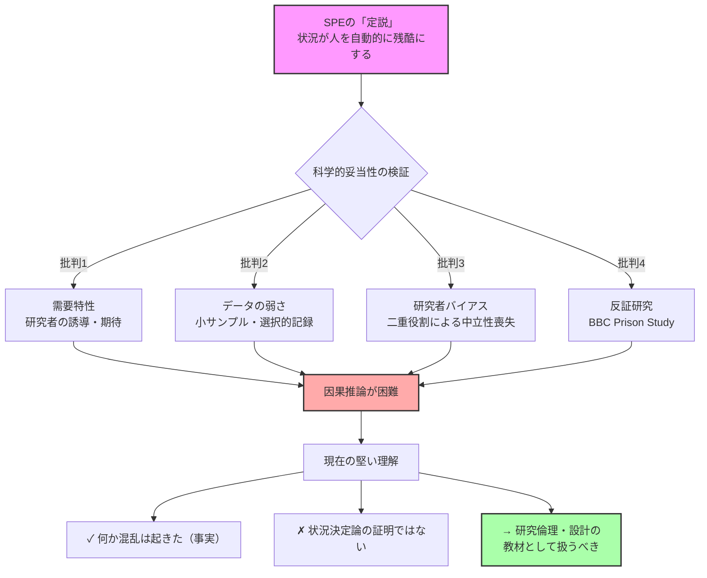

## 要約（Summary）

- スタンフォード監獄実験（SPE）は「状況が人を残酷にする」証明として有名だが、近年の批判により科学的妥当性に深刻な疑問が提起されている
- 需要特性（研究者の誘導）、データの不十分さ、研究者バイアスなどから、SPEを人間本性の証明として扱うのは危険
- 今はむしろ研究倫理・設計・解釈の危うさを学ぶ教材として位置づけるべき

## 本文（Body）

### 背景・問題意識

1971年のスタンフォード監獄実験（SPE）は、ジンバルドーによる「状況が人を残酷にする」証明として心理学の教科書に長く掲載されてきた。しかし、アーカイブ調査や後続研究により、この「定説」に対する科学的検証が進み、結論の妥当性が大きく疑問視されている。

SPEは単なる歴史的実験ではなく、今も組織論・犯罪学・倫理教育で引用されるため、その正確性を批判的に評価することが重要である。

### アイデア・主張

**SPEの「状況決定論」は、実験結果としては信頼できない。研究設計の欠陥（需要特性、研究者介入、データ選択性）が大きすぎて、因果推論に耐えない。**

主要な批判点：

1. **需要特性（demand characteristics）**: 看守役が「どう振る舞うべきか」について研究者から具体的な期待・指示を受けていた可能性。参加者が研究者の期待に沿って役割演技した可能性が高い

2. **再現性・検証可能性の欠如**: サンプルが小さく、手続きが標準化されておらず、記録が選択的・逸話中心。科学的に因果を切り分けるには情報不足

3. **研究者の二重役割**: ジンバルドー自身が「所長役」を担い、観察者としての中立性を損ねた。参加者の行動が実験への反応なのか組織適応なのか区別できない

4. **反証研究の存在**: BBC Prison Study（リッヒャー＆ハスラム）では、同様の設定でも看守が必ずしも暴虐化せず、集団同一視やリーダーシップの条件が重要だと示された

### 内容を視覚化するMermaid図

### 具体例・ケース

**実務的な影響**:
- 組織論で「権力構造が人を腐敗させる」根拠としてSPEを引用する場合、追加の証拠（ミルグラム実験、アッシュ実験、現代の組織研究）も併記すべき
- 研修・教育でSPEを扱う際は、「状況の力」だけでなく、批判的思考・研究倫理の教材として位置づける方が安全
- BBC Prison Studyのような後続研究を併記することで、「状況vs社会的同一視」の議論に精度を上げられる

**批判のポイント**:
- ジンバルドー側も反論しており、「全部ウソ」ではない。しかし、単体で決定打にするには弱い
- 権力差や非人間化が影響する、という広い教訓自体は他分野でも支持されている

### 反論・限界・条件

**擁護側の主張**:
- 映像や文書などの証拠に基づき、批判は誇張されているとの反論もある
- SPEが完全に無価値というわけではなく、「組織・制度が逸脱行動を増幅しうる」という象徴的価値は残る

**この批判が成り立つ条件**:
- アーカイブ調査や参加者インタビューが信頼できること
- 研究倫理や実験デザインの現代基準を過去の研究に適用することの妥当性

**限界**:
- SPE単体を否定しても、状況要因の影響全般を否定するわけではない
- ミルグラム実験など他の古典的研究も同様の批判を受けており、心理学の再現性危機の文脈で理解すべき

## 関連ノート（Links）

- [[20251226035800-demand-characteristics-experimental-validity]] 需要特性と心理実験の妥当性（今回作成）
- [[20251215010141-magazine-book-statistical-confusion]] データの選択性・記録の問題に関連
- [[20251220050704-code-delivery-with-proof-of-work]] 動作証明の重要性（研究でも再現性が重要）
- [[20251129225832-coding-agent-estimation-disruption]] 従来の見積もり破壊（SPEも従来の定説破壊に類似）
- [[20251214235033-claude-md-strategic-design-principles]] 批判的思考・設計原則の重要性

## To-Do / 次に考えること

- [ ] BBC Prison Study（リッヒャー＆ハスラム）の詳細を別zettelで整理
- [ ] ミルグラム実験への批判も同様に調査
- [ ] 心理学の再現性危機（replication crisis）全般のzettelを作成
- [ ] 組織論・倫理教育での引用時の注意点をまとめる
