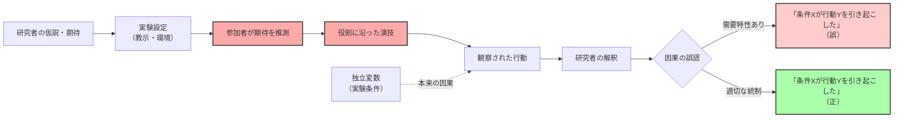

## 要約（Summary）

- **需要特性（demand characteristics）**とは、参加者が「研究者が期待する行動」を推測して、それに合わせてしまう現象
- 実験の中立性を損ない、因果推論を困難にする重大なバイアス源
- 対策として、二重盲検法、欺瞞（デセプション）、行動測定の客観化などが用いられる

## 本文（Body）

### 背景・問題意識

心理学実験では、参加者が「研究者が何を調べているか」「どう振る舞えば良い結果になるか」を推測し、無意識または意識的にその期待に沿った行動をとってしまうことがある。これを**需要特性（demand characteristics）**と呼ぶ。

これは単なる「協力的すぎる参加者」の問題ではなく、実験の内的妥当性（因果推論の正確性）を根本的に脅かす。スタンフォード監獄実験（SPE）のような有名な研究でも、需要特性が結果の解釈を大きく歪めた可能性が指摘されている。

### アイデア・主張

**需要特性は、参加者が研究者の期待を「読んで演技する」ことで、実験結果が本来の因果関係ではなく、役割演技の産物になるリスクを生む。**

主要な問題点：

1. **内的妥当性の低下**: 観察された行動が、独立変数（実験条件）の効果なのか、参加者の推測による演技なのか区別できない

2. **再現性の問題**: 研究者の態度・期待が変われば結果も変わる可能性があり、科学的再現性が損なわれる

3. **因果推論の誤り**: 「状況Xが行動Yを引き起こす」という結論が、実際には「研究者の期待が行動Yを引き起こす」である可能性

4. **発見が難しい**: 参加者自身も無意識に演技していることがあり、事後のインタビューでも検出しにくい

### 内容を視覚化するMermaid図

### 具体例・ケース

**古典的事例**:
- **スタンフォード監獄実験（SPE）**: 看守役が「強権的に振る舞うべき」という研究者の期待を受け取り、それに沿って演技した可能性。「状況が自動的に残酷化させた」のではなく、「研究者の期待に応えた」可能性が高い

- **ミルグラム実験**: 「権威に従う」という行動が、実験状況への適応なのか本当の服従なのか区別が難しい（ただし、欺瞞技法により一定程度は統制されている）

**対策例**:
1. **二重盲検法（double-blind）**: 研究者も参加者も、どの条件に割り当てられているか知らない状態で実験を行う

2. **欺瞞（deception）**: 参加者に本当の研究目的を隠す（倫理的配慮が必要）

3. **行動測定の客観化**: 自己報告ではなく、生理指標（心拍数、視線追跡）や客観的な行動記録を使う

4. **事後質問紙**: 実験後に「何を調べていたと思ったか」を尋ね、需要特性の影響を評価

### 反論・限界・条件

**需要特性を過大評価すべきでない場合**:
- すべての実験が需要特性に汚染されているわけではない。適切な統制があれば問題ない
- フィールド実験や自然観察では、需要特性の影響が小さい

**需要特性が重大な問題になる条件**:
- 研究者が期待を明示的または暗黙的に伝えている
- 参加者が「良い結果を出したい」と強く動機づけられている
- 行動測定が主観的・自己報告中心である

**倫理的ジレンマ**:
- 欺瞞技法（デセプション）は需要特性を減らすが、インフォームド・コンセントの原則と矛盾する
- 現代の研究倫理では、欺瞞の使用には厳格な審査と事後説明（デブリーフィング）が必要

## 関連ノート（Links）

- [[20251226035625-stanford-prison-experiment-critical-revaluation|スタンフォード監獄実験の批判的再評価]] スタンフォード監獄実験の批判的再評価
- [[20251215010141-magazine-book-statistical-confusion|書籍と雑誌の統計的混同]] データの選択性・方法論の問題
- [[20251220050704-code-delivery-with-proof-of-work|エンジニアの責任は動作証明されたコードを届けることである]] 動作証明の重要性（実験でも検証可能性が重要）
- [[20251214235033-claude-md-strategic-design-principles|CLAUDE.mdファイルの戦略的設計原則]] 設計原則・批判的思考
- [[20251129160320-ai-task-granularity|AIへのタスク粒度と効率の関係]] タスク粒度と効率（実験設計の粒度にも関連）

## To-Do / 次に考えること

- [ ] 二重盲検法の具体的な実装例を調査
- [ ] 欺瞞技法（デセプション）の倫理的ガイドラインを整理
- [ ] フィールド実験での需要特性統制の方法を別zettelで整理
- [ ] 心理学の再現性危機（replication crisis）との関連を深掘り
