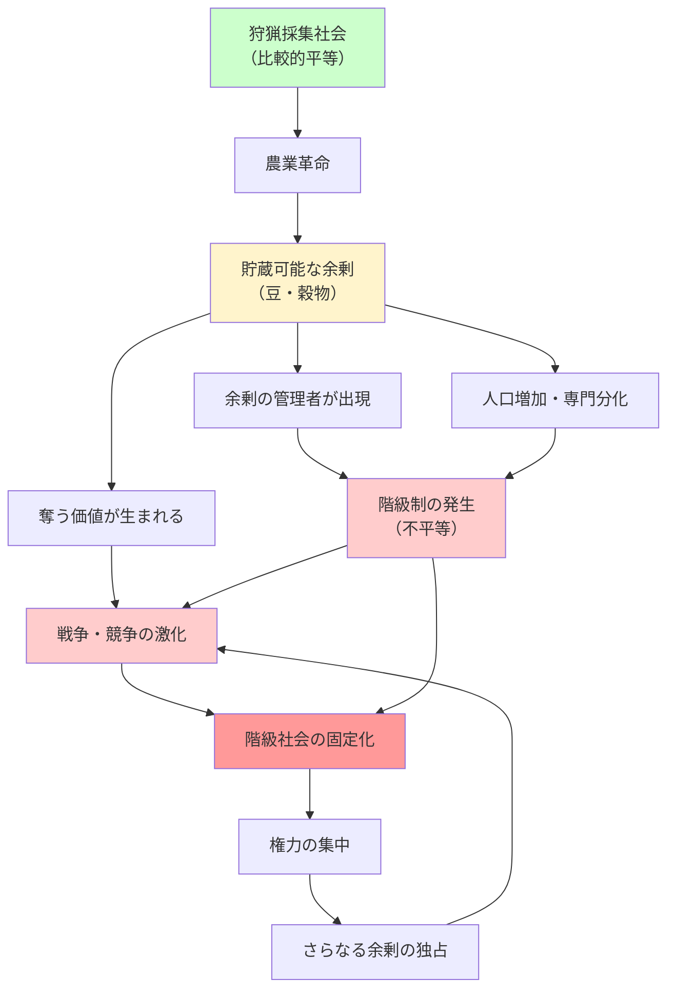

## 要約（Summary）

- 「戦争と豆」は階級社会（ヒエラルキー）の起源を説明する簡潔なフレーズ
- **豆（農業）→ 貯蔵可能な余剰 → 階級制が可能になる → 余剰をめぐる戦争（競争・暴力）**という因果連鎖
- 階級社会は「悪人の陰謀」ではなく、貯蔵できる資源が生まれると構造的に立ち上がりやすい

## 本文（Body）

### 背景・問題意識

なぜ人類社会には階級（ヒエラルキー）が生まれたのか？ブライアン・クラースは、ジャレド・ダイアモンドの『銃・病原菌・鉄』で広まった説明を引用し、**「戦争と豆」という短い言い回しで階級社会の起源を圧縮**する。

狩猟採集社会は比較的平等だったが、農業革命以降、不平等と階級制が急速に広がった。この変化を説明するカギは、「貯められる余剰」と「それをめぐる争い」にある。

### アイデア・主張

階級社会の立ち上がりは、以下の因果連鎖で説明される：

#### 1. 豆（農業）→ 貯蔵可能な余剰

- **農業の発明**により、食料生産量が増加し、しかも**収穫物を貯蔵できる**ようになった（例：エンドウ豆、穀物）
- 狩猟採集では、獲物は貯蔵しにくく、その日のうちに消費されるか腐るため、長期的な余剰は生まれにくい
- 農業による貯蔵可能な余剰が、**「溜め込む」ことを可能にした**

#### 2. 余剰 → 階級制が可能になる

- 余剰ができると、**全員が毎日食料調達に張り付かなくてよくなる**
- 人口が増え、社会が複雑化し、専門分化（職人、戦士、管理者）が進む
- 最も重要なのは、**余剰を管理する人／溜め込む人が出てくる**こと
- ここで初めて**不平等（階級化）が"可能になる"**：余剰がなければ、誰も富を独占できない

#### 3. 余剰 → 戦争（競争・暴力）

- 貯められる資源ができたことで、**「奪う価値」が生まれる**
- 個人や集団が、その優位（食料・土地・地位）を確立しようとして争いが増える
- 階級化によって**「奪う／守るための組織化」**が進み、戦争がより体系的になる

### 内容を視覚化するMermaid図

### 具体例・ケース

**メソポタミア文明**:
- 農業（小麦・大麦）による余剰が、最初の都市国家を支えた
- 穀物倉庫を管理する神官・官僚階級が出現
- 都市国家間で水資源や土地をめぐる戦争が頻発

**古代エジプト**:
- ナイル川の氾濫による豊富な収穫を、ファラオと官僚が管理
- ピラミッド建設など、余剰労働力を動員する大規模プロジェクトが可能に
- 周辺部族との戦争で領土拡大

**封建社会**:
- 土地（農地）という貯蔵可能な資源を、貴族が独占
- 農民は余剰を地主に納め、地主は軍事力を維持
- 領地をめぐる戦争が、階級制をさらに強化

### 反論・限界・条件

- **農業が必ず階級社会を生むわけではない**：小規模農業社会には、比較的平等なものもある
- **他の要因も重要**：人口密度、地理的条件（防御しやすい土地）、技術（武器・輸送）なども階級化に影響
- **階級社会は農業"だけ"の産物ではない**：遊牧社会でも階級制は生まれる（家畜という貯蔵可能な資源）
- **現代への適用には注意が必要**：この理論は歴史的起源の説明であり、現代の不平等を「自然で避けられない」と正当化するものではない
- **構造決定論への批判**：人間の選択や制度設計によって、階級制の程度は変えられる

## 関連ノート（Links）

- [[20251223233758-power-seeking-self-selection-bias|権力への自己選択バイアス：不適切な人がリーダーになる構造]] - 階級社会が生まれた後、どのように権力者が選ばれるか
- [[20251223233911-power-corrupts-mechanism|権力による腐敗メカニズム：権力が人の共感と行動を変える理由]] - 階級社会における権力の心理的効果
- [[20251223234018-system-design-prevent-power-corruption|権力腐敗を防ぐシステム設計の3要素：選抜・責任・監視]] - 階級社会の問題への制度的対処
- [[20251221231128-refundable-tax-credit-work-incentive-design|給付付き税額控除の就労インセンティブ設計：フェーズイン・プラトー・フェーズアウト構造]] - 現代における余剰の再分配メカニズム
- [[20251215102820-domain-knowledge-as-moat|ドメイン知識と業界知識が開発者の唯一の持続的競争優位（護城河）]] - 現代における「奪いにくい資源」としての知識

## To-Do / 次に考えること

- [ ] 現代社会における「貯蔵可能な余剰」は何か？（データ、知識、ネットワーク効果など）
- [ ] デジタル経済では、階級制の立ち上がり方はどう変わるか？
- [ ] ベーシックインカムや富裕税は、「戦争と豆」の因果連鎖をどう断ち切るか？
- [ ] ジャレド・ダイアモンド『銃・病原菌・鉄』を読んで、より詳細な議論を確認する
