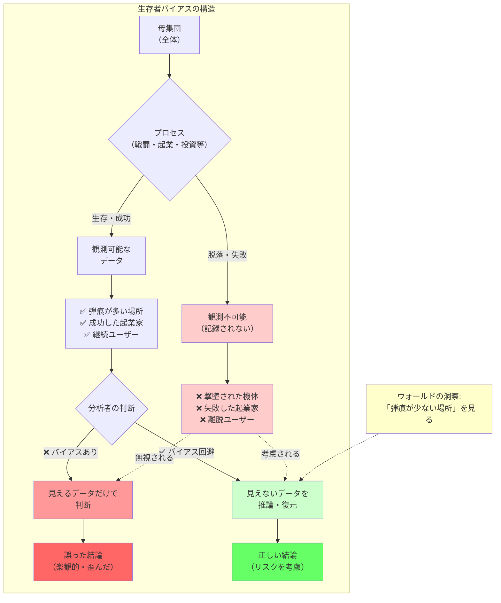

## 要約（Summary）

- 生存者バイアス（survivorship bias）は、「生き残った事例だけ」を見て判断し、途中で脱落・失敗した事例を無視することで、結論が楽観的・歪んだ方向に寄る認知の偏り
- ウォールドの飛行機問題が示すように、「弾痕が多い場所」ではなく「弾痕が少ない場所（＝被弾すると生存できない場所）」を補強すべき
- 統計学的には選択バイアス（selection bias）の一種で、データ収集の段階で「観測される確率が結果と結びついている」状況で起きる

## 本文（Body）

### 背景・問題意識

人間は自然と「目に見えるもの」に注目し、「見えないもの」を無視する傾向がある。特に、成功事例は目立ち、記録され、語り継がれるが、失敗事例は消え去り、記録されず、忘れられる。

この非対称性が、意思決定において深刻な問題を引き起こす。成功者の習慣を真似ても成功しない理由、投資戦略が過去のデータで優れているように見える理由、プロダクト改善が継続ユーザーだけを見て失敗する理由――これらすべてに生存者バイアスが関わっている。

### アイデア・主張

**生存者バイアスの本質は、「観測できるデータ」が「何らかのフィルタを通過したもの」であることを見落とし、そのフィルタ自体が結論を歪めていることに気づかないことである。**

#### ウォールドの飛行機問題：逆転の発想

第二次世界大戦中、連合軍は爆撃機の被害を減らすため「どこを装甲強化すべきか」を検討していた。基地に帰還した機体を調べると、翼や胴体に弾痕が多い。直感的には「弾痕が多い場所を補強しよう」となる。

しかし統計学者アブラハム・ウォールド（Abraham Wald）は逆を提案した：

1. **いま観測できているのは「帰還できた機体」だけ**
2. 翼や胴体に被弾しても帰って来られる＝致命傷になりにくい部位
3. 逆に、帰還機に弾痕が少ない場所（例：エンジン周りや操縦席など）は、そこを撃たれると墜落して「観測から消える」
4. **だから補強すべきは弾痕が少ない場所（＝被弾すると生存できない場所）**

ポイントは「弾痕分布そのもの」ではなく、**「帰還できたというフィルタを通ったデータ」を見ている**点である。ここでの見落としが、まさに生存者バイアスである。

#### なぜ起きるか：見えない失敗が「母集団」から消える

生存者バイアスの本質は、次の構造である：

1. あるプロセス（戦闘、起業、採用、学習、投資…）がある
2. 途中で脱落したものは記録されない・目につかない・後から追跡できない
3. 残ったものだけがデータとして集まる
4. そのデータを「全体の代表」と誤認して結論を出す

結果、**成功確率の過大評価**、**成功要因の取り違え**、**リスクの過小評価**が起こりやすくなる。

### 内容を視覚化するMermaid図

### 具体例・ケース

#### よくある具体例（ウォールド型の「逆を見る」が効く）

**起業・成功法則**：
- 見えるデータ：「成功した起業家の習慣」だけ読んで再現しようとする
- 見えない側：同じ習慣でも失敗した企業、資金が尽きた企業、撤退した企業
- バイアス：成功要因を過大評価し、運や環境要因を過小評価

**投資**：
- 見えるデータ：「長期で勝った銘柄」だけを見て戦略を正当化
- 見えない側：途中で上場廃止・合併・低迷で指数から消えた銘柄
- バイアス：投資戦略の成功率を過大評価

**プロダクト分析**：
- 見えるデータ：継続ユーザーの行動だけを見て改善を決める
- 見えない側：初期離脱者が何に詰まったか（ここが一番重要なことも多い）
- バイアス：新規ユーザーの障壁を見落とす

**採用**：
- 見えるデータ：「採用できた人材」の特徴だけを最適化
- 見えない側：途中辞退・早期離職・選考で落としたが後に活躍した人材
- バイアス：採用基準が偏り、多様性を失う

#### ウォールドの教訓を一般化すると

**「いま見えている『痕跡が多いところ』は、必ずしも弱点ではない」**

むしろ**「痕跡が少ないところ（＝消えてしまう原因）」を疑う**ことが重要である。

### 反論・限界・条件

#### 実務での対策：まず「脱落者」をデータとして復元する

完全に避けるのは難しいが、手順としては次が効く：

1. **観測条件（フィルタ）を明文化する**
   - 「これは『生き残った人/物』だけのデータか？」を最初に書く

2. **欠損が「ランダムではない」可能性を疑う**
   - 失敗や脱落は、たいてい偶然ではなく理由がある（エンジン被弾のように）

3. **脱落ログを作る／追跡する**
   - 例：解約理由、離脱ステップ、選考辞退理由、障害でリトライされず終わったリクエスト等

4. **反事実（counterfactual）を置く**
   - 「見えていないものが何で、どの方向に結論を歪めるか」を仮説として書く

5. **分析単位を「母集団」に戻す**
   - 継続ユーザーではなく「全流入」、成功案件ではなく「全案件」を基準に指標を作る

#### バイアス回避の限界

生存者バイアスは、頭の良さというより**「データがそういう形でしか集まらない」**ことで起きる。完全に避けることは不可能だが、意識することで大幅に軽減できる。

ウォールドの話は、**「見えるデータ」を増やすより先に、「見えないデータ」を定義して取り戻せ**というメッセージとして使うと強い。

## 関連ノート（Links）

- [[20251215085315-critical-perspective-integration|批判的視点の統合による読書深化]] - 反対派の視点を集めることで、見えない失敗や批判を考慮する手法
- [[20251220051346-unverified-pr-burden-shift|未検証コードのPRはレビュワーへの負担転嫁である]] - 「動いたコードだけ見る」＝失敗したコードを見ない問題
- [[20251220140609-neonatal-jaundice-neurotoxicity-risk-assessment|新生児黄疸における神経毒性リスク因子の階層的評価]] - 見えないリスクも体系的に考慮するリスク評価の例
- [[20251221223329-one-time-revenue-fixed-cost-mismatch-risk|単発収入で固定費を積む財務リスク]] - 見えているデータ（単発収入）だけで判断する危険性
- [[20251129160321-ai-delegation-failure-patterns|AI丸投げの失敗パターン]] - 失敗事例から学ぶことの重要性（生存者バイアスの逆）

## To-Do / 次に考えること

- [ ] 自分のプロジェクトで「脱落ログ」を記録する仕組みを作る
- [ ] 過去の意思決定で生存者バイアスに陥っていなかったか振り返る
- [ ] ウォールドの他の統計学的貢献（逐次解析など）を調べる
- [ ] 「見えないデータ」を推論する統計手法（傾向スコア、感度分析など）を学ぶ
