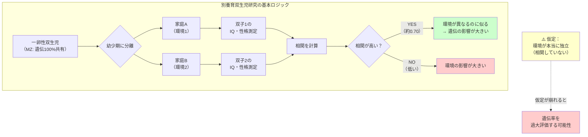

## 要約（Summary）

- ミネソタ双生児実験（MISTRA: Minnesota Study of Twins Reared Apart）は、幼少期に別々の家庭で育った双子を対象に、心理・生理検査を行い遺伝と環境の影響を分離しようとした研究（1979年頃〜）
- 主要な結果として「IQの分散の約70%が遺伝的変異と関連」「性格・気質なども一卵性別養育双生児が同居双生児と同程度に似る」ことが報告された
- この研究は遺伝率推定の代表例だが、環境の独立性仮定、サンプルの代表性、選択的配置などの方法論的課題も指摘されている

## 本文（Body）

### 背景・問題意識

「人間の特性（知能、性格、興味など）はどれだけ遺伝で決まり、どれだけ環境で決まるのか？」という古典的な nature vs nurture の問いに答えるため、行動遺伝学では双子研究が用いられてきた。

特に「別々に育てられた一卵性双生児」は、**遺伝は100%共有するが、家庭環境は共有しない**という理想的なケースに近く、遺伝要因を純粋に推定できる可能性がある。ミネソタ双生児実験は、この希少なサンプルを大規模に集めて体系的に調査した代表的研究である。

### アイデア・主張

**別養育双生児研究の核心的なロジックは、「遺伝が同じで環境が異なる双子が似ていれば、その類似は主に遺伝による」という推論である。**

ただし、この推論が成立するには「環境が本当に無相関（独立）である」という強い仮定が必要で、この仮定が崩れると遺伝率を過大評価する可能性がある。

#### 研究の基本設計

- **対象**: 幼少期に別々の家庭に分かれて育てられた一卵性双生児（MZ: monozygotic）と二卵性双生児（DZ: dizygotic）
- **評価**: 約1週間にわたる集中的な心理検査・生理検査（IQ、性格、興味、態度など）
- **サンプル数**: 100組超の別養育双子／三つ子（1990年論文時点）

#### 主要な結果

1. **IQの遺伝率**: 別養育MZ双生児のIQ相関が約0.70で、「IQ分散の約70%が遺伝的変異と関連」と推定
2. **性格・気質の遺伝率**: 複数の心理特性で、一卵性別養育双生児が一卵性同居双生児と同程度に類似
3. **effective environment仮説**: 遺伝の影響は直接ではなく、「その子が引き寄せる／作り出す環境」を通じて間接的に現れる

### 内容を視覚化するMermaid図

### 具体例・ケース

#### 典型的な引用のされ方

**教育分野**: 「IQの70%は遺伝で決まるから、教育の効果は限定的」という誤った解釈が生まれやすい（実際には遺伝率は集団内分散の説明であり、個人の運命ではない）

**採用・人事**: 「性格は遺伝で決まるから、環境を変えても無駄」という誤解（実際には非共有環境の影響も大きい）

**政策議論**: 「遺伝が重要だから、社会政策よりも個人責任」という極論（遺伝率は環境の分散に依存するため、環境を改善すれば遺伝率は変化しうる）

#### 研究の意義（正しい読み方）

- **遺伝要因の無視は非現実的**: 遺伝的差異が存在することを認識し、個人差を尊重する根拠になる
- **環境の効き方の理解**: 共有環境（同じ家庭）より非共有環境（個別の経験）が重要という示唆
- **遺伝×環境の相互作用**: effective environmentの概念により、遺伝が環境選択に影響するという動的な視点

### 反論・限界・条件

#### 主要な方法論的批判

**A. 環境の独立性仮定の問題**:
- 養子縁組の慣行により、似た社会経済状況（SES）に選択的に配置される可能性（選択的配置）
- 完全に接触ゼロではない、再会後の影響が混じる可能性
- この批判はJosephらが体系的に展開

**B. サンプルの代表性・選抜バイアス**:
- 別養育双子は希少で、参加は多くの場合ボランタリー（自己選択バイアス）
- 発見されやすい双子、研究参加に前向きな家庭に偏る可能性
- 国・時代・人種・養子縁組制度に依存

**C. 胎内環境の共有**:
- 双子は胎内環境（子宮内環境）や出生前の栄養・合併症リスクを共有
- これは「遺伝」でも「家庭環境」でもない第三の要因

**D. 環境レンジが狭いと遺伝率は上がる**:
- 研究参加家庭が平均より安定している場合、環境のばらつきが狭く、相対的に遺伝率が高く見える
- これは統計的なアーティファクトの可能性

#### 擁護側の反論

- 等環境仮説（EEA: Equal Environments Assumption）への批判は繰り返し検証されており、「決定的な反証にはなっていない」（Segalら）
- Bouchardは「批判が依拠するソースやバイアス列挙が論証として成立していない」と反論（2023年）
- TRA（Twins Reared Apart）研究は「建設的追試」であり、複数の研究で一貫した結果が得られている

## 関連ノート（Links）

- [[20251226060019-heritability-interpretation|遺伝率は集団の分散説明であり個人の運命ではない]] - 遺伝率の正しい解釈（このzettelの結果を解釈する前提）
- [[20251226060141-twin-study-methodological-critique|別養育双生児研究の方法論的課題：環境の独立性仮定]] - この研究への体系的批判
- [[20251226051416-survivorship-bias-unseen-failure|生存者バイアス：見えない失敗が判断を歪める認知の偏り]] - サンプルの選抜バイアス（参加しなかった双子、発見されなかった双子は見えない）
- [[20251223233758-power-seeking-self-selection-bias|権力への自己選択バイアス：不適切な人がリーダーになる構造]] - 自己選択バイアス（研究参加に前向きな家庭に偏る問題）
- [[20251215010144-bestseller-ranking-representativeness-bias|ベストセラーランキングの代表性バイアス]] - 代表性の問題（特定のサンプルから一般化する際の注意）

## To-Do / 次に考えること

- [ ] ACEモデル（遺伝A・共有環境C・非共有環境E）の数理的詳細を調べる
- [ ] Josephの批判論文を読み、具体的な論点を整理する
- [ ] effective environmentの概念を深掘りし、遺伝×環境相互作用の具体例を集める
- [ ] 他の双子研究（同居双生児研究、養子研究）との比較を整理する
