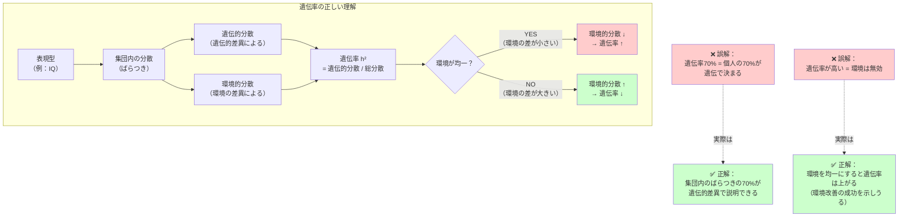

## 要約（Summary）

- 遺伝率（heritability）は「ある集団において、個人差（分散）のどれだけが遺伝的差異と統計的に対応するか」を示す概念であり、個人の特性が遺伝で何%決まるという意味ではない
- 「遺伝率が高い = 環境を変えても無駄」という解釈は誤りで、環境の分散が変われば遺伝率も変わる
- 遺伝率は集団・環境・時代に依存する相対的な指標であり、個人の可能性や介入の有効性を否定する根拠にはならない

## 本文（Body）

### 背景・問題意識

「IQの遺伝率は70%」といった数字は、しばしば「個人のIQの70%は遺伝で決まり、教育や環境の効果は30%しかない」と誤解される。この誤解は、教育政策、人事、社会政策において「遺伝だから仕方ない」という諦めや、環境改善の軽視につながる危険性がある。

遺伝率の正しい理解は、遺伝と環境の相互作用を適切に評価し、効果的な介入を設計するための前提である。

### アイデア・主張

**遺伝率は「個人の運命」ではなく「集団内の分散説明」である。**

具体的には、遺伝率 h² は次のように定義される：

**h² = 遺伝的分散 / 表現型の総分散**

これは「ある集団において、観測される個人差（分散）のうち、遺伝的差異で説明できる割合」を意味する。

#### 遺伝率の3つの重要な性質

**1. 集団レベルの統計量であり、個人には適用できない**

「IQの遺伝率が70%」は、「ある個人のIQの70%が遺伝で決まる」という意味ではない。それは「集団内のIQのばらつきのうち、70%が遺伝的差異で説明できる」という意味である。

個人Aの実際のIQが遺伝と環境のどちらにどれだけ依存するかは、遺伝率からは直接わからない。

**2. 環境の分散に依存する（環境が均一だと遺伝率は上がる）**

遺伝率は、分母の「表現型の総分散」に環境の分散も含まれるため、環境がどれだけばらついているかに依存する。

- **環境が均一な集団**（例：栄養状態が一様、教育機会が平等）では、環境による差が小さくなり、相対的に遺伝率が高く見える
- **環境が多様な集団**（例：貧困から富裕まで幅広い）では、環境による差が大きくなり、遺伝率は低く見える

つまり、「遺伝率が高い = 環境は無関係」ではなく、「環境のばらつきが小さい集団で測定された」可能性がある。

**3. 集団・時代・環境で変化する（固定的な値ではない）**

同じ形質（例：身長、IQ）でも、集団や時代によって遺伝率は異なる。

- 例：栄養状態が改善され、全員が十分な栄養を得られる社会では、身長の遺伝率は上がる（栄養による差がなくなるため）
- 例：教育機会が平等化されれば、IQの遺伝率は上がる可能性がある（教育格差による差がなくなるため）

### 内容を視覚化するMermaid図

### 具体例・ケース

#### よくある誤解と正しい解釈

**誤解1：「IQの遺伝率が70%だから、教育の効果は30%しかない」**

正しい解釈：遺伝率は集団内の差の説明であり、介入の効果とは別。例えば、栄養状態の改善により集団全体のIQを10ポイント上げることは可能で、その場合でも遺伝率は70%のまま（個人差の説明）かもしれない。

**誤解2：「身長の遺伝率が80%だから、栄養改善は意味がない」**

正しい解釈：栄養状態が改善されると、集団全体の平均身長が上がる（これは遺伝率とは無関係）。さらに、栄養が均一化すると、栄養による差がなくなり、遺伝率はむしろ上がる。つまり「遺伝率が高い = 環境介入が無効」ではない。

**誤解3：「遺伝率は固定的な値だ」**

正しい解釈：同じ形質でも、集団や時代によって遺伝率は変化する。例えば、19世紀の身長の遺伝率と現代の遺伝率は異なる（栄養環境の違いによる）。

#### 実際の適用例

**教育政策**：遺伝率が高いからといって教育を諦めるのではなく、「環境を均一化することで全員の底上げができる」という視点が重要。

**採用・人事**：遺伝率が高い特性でも、適切な環境（研修、メンタリング）で個人の成長を促進できる。遺伝率は「現在の環境でのばらつき」を説明するだけで、「変化の可能性」を否定しない。

**医療・公衆衛生**：疾患の遺伝率が高くても、環境要因（食事、運動、ストレス管理）の改善で発症リスクを下げられる場合が多い。

### 反論・限界・条件

#### 遺伝率の有用性

遺伝率は無意味な指標ではなく、以下の用途で有用：

- **育種・品種改良**：遺伝率が高い形質ほど、選抜育種の効果が大きい
- **遺伝的リスク評価**：疾患の遺伝率から、遺伝的要因の重要性を評価できる
- **研究の優先順位**：遺伝率が高い形質では、遺伝子探索の優先度が上がる

#### 注意すべき点

- **遺伝率は因果関係ではない**：遺伝率が高くても、遺伝子が直接的に形質を決めるわけではない（遺伝×環境の相互作用が重要）
- **広義と狭義の遺伝率**：広義の遺伝率（H²）は遺伝的要因全体、狭義の遺伝率（h²）は加算的遺伝効果のみを含む
- **測定の精度**：遺伝率の推定は、双子研究や養子研究の仮定に依存し、バイアスの可能性がある

## 関連ノート（Links）

- [[20251226055839-minnesota-twin-study-mistra|ミネソタ双生児実験：別養育双生児による遺伝と環境の分離]] - 遺伝率推定の具体的研究例
- [[20251226060020-twin-study-methodological-critique|別養育双生児研究の方法論的課題：環境の独立性仮定]] - 遺伝率推定の方法論的限界
- [[20251226051416-survivorship-bias-unseen-failure|生存者バイアス：見えない失敗が判断を歪める認知の偏り]] - 見えるデータだけで判断する危険性（環境の分散が狭いサンプルでの遺伝率推定）
- [[20251215010144-bestseller-ranking-representativeness-bias|ベストセラーランキングの代表性バイアス]] - サンプルの代表性と一般化の問題
- [[20251223233758-power-seeking-self-selection-bias|権力への自己選択バイアス：不適切な人がリーダーになる構造]] - 集団の選択バイアスが結論を歪める例

## To-Do / 次に考えること

- [ ] 広義の遺伝率（H²）と狭義の遺伝率（h²）の違いを詳しく調べる
- [ ] 遺伝率の推定方法（双子法、養子法、ゲノムワイド法）を比較する
- [ ] 「遺伝×環境相互作用」が遺伝率推定に与える影響を整理する
- [ ] 自分の関わるプロジェクトで、集団レベルの統計と個人レベルの判断を混同していないか確認する
