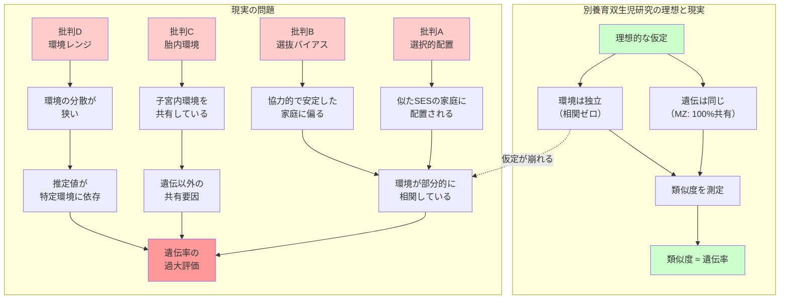

## 要約（Summary）

- 別養育双生児研究は「遺伝が同じで環境が異なる双子の類似度」から遺伝率を推定するが、その推論は「環境が本当に独立（無相関）である」という強い仮定に依存する
- 主要な批判として、**選択的配置**（似た家庭に配置される）、**サンプルの選抜バイアス**（参加が自発的）、**胎内環境の共有**、**環境レンジが狭い**（平均より安定した家庭に偏る）が指摘されている
- これらの問題は遺伝率を過大評価する方向に働く可能性があり、推定値の解釈には注意が必要

## 本文（Body）

### 背景・問題意識

別養育双生児（Twins Reared Apart: TRA）研究は、遺伝と環境を分離する理想的な「自然実験」として扱われてきた。しかし、その理想的な状況が実際に成立しているかは、方法論的に慎重な検証が必要である。

特に、**「環境が独立」という仮定が崩れると、双子の類似度が遺伝以外の要因（環境の類似）で説明できてしまい、遺伝率推定が歪む**という問題がある。

### アイデア・主張

**別養育双生児研究の推論は「環境の独立性仮定（環境が無相関）」に依存しており、この仮定が崩れると遺伝率を過大評価する可能性がある。**

#### 主要な方法論的課題（4つの批判）

**A. 選択的配置（Selective Placement）：似た環境に配置される問題**

養子縁組の実務では、養子先の選定に際して、養子の背景（生物学的親の社会経済状況など）を考慮する慣行がある。その結果、別々の家庭といっても、**似た社会経済状況（SES）、教育水準、価値観を持つ家庭に配置される**可能性がある。

- **結果**：環境が実際には部分的に相関し、双子が似る理由の一部が「環境の類似」で説明できる
- **影響**：遺伝率を過大評価する方向に働く
- **批判者**：Joseph（2001）らがこの点を体系的に批判

**B. サンプルの代表性・選抜バイアス（Selection Bias）：誰が研究に参加するか**

別養育双子は非常に希少で、研究参加は多くの場合ボランタリー（自発的）である。そのため、以下のバイアスが働く：

- **発見されやすい双子**：メディア報道や双子レジストリに登録された双子に偏る
- **研究参加に前向きな家庭**：協力的で安定した家庭に偏る可能性
- **国・時代・人種・養子縁組制度への依存**：特定の社会的文脈に限定される

これらは、サンプルが一般集団を代表しない（外的妥当性の問題）ことを意味し、推定値の一般化に限界がある。

**C. 胎内環境の共有（Prenatal Environment）：家庭環境以外の共有要因**

双子は別々の家庭で育っても、**胎内環境（子宮内環境）は共有**している。これには、栄養状態、母体のストレス、合併症リスクなどが含まれる。

- **結果**：一卵性双生児の類似度には、「遺伝」でも「家庭環境」でもない第三の要因（胎内環境）が含まれる
- **影響**：遺伝率推定に系統的バイアスが残る（純粋な遺伝効果とは言えない）
- **注意**：この問題は双子研究全般に共通する古典的な限界

**D. 環境レンジが狭いと遺伝率は上がる（Range Restriction）**

研究参加家庭が平均より安定している場合、**環境のばらつき（分散）が狭く**なる。遺伝率は「遺伝的分散 / 総分散」なので、環境の分散が小さいと相対的に遺伝率が高く見える。

- **例**：栄養状態が一様に良好、教育機会が均等、虐待やネグレクトのリスクが低い
- **結果**：推定された遺伝率は、その狭い環境レンジでの値であり、一般集団（環境が多様）での遺伝率とは異なる可能性
- **関連**：遺伝率の定義と密接に関連（遺伝率は環境の分散に依存する）

### 内容を視覚化するMermaid図

### 具体例・ケース

#### 具体的な批判の展開（Josephの再評価）

行動遺伝学者Joseph（2001）は、ミネソタ双生児研究を含む複数のTRA研究を再評価し、以下の点を指摘：

- **選択的配置の証拠**：養子縁組記録の分析により、双子が似た家庭に配置される傾向が確認された
- **接触の問題**：「完全に別々」と報告されたケースでも、再会後の接触や影響が混じる可能性
- **仮定の非現実性**：環境が無相関という仮定は、実務的にほぼ成立しない

#### 批判への反論（Bouchardらの擁護）

研究側（Bouchardら）は、批判に対して次のように反論：

- **等環境仮説（EEA）の検証**：一卵性双生児が「特別扱い」されることが類似度を説明するという批判に対し、既存研究ではEEAを直接検証しており、決定的な反証にはなっていない（Segalら）
- **建設的追試**：複数の独立したTRA研究で一貫した結果が得られており、特定の研究のバイアスだけでは説明できない
- **批判の論証不足**：Josephの批判が依拠するソースやバイアス列挙が、論証として成立していない（Bouchard, 2023）

#### 実務的な含意

これらの批判は、「TRA研究が無意味」ということではなく、**推定値の解釈に慎重さが必要**ということを示す：

- 遺伝率の点推定値（例：70%）を固定的・絶対的なものとして扱わない
- 推定値の不確実性（信頼区間）を考慮する
- 特定の集団・環境での推定値であることを認識し、一般化に注意する

### 反論・限界・条件

#### 批判の限界

批判側の主張にも限界がある：

- **完全な環境独立は不可能**：どんな研究でも、ある程度の環境相関は避けられない（問題は「どの程度影響するか」）
- **複数研究の一貫性**：独立した複数のTRA研究で類似の結果が得られている事実は、単純なバイアスだけでは説明しにくい
- **代替手法との整合性**：養子研究、ゲノムワイド研究など他の手法でも、遺伝要因の重要性を示唆する結果が得られている

#### 建設的な読み方

TRA研究の価値は、「遺伝率の正確な点推定」ではなく、**「遺伝要因が無視できないことの示唆」**と捉えるべきである。

批判を踏まえた上で、複数の手法（双子法、養子法、ゲノムワイド法）を組み合わせて、遺伝と環境の影響を総合的に評価することが重要。

## 関連ノート（Links）

- [[20251226055839-minnesota-twin-study-mistra|ミネソタ双生児実験：別養育双生児による遺伝と環境の分離]] - 批判対象となる研究の概要
- [[20251226060019-heritability-interpretation|遺伝率は集団の分散説明であり個人の運命ではない]] - 環境レンジと遺伝率の関係（批判Dと直結）
- [[20251226051416-survivorship-bias-unseen-failure|生存者バイアス：見えない失敗が判断を歪める認知の偏り]] - サンプル選択バイアスの一般的構造（批判Bと関連）
- [[20251223233758-power-seeking-self-selection-bias|権力への自己選択バイアス：不適切な人がリーダーになる構造]] - 自己選択バイアス（研究参加に前向きな家庭に偏る問題）
- [[20251215010144-bestseller-ranking-representativeness-bias|ベストセラーランキングの代表性バイアス]] - サンプルの代表性問題（批判Bと関連）

## To-Do / 次に考えること

- [ ] Josephの批判論文（2001）を原文で読み、具体的な論点を整理する
- [ ] Bouchardの反論（2023）を読み、双方の主張を公平に評価する
- [ ] 等環境仮説（EEA）の検証方法を調べる
- [ ] 養子研究、ゲノムワイド研究など他の手法と比較し、遺伝率推定の頑健性を評価する
- [ ] 自分の研究や実務で、環境の独立性仮定が暗黙に置かれていないか確認する
