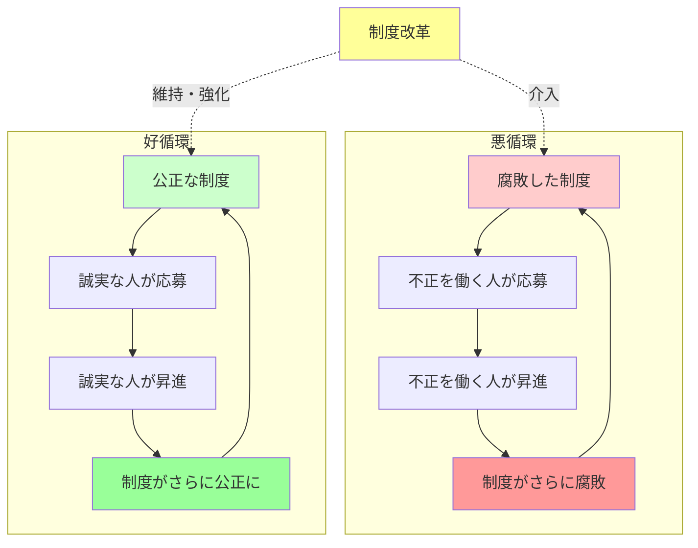

## 要約（Summary）

- 腐敗した制度は腐敗した人材を引き寄せ、公正な制度は公正な人材を引きつける
- インドとデンマークの比較研究で、制度の質が応募者の倫理性を決定することが実証された
- 権力の問題は個人ではなく制度設計にあり、制度改革が好循環・悪循環を生む

## 本文（Body）

### 背景・問題意識

「権力は腐敗する」という格言は、権力を握った人が腐敗すると考えがちだ。しかし、もう一つの可能性がある。**腐敗した制度そのものが、腐敗した人を引き寄せている**のではないか？もしそうなら、権力者個人を責めるよりも、制度の質を改善することが根本的な解決策になる。

### アイデア・主張

制度の質と人材の質には**自己強化的な相関関係**がある：

1. **腐敗した制度は腐敗した人を引きつける**: 不正が横行する組織では、不正を働くことに抵抗がない人ほど応募・昇進する
2. **公正な制度は公正な人を引きつける**: 透明性が高く倫理的な組織では、誠実な人が働きたいと思う
3. **自己強化メカニズム**: いったん悪循環（または好循環）が始まると、制度と人材の質が互いに強化し合う

**インドとデンマークの実験的証拠**：
- インドで学生にサイコロを振らせ、出た目を自己申告させる実験を実施
- 不正（大きい目を虚偽申告）をした学生ほど、腐敗した行政職を志望
- デンマークで同じ実験をすると、正直に申告した学生ほど公務員を志望
- 腐敗した制度が腐敗した人を、清廉な制度が清廉な人を引きつけることが実証された

### 内容を視覚化するMermaid図

### 具体例・ケース

**インドの腐敗した行政**：
- 賄賂や不正が日常化している組織
- サイコロ実験で不正をした学生が、そのような職を志望
- 「どうせ不正をしても問題ない」という期待が人材を引きつける

**デンマークの透明な公務員制度**：
- 汚職ランキングで世界最上位の清廉性
- 正直な学生ほど公務員になりたがる
- 「公正に働ける環境」が誠実な人を引きつける

**企業での応用**：
- 内部告発を保護し、不正を厳格に処罰する企業文化があれば、倫理的な人材が集まる
- 逆に、不正が見逃される文化があれば、不正を働く人が昇進しやすい

### 反論・限界・条件

- すべての人が制度に完全に影響されるわけではない（個人の倫理観も重要）
- 制度改革には時間がかかり、既得権益の抵抗がある
- 制度の質を測定すること自体が難しい場合がある（透明性、説明責任の指標が必要）
- この理論は「権力が人を腐敗させる」メカニズムを否定するものではなく、補完する

## 関連ノート（Links）

- [[20251223233758-power-seeking-self-selection-bias|権力への自己選択バイアス：不適切な人がリーダーになる構造]] - 自己選択バイアスの基本メカニズム
- [[20251223234018-system-design-prevent-power-corruption|権力腐敗を防ぐシステム設計の3要素：選抜・責任・監視]] - 制度設計による対策
- [[20251226035625-stanford-prison-experiment-critical-revaluation|スタンフォード監獄実験の批判的再評価]] - 状況が人を変えるメカニズムの批判的検証
- [[20251215095358-tag-enforcement-governance|作成時タグ強制によるガバナンス戦略]] - ガバナンスと制度設計
- [[20251226035919-heritability-population-variance|遺伝率は集団の分散説明であり個人の運命ではない]] - 集団レベルの分析と個人レベルの誤謬

## To-Do / 次に考えること

- [ ] 自社の採用・昇進プロセスが、どのような人材を引きつけているか分析する
- [ ] 透明性・説明責任を高める具体的な施策（内部告発制度、多面評価等）を検討
- [ ] 制度の質を測定する指標（汚職認識指数、従業員満足度調査等）を調査
