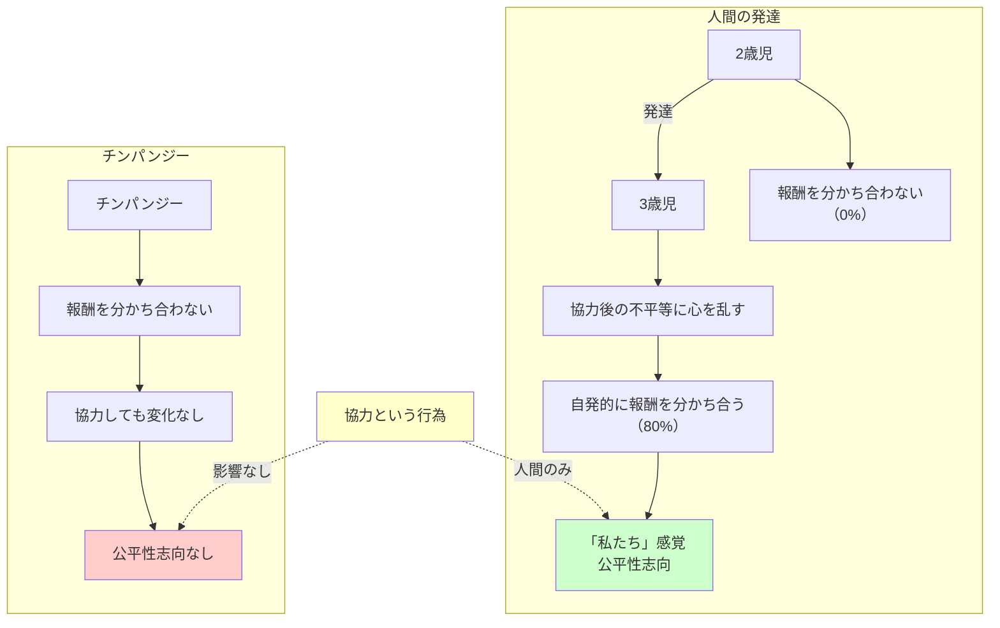

## 要約（Summary）

- 人間は3歳になると、協力した後の不平等な報酬配分に心を乱し、自発的に報酬を分かち合う
- チンパンジーには見られないこの行動は、人間特有の「私たち」という感覚と公平性志向を示す
- 協力本能と公平性は、人間が大規模な社会を形成する上で重要な進化的基盤

## 本文（Body）

### 背景・問題意識

人間は生まれつき利己的なのか、それとも協力的なのか？この問いに対して、発達心理学者マイケル・トマセロの実験が重要な洞察を提供する。幼児の行動を観察することで、社会化される前の「生の」人間性を理解できる可能性がある。

### アイデア・主張

**人間には生まれつき協力本能と公平性志向がある**：

1. **3歳で公平性が発達**: トマセロの実験で、3歳児の80%が、協力した後に不平等な報酬（3対1）を受け取ると、自発的に報酬を分かち合い対等にした
2. **2歳児は分かち合わない**: 2歳児は誰も報酬を分かち合わなかった。公平性は学習と発達によって現れる
3. **協力が「私たち」感覚を生む**: 協力という行為が「私たち」という感覚を生じさせ、それに導かれてパートナーも平等に報われるべきと感じる
4. **チンパンジーとの決定的な違い**: 同じ実験をチンパンジーで行うと、分かち合いは稀で、設定による違いもなかった。協力しても公平性は生まれない

**人間特有の進化的特徴**：
- 協力本能と公平性志向は、人間が大規模な集団を形成し、複雑な社会を築く基盤
- 「私たち」という感覚は、見知らぬ他者とも協力できる能力につながる

### 内容を視覚化するMermaid図

### 具体例・ケース

**トマセロの実験設定**：
1. **設定1（運任せ）**: 子どもが部屋に入ると、幸運な子は報酬3つ、不運な子は1つ → 誰も分かち合わない
2. **設定2（共同作業）**: 2人がロープを引っ張る → 一部の子が分かち合う
3. **設定3（協力+不平等）**: 2人が平等に協力して課題に取り組むが、報酬は3対1 → 3歳児の80%が自発的に分かち合う

**実社会への示唆**：
- チームで仕事をした後、不公平な評価や報酬があると、人は強く不満を感じる
- 協力的なプロジェクトでは、成果の公平な分配が重要（ボーナス、昇進、認知）
- 「私たち」感覚を醸成することが、組織の協力文化を強化する

### 反論・限界・条件

- 3歳児の行動が「本能」なのか「学習」なのかは議論の余地がある（親からの教え、社会化の影響）
- 文化による違いがある可能性（個人主義的文化 vs 集団主義的文化）
- 公平性志向があっても、大人になると利己的な行動が増える（社会化、競争環境の影響）
- チンパンジーも一定の互恵性や協力は見せる（完全に利己的ではない）

## 関連ノート（Links）

- [[20251226035919-heritability-population-variance|遺伝率は集団の分散説明であり個人の運命ではない]] - 遺伝と環境の相互作用
- [[20251223233758-power-seeking-self-selection-bias|権力への自己選択バイアス：不適切な人がリーダーになる構造]] - 協力的でない人が権力を求める問題
- [[20251226082726-institutional-quality-attracts-matching-people|制度の質が引き寄せる人材の質：腐敗の自己強化メカニズム]] - 制度が協力を促進するか抑制するか
- [[20251220051210-computer-cannot-be-accountable|コンピューターは説明責任を負えない]] - 責任と倫理の問題
- [[20251215004321-ai-output-quality-check-responsibility|AI生成コンテンツの品質チェック責任]] - 協力と責任の関係

## To-Do / 次に考えること

- [ ] 自社のチーム文化が「私たち」感覚を醸成しているか評価する
- [ ] 協力的なプロジェクトでの報酬・評価の公平性を見直す
- [ ] 公平性を重視する採用・育成プロセスを設計する
- [ ] 文化人類学の研究で、公平性志向の文化差を調査する
