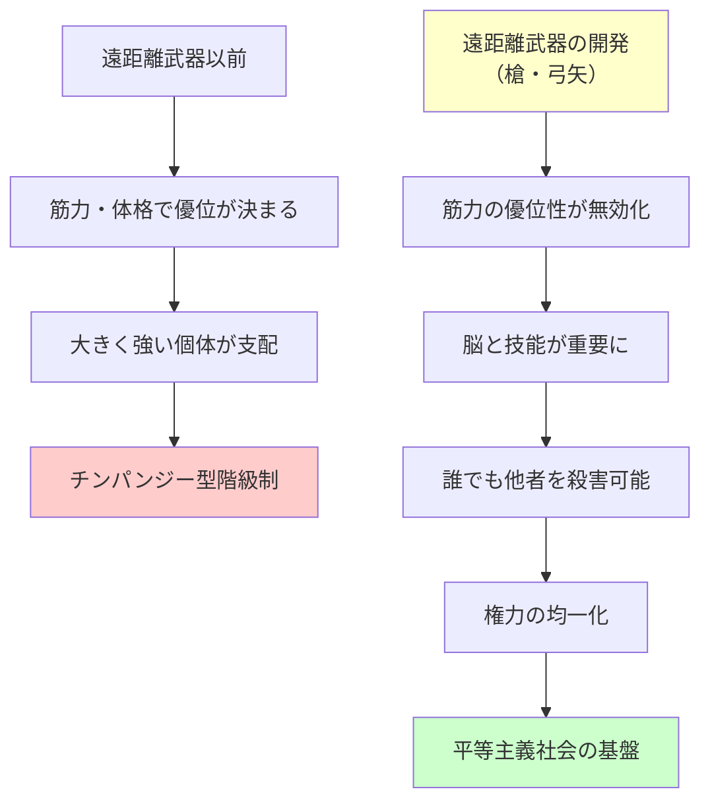

## 要約（Summary）

- 遠距離武器（槍、弓矢などの投射物）の開発により、体格や筋力による優位性が無効化された
- 殺害のカギが筋力から脳と技能に移行し、権力をめぐる争いで優劣が均一化された
- この技術的変化が、チンパンジー型の専制政治から人間の平等主義社会への移行を可能にした

## 本文（Body）

### 背景・問題意識

チンパンジーは明確な階級制を持ち、体格の大きいオスが支配する。一方、人間の狩猟採集社会は驚くほど平等主義的だった。なぜ人間はチンパンジーと異なる道を歩んだのか？その答えのカギを握るのが**遠距離武器の開発**である。

### アイデア・主張

**遠距離武器が権力の物理的基盤を無効化した**：

1. **筋力と体格の優位性が消滅**: 槍や弓矢があれば、小柄な個人でも大柄な支配者を遠くから殺害できる
2. **脳と技能が重要に**: 殺害のカギが筋力から、武器を作る技能や戦略的思考に移行
3. **権力の均一化**: 誰もが他者を殺害できる能力を持つことで、優劣が大幅に均一化された
4. **リーダー志望者への警告**: 権力を握ろうとする者は、集団の誰からでも脅かされる可能性が生まれた

**技術革新が社会構造を変えた**：
- 遠距離武器は単なる道具ではなく、**社会の権力構造を根本から変える技術革新**だった
- この変化が、後述の「逆順位制」を可能にし、人間社会の平等主義の基盤となった

### 内容を視覚化するMermaid図

### 具体例・ケース

**狩猟採集社会での平等主義**：
- !Kung族やHadza族などの狩猟採集民は、驚くほど平等主義的
- リーダーはいても、強制力は持たず、合意形成に基づく
- 遠距離武器があるため、誰もが支配者を殺害できる潜在的能力を持つ

**現代への示唆**：
- 技術革新が権力構造を変える（インターネットが情報の権力を分散させたように）
- 暴力の独占（警察、軍隊）が国家の権力基盤（ウェーバーの定義）
- 遠距離武器を持つ市民と政府の関係（銃規制の議論にも関連）

**歴史的類似**：
- 印刷技術が教会の情報独占を崩壊させた
- 核兵器が大国間の権力均衡を生んだ（相互確証破壊）

### 反論・限界・条件

- 遠距離武器だけが平等主義の原因ではない（言語、協力、文化の役割も重要）
- すべての狩猟採集社会が完全に平等だったわけではない（一部に階級制が存在）
- 遠距離武器があっても、後に階級制社会が台頭した（農業革命後）
- 技術決定論に陥る危険性（技術が社会を一方的に決定するわけではない）

## 関連ノート（Links）

- [[20251226082846-human-cooperation-instinct-fairness-development|人間の協力本能と3歳での公平性の発達]] - 協力と公平性が平等主義社会を支える
- [[20251223233758-power-seeking-self-selection-bias|権力への自己選択バイアス：不適適な人がリーダーになる構造]] - 権力を求める人への制約がなくなった現代社会
- [[20251226082726-institutional-quality-attracts-matching-people|制度の質が引き寄せる人材の質：腐敗の自己強化メカニズム]] - 制度が権力構造を決める
- [[20251215102820-domain-knowledge-as-moat|ドメイン知識と業界知識が開発者の唯一の持続的競争優位（護城河）]] - 技術革新による競争優位の変化
- [[20251214235033-claude-md-strategic-design-principles|CLAUDE.mdファイルの戦略的設計原則]] - 設計原則と構造の重要性

## To-Do / 次に考えること

- [ ] 現代の技術革新（AI、ブロックチェーン等）が権力構造をどう変えるか考察
- [ ] 遠距離武器と逆順位制の関係を詳しく調査
- [ ] 農業革命後に階級制が復活したメカニズムを調査（次のzettelで扱う）
- [ ] 技術決定論 vs 社会構築主義の議論を整理
