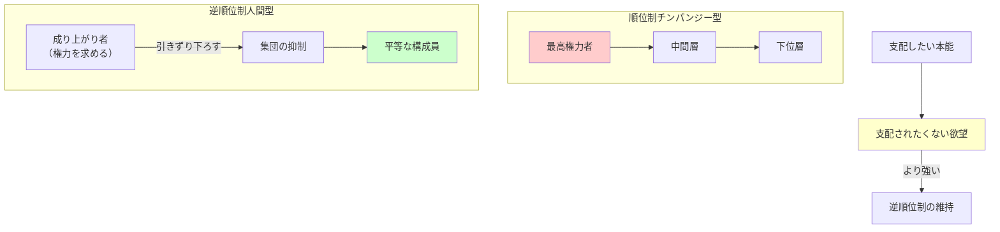

## 要約（Summary）

- 逆順位制は、集団が「成り上がり者」を抑制し、権力の平等を維持する社会構造
- 「支配したい」本能よりも「支配されたくない」欲望のほうが強く、これが平等主義を生む
- 遠距離武器により可能になったこの構造が、人間社会の平等主義の基盤となった

## 本文（Body）

### 背景・問題意識

チンパンジーは急勾配のピラミッド型階級制（順位制）を持つ。一方、人間の狩猟採集社会は驚くほど平らな社会構造を持っていた。この違いを説明するために、人類学者クリストファー・ベームが提唱したのが**逆順位制（reverse dominance hierarchy）**という概念である。

### アイデア・主張

**逆順位制とは、集団が権力を求める個人を抑制する社会構造**：

1. **順位制 vs 逆順位制**:
   - **順位制（チンパンジー型）**: 急勾配のピラミッド、最高権力者が頂点から他の全員に君臨
   - **逆順位制（人間型）**: 平らな線、誰もがおおむね平等

2. **成り上がり者の抑制**: 権力を握ろうとする者（「アップスタート」）は、集団に支配され、他の全員と同じレベルに引きずり下ろされる

3. **支配の逆説**: 誰もが支配しようとするが、支配できないときには平等であることのほうを好む

4. **支配されたくない欲望が勝る**: 支配したいという本能よりも、**誰か他の人に支配されたくないという、より強い欲望**のほうが優った

**逆順位制が機能する条件**：
- 遠距離武器により、誰もが権力者を脅かせる能力を持つ
- 集団の協力により、成り上がり者を抑制できる
- 公平性志向と協力本能が社会規範として機能

### 内容を視覚化するMermaid図

### 具体例・ケース

**狩猟採集社会での実践**：
- !Kung族: 狩りで大きな獲物を仕留めた人を賞賛せず、むしろ謙遜を強要
- 自慢する者や支配的な態度を取る者は、集団から嘲笑や排除を受ける
- 極端な場合、成り上がり者は集団によって殺害されることもあった

**現代社会での痕跡**：
- 民主主義: 権力の分散と相互監視（三権分立、任期制限）
- 組織のフラット化: 階層を減らし、意思決定を分散
- 反権威主義的な文化: 「出る杭は打たれる」という日本の諺

**逆順位制が崩壊する場合**：
- 農業革命後、土地の支配が重要になると逆順位制が維持できなくなった
- 現代の企業や政治では、成り上がり者を抑制する集団の力が弱い

### 反論・限界・条件

- すべての狩猟採集社会が完全に平等だったわけではない（一部に階級制が存在）
- 逆順位制は小規模集団でしか機能しない（大規模社会では階級制が必要）
- 「支配されたくない」欲望が常に勝つわけではない（条件次第で支配を受け容れる）
- 現代社会で逆順位制を復活させることは困難（大規模・複雑な社会では階級制が不可欠）

## 関連ノート（Links）

- [[20251226083009-ranged-weapons-power-equalization|遠距離武器が平等主義社会を可能にした理由]] - 逆順位制を可能にした技術的基盤
- [[20251226082846-human-cooperation-instinct-fairness-development|人間の協力本能と3歳での公平性の発達]] - 逆順位制を支える協力本能と公平性
- [[20251223233758-power-seeking-self-selection-bias|権力への自己選択バイアス：不適切な人がリーダーになる構造]] - 逆順位制が崩壊した現代社会の問題
- [[20251226082726-institutional-quality-attracts-matching-people|制度の質が引き寄せる人材の質：腐敗の自己強化メカニズム]] - 制度設計と権力構造
- [[20251223234018-system-design-prevent-power-corruption|権力腐敗を防ぐシステム設計の3要素：選抜・責任・監視]] - 現代版の逆順位制メカニズム

## To-Do / 次に考えること

- [ ] 民主主義制度が逆順位制の現代版としてどう機能しているか分析
- [ ] 組織のフラット化が逆順位制の原理をどう応用しているか調査
- [ ] 大規模社会で逆順位制的メカニズムを維持する方法を検討
- [ ] 農業革命後に逆順位制が崩壊したメカニズムを詳しく調査（次のzettelで扱う）
