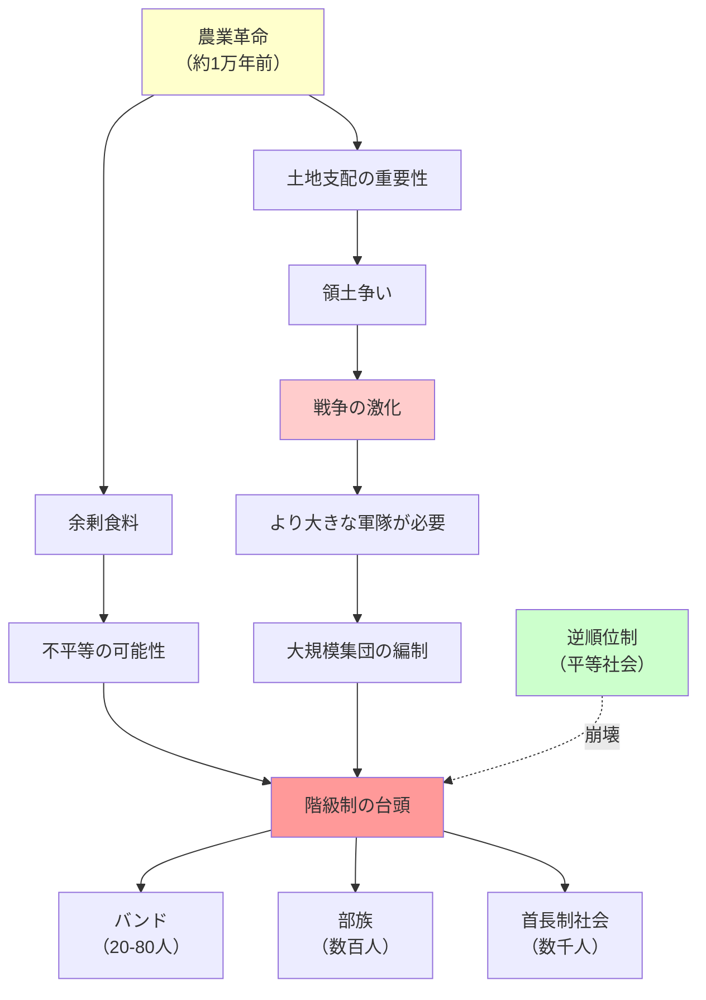

## 要約（Summary）

- 人類史の大半は平等主義社会だったが、約1万年前から急速に階級制社会が台頭した
- 農業（食料余剰と土地支配）と戦争（大規模軍隊の必要性）が組み合わさり、階級制を不可避にした
- 平らな社会は小規模集団でしか維持できず、大規模社会では階級制が歴史の鉄則

## 本文（Body）

### 背景・問題意識

人間は約30万年前に誕生し、そのほとんどの期間を平等主義的な狩猟採集社会で過ごした。しかし約1万年前、農業革命を境に、急速に階級制社会が台頭した。なぜこの変化が起こったのか？ピーター・ターチンは「クリオダイナミクス（歴史動力学）」という新分野で、この謎に数学とデータで答えようとした。

### アイデア・主張

**「戦争と豆」理論：農業と戦争が階級制を生んだ**：

1. **農業の影響**:
   - 余剰食料が不平等を可能にした（溜め込む人が出現）
   - より大きな人口集団を支えられるようになった
   - 土地支配が重要になった（環境制限理論：耕作地が広ければ生産能力も高まる）

2. **戦争の影響**:
   - 遠距離武器の普及により、より多くの兵士を持つ社会が圧倒的に有利になった
   - 数百人の軍隊を編制できる首長制社会が、20〜80人のバンドを圧倒
   - 集団淘汰：勇敢な戦士だらけの軍隊が、臆病な戦士だらけの軍隊に勝つ

3. **階級制の必然性**:
   - ある程度の数の人を集めると、階級制と支配が**必ず**現れる（歴史の鉄則）
   - バンド → 部族 → 首長制社会という段階的移行
   - 平らな社会は小規模集団でしか維持できない

**戦争と農業の相乗効果**：
- 農業が余剰と人口を生み、戦争が大規模組織を要求
- 大規模組織は階級制なしには機能しない
- 両者が組み合わさって、平等社会から階級社会への移行を引き起こした

### 内容を視覚化するMermaid図

### 具体例・ケース

**農業革命前（狩猟採集社会）**：
- 小規模バンド（20〜80人）
- 移動生活で余剰を溜め込めない
- 逆順位制で平等を維持

**農業革命後（階級制社会）**：
- 定住により土地が重要に
- 食料余剰を溜め込む個人・家族が出現
- 大規模な軍隊が編制され、戦争が激化
- 首長や王が権力を握る

**歴史的証拠**：
- メソポタミア、エジプト、インダス、中国で、農業革命後に急速に階級制国家が形成
- ジャレド・ダイアモンド『銃・病原菌・鉄』が詳細に記述

**現代への示唆**：
- 大規模社会では階級制が不可避（完全な平等は非現実的）
- 問題は階級制の有無ではなく、**どのような階級制を設計するか**
- 階級制を悪用する人を防ぎ、協力を促進する制度設計が重要

### 反論・限界・条件

- 農業革命が起こっても、すべての社会が階級制になったわけではない（地理的条件の影響）
- 戦争だけが階級制の原因ではない（交易、宗教、技術革新も重要）
- 階級制は必ずしも悪ではない（協力と組織化を可能にする手段でもある）
- 「戦争と豆」は統一理論ではなく、複数要因の相互作用として理解すべき

## 関連ノート（Links）

- [[20251226083130-reverse-dominance-hierarchy|逆順位制：支配されたくない欲望が生む平等社会]] - 農業革命前の平等主義社会
- [[20251226083009-ranged-weapons-power-equalization|遠距離武器が平等主義社会を可能にした理由]] - 遠距離武器と戦争の関係
- [[20251226082846-human-cooperation-instinct-fairness-development|人間の協力本能と3歳での公平性の発達]] - 協力本能が階級制でどう変化したか
- [[20251226082726-institutional-quality-attracts-matching-people|制度の質が引き寄せる人材の質：腐敗の自己強化メカニズム]] - 階級制における制度設計の重要性
- [[20251223234018-system-design-prevent-power-corruption|権力腐敗を防ぐシステム設計の3要素：選抜・責任・監視]] - 階級制社会での権力腐敗への対策

## To-Do / 次に考えること

- [ ] ジャレド・ダイアモンド『銃・病原菌・鉄』を読み、詳細を確認
- [ ] 現代の大規模社会で、階級制の弊害を最小化する制度設計を調査
- [ ] 階級制が協力を促進する側面と抑制する側面を整理
- [ ] ピーター・ターチンのクリオダイナミクスについて詳しく調査
