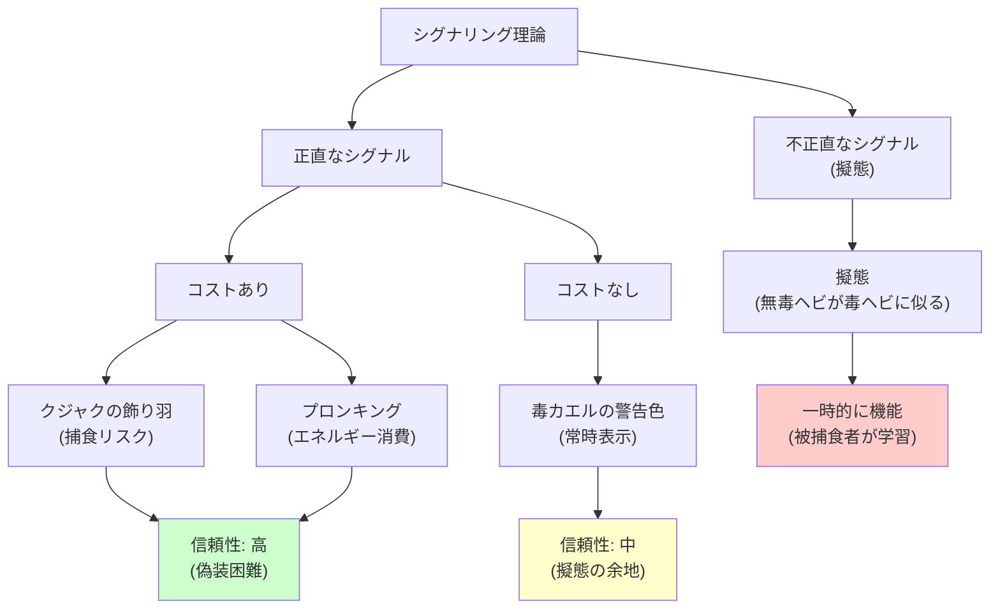

## 要約（Summary）

- シグナリング理論は、生物が情報を効率的に伝達するために進化した仕組みを説明する
- **正直なシグナル**は、送り手の真の能力や状態を正確に反映する（例：スプリングボックのプロンキング、毒カエルの色）
- シグナルは**コストの有無**によって分類され、コストがかかるシグナル（クジャクの飾り羽）は偽装が困難なため信頼性が高い

## 本文（Body）

### 背景・問題意識

動物界では、個体間のコミュニケーションが生存と繁殖に不可欠である。しかし、相手の能力や意図を確認するには通常、多大なコストがかかる。例えば、チーターがスプリングボックの走力を確認するには実際に追いかける必要がある。

シグナリング理論は、この問題を解決するために生物が進化させた**情報伝達の仕組み**を説明する。重要なのは、シグナルが**正直**であるか、そして**コスト**がかかるかどうかである。

### アイデア・主張

シグナルは以下の2つの軸で分類できる：

#### 1. 正直なシグナル vs 不正直なシグナル

- **正直なシグナル**：送り手の真の能力や状態を正確に反映する
  - 例：スプリングボックのプロンキング（跳躍力は走力と相関）
  - 例：毒カエルの鮮やかな色（実際に毒を持っている）

- **不正直なシグナル**：実際の能力や状態を偽装する
  - 例：擬態（無毒なヘビが毒ヘビに似た模様を持つ）

#### 2. コストがかかるシグナル vs コストがかからないシグナル

- **コストがかかるシグナル**：シグナルを発すること自体に代償がある
  - 例：クジャクの飾り羽（目立つため捕食者に狙われやすい）
  - 例：プロンキング（エネルギーを消費する）
  - **偽装が困難**なため、信頼性が高い

- **コストがかからないシグナル**：シグナルを発してもリスクやコストがない
  - 例：毒カエルの警告色（常に表示されている）
  - **偽装が容易**なため、進化的に擬態が発生しやすい

### 内容を視覚化するMermaid図

### 具体例・ケース

**動物界の例**：
- **スプリングボックのプロンキング**：宙に高く跳ねることで、チーターに「自分は捕まえるのが困難だ」と伝える。跳躍力は走力と相関するため正直なシグナル。エネルギーを消費するためコストがかかる
- **クジャクの飾り羽**：オスの遺伝的品質を示す正直なシグナル。しかし飾り羽のせいで動きが鈍り、捕食されやすくなる（コスト大）
- **毒カエルの鮮やかな色**：「食べたら毒に中る」という警告。実際に毒を持っているため正直。常に表示されているためコストなし

**人間社会への応用**：
- **学位や資格**：能力を示すコストがかかる正直なシグナル（取得に時間とお金がかかる）
- **高級品の誇示**：富や地位を示すコストがかかるシグナル（ただし、必ずしも能力を反映しない）
- **パワーポーズ**：自信があるように見せるコストがかからないシグナル（実際の能力とは無関係）

### 反論・限界・条件

- **環境によってシグナルの有効性は変化する**：捕食者がいない環境では、クジャクの飾り羽のコストは低下する
- **受信者の学習**：擬態（不正直なシグナル）は、被捕食者が学習すると効果を失う
- **人間社会では文化的要因が複雑化**：何が「正直なシグナル」かは文化によって異なる（学歴の価値は社会ごとに違う）
- **コストがかかるシグナルでも偽装は可能**：人間は借金をしてでも高級品を買い、富裕層を装うことができる

## 関連ノート（Links）

- [[20251226092950-conspicuous-consumption-social-capital|誇示消費による社会関係資本の獲得]] - 人間社会におけるシグナリングの応用
- [[20251226093115-evolutionary-mismatch-leadership|進化的ミスマッチとリーダーシップ選択]] - シグナルの誤読が引き起こす問題
- [[20251226093245-evolutionary-leadership-theory|進化的リーダーシップ理論]] - 身体的特性がリーダー選択のシグナルとして機能する理由
- [[20251226055839-minnesota-twin-study-mistra|ミネソタ双生児実験：別養育双生児による遺伝と環境の分離]] - 遺伝的シグナルと環境の相互作用
- [[20251223233758-power-seeking-self-selection-bias|権力への自己選択バイアス：不適切な人がリーダーになる構造]] - 表面的シグナルで人を判断する問題

## To-Do / 次に考えること

- [ ] 自社の採用プロセスで、コストがかかる正直なシグナル（実績、作品、試用期間での評価）を重視しているか確認
- [ ] 学歴や肩書きといったシグナルに過度に依存していないか検討
- [ ] 面接でのパワーポーズや自信といった「コストなしシグナル」に惑わされていないか振り返る
