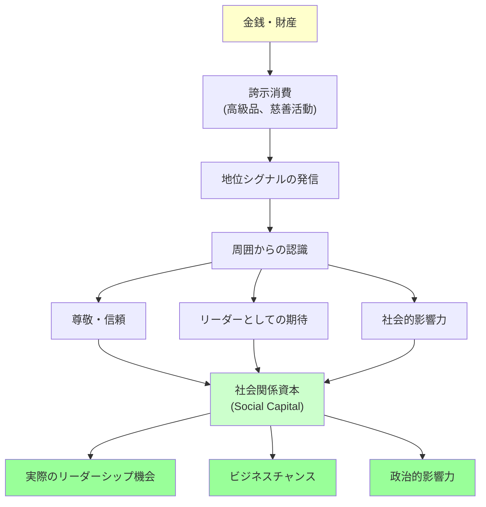

## 要約（Summary）

- **誇示消費**（Conspicuous Consumption）は、高価な財を派手に見せることで地位や富を誇示する行為（ヴェブレン）
- ブルデューは、誇示消費を「金銭を社会関係資本に変換する合理的行為」と再解釈した
- 人間は本能的に富の誇示行動を通じて地位を伝達し、リーダーとして認識されやすくなる

## 本文（Body）

### 背景・問題意識

なぜ富裕層は高級車や高価な時計を身につけるのか？　なぜ慈善家は巨額の寄付を公表するのか？　これらは一見、無駄な支出に見えるが、社会学・経済学の観点からは**地位獲得の合理的戦略**として理解できる。

19世紀末の経済学者ソースタイン・ヴェブレンと、20世紀の社会学者ピエール・ブルデューは、この現象を「誇示消費」として理論化した。

### アイデア・主張

#### ヴェブレンの誇示消費論（1899年）

ヴェブレンは、富裕層が**機能以上に高価な財を購入する行為**を「誇示消費（Conspicuous Consumption）」と名づけた。

- 目的：自分の経済的地位を他者に見せつけること
- 例：高級車、高級時計、豪邸、高価な服
- メカニズム：「これだけの無駄遣いができる」ことが、経済的余裕の証明になる

#### ブルデューの再解釈（20世紀）

ブルデューは、誇示消費を単なる「見栄」ではなく、**金銭を社会関係資本（Social Capital）に変換する合理的行為**として再評価した。

- **社会関係資本**：人脈、信頼、社会的地位、影響力などの無形資産
- **変換メカニズム**：高価な財の誇示 → 周囲からの尊敬や信頼 → リーダーシップや影響力の獲得
- **具体例**：慈善事業への巨額寄付は、金銭を「社会的尊敬」「リーダーとしての地位」に変換する

#### 本能的な誇示行動

人間は**意識せずに**富の誇示行動を行う。これは、動物がプロンキング（跳躍による能力誇示）を意識せずに行うのと同じである。

- 私たちは「外見が人生の階段を上るのを助ける」ことを本能的に理解している
- 高級品の所有や派手な慈善活動は、自動的に地位シグナルとして機能する

### 内容を視覚化するMermaid図

### 具体例・ケース

**ビル・ゲイツの慈善活動**：
- ビル&メリンダ・ゲイツ財団に巨額の寄付を行い、公衆衛生や教育に投資
- 結果として、世界的なオピニオンリーダーとしての地位を獲得
- ジェフ・ベゾスよりも社会的尊敬が高い（ブライアン・クラースの指摘）
- これは金銭を社会関係資本に変換した好例

**高級車の所有**：
- ロレックスの腕時計、レイバンのサングラス、高級車などは、機能以上に「地位の証明」として機能
- 周囲から「成功者」と認識され、信頼やビジネスチャンスが増える

**企業の社会貢献活動（CSR）**：
- 企業が環境保護や社会貢献に資金を投じる行為も、誇示消費の一種
- ブランドイメージ向上 → 顧客の信頼 → 売上増加という変換

### 反論・限界・条件

- **すべての誇示消費が成功するわけではない**：文化や文脈によって、何が「地位シグナル」になるかは異なる
- **偽装可能**：借金をしてでも高級品を買い、富裕層を装うことは可能（ただし長期的には持続不可能）
- **倫理的問題**：富の誇示が格差を拡大し、社会的分断を招く可能性
- **効果の限界**：地位シグナルだけでは、実際のリーダーシップ能力を証明できない

## 関連ノート（Links）

- [[20251226092824-honest-signaling-theory-cost|シグナリング理論における正直なシグナルとコスト]] - 誇示消費は「コストがかかるシグナル」の人間版
- [[20251226093115-evolutionary-mismatch-leadership|進化的ミスマッチとリーダーシップ選択]] - 富の誇示が現代でもリーダー選択に影響する理由
- [[20251223233758-power-seeking-self-selection-bias|権力への自己選択バイアス：不適切な人がリーダーになる構造]] - 誇示消費で地位を得る人が必ずしも有能ではない
- [[20251226093415-savanna-hypothesis-crisis-leadership|サバンナ仮説：危機時に男性的リーダーを求める本能]] - 別の形態の地位シグナル
- [[20251220154324-vibe-coding-entropy|Vibe Codingで加速するコードエントロピーと対策]] - 表面的なシグナル（見栄え）に頼る問題

## To-Do / 次に考えること

- [ ] 自社のブランド戦略やCSR活動が、社会関係資本の獲得にどの程度貢献しているか評価
- [ ] 個人の「地位シグナル」（肩書き、学歴、高級品）に過度に依存していないか振り返る
- [ ] 誇示消費に頼らず、実績や能力で評価される仕組みを検討
