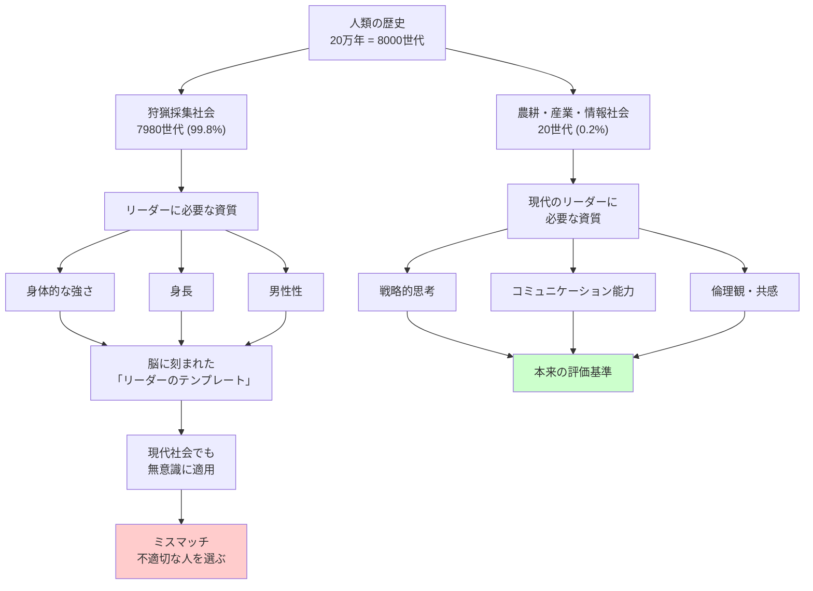

## 要約（Summary）

- 人間の脳は**石器時代の環境**（狩猟採集社会）に最適化されており、現代社会とはミスマッチを起こしている
- 食生活や恐怖反応と同様に、**リーダー選択**においても進化的ミスマッチが発生し、不適切な人を選んでしまう
- ヒト史の約99.8%（8000世代のうち7980世代）は狩猟採集社会であり、現代社会（0.2%）に脳は適応していない

## 本文（Body）

### 背景・問題意識

人間の脳は、過去20万年の進化の過程で形成された。しかし、そのほぼすべて（99.8%）が**狩猟採集社会**で過ごされた。農業革命（約1万年前）や産業革命（約250年前）、情報革命（約50年前）は、進化の時間スケールでは「つい最近」の出来事である。

このため、私たちの脳は**現代社会に適応していない**。食生活（高カロリー食への欲求）や恐怖反応（捕食者への過剰な警戒）と同様に、**リーダー選択**においても進化的ミスマッチが起きている。

### アイデア・主張

#### 石器時代の脳と現代社会のギャップ

人間の脳は、狩猟採集社会で生き延びるために進化した。当時のリーダーに求められた資質は：

- **身体的な強さ**：狩猟や戦闘での能力
- **身長**：威嚇や物理的優位性
- **男性性**：戦士としての資質

これらの特性は、狩猟採集社会では**実際にリーダーシップと相関していた**。強いリーダーは狩りで先頭に立ち、敵部族との戦いで集団を守った。

#### 現代社会では無意味なシグナル

しかし、現代のリーダーシップでは：

- 戦略的思考、コミュニケーション能力、倫理観、共感能力が重要
- 身体的な強さや身長は**ほとんど無関係**

それにもかかわらず、私たちは**無意識に**以下の特性を持つ人をリーダーとして選びがちである：

- 背が高い人（特に男性）
- 男性的な顔つきの人
- 自信に満ちた態度の人

これは、石器時代の脳が「リーダーらしさ」のテンプレートを保持しており、現代でもそれを適用してしまうからである。

#### 時代遅れの本能を捨てる時

ブライアン・クラースは、「私たちの社会的な世界は変化したが、脳は変わっていない」と指摘する。したがって、**時代遅れの本能は意識的に克服する必要がある**。

### 内容を視覚化するMermaid図

### 具体例・ケース

**食生活のミスマッチ**：
- 狩猟採集時代：高カロリー食（肉、脂肪、糖）は貴重で、積極的に摂取すべきだった
- 現代：高カロリー食は過剰摂取により肥満や生活習慣病を引き起こす
- しかし、脳は依然として高カロリー食を「おいしい」と感じるようプログラムされている

**リーダー選択のミスマッチ**：
- 狩猟採集時代：背が高く強い男性リーダーは、狩猟や戦闘で実際に有能だった
- 現代：企業経営や政治では、身体的特性はほぼ無関係
- しかし、私たちは依然として「背が高い」「自信に満ちている」人をリーダーとして選びがち

**アメリカ大統領選挙**：
- 背の高い候補者が一貫して有利（詳細は進化的リーダーシップ理論のzettelを参照）
- これは合理的な選択ではなく、石器時代の脳の名残

### 反論・限界・条件

- **すべての選択がミスマッチではない**：一部の身体的特性（健康、エネルギー）は現代でも重要かもしれない
- **文化的差異**：文化によって、身体的特性への依存度は異なる（協調を重視する文化では、この傾向は弱い）
- **教育で緩和可能**：進化的ミスマッチを意識することで、偏見を減らすことができる
- **制度設計で克服可能**：匿名評価、多面評価などの仕組みで、表面的特性への依存を減らせる

## 関連ノート（Links）

- [[20251226093245-evolutionary-leadership-theory|進化的リーダーシップ理論]] - 身体的特性がリーダー選択に影響する具体的メカニズム
- [[20251226093415-savanna-hypothesis-crisis-leadership|サバンナ仮説：危機時に男性的リーダーを求める本能]] - 危機時に進化的ミスマッチが増幅される
- [[20251226092824-honest-signaling-theory-cost|シグナリング理論における正直なシグナルとコスト]] - 石器時代には正直だったシグナルが現代では不正直に
- [[20251223233758-power-seeking-self-selection-bias|権力への自己選択バイアス：不適切な人がリーダーになる構造]] - ミスマッチが引き起こす問題の具体例
- [[20251226060019-heritability-interpretation|遺伝率は集団の分散説明であり個人の運命ではない]] - 進化と遺伝の誤解を解く

## To-Do / 次に考えること

- [ ] 自社のリーダー選抜プロセスで、身体的特性（身長、見た目、性別）が無意識に影響していないか評価
- [ ] 面接官や評価者に対して、進化的ミスマッチについての教育を実施
- [ ] 匿名評価や構造化面接など、表面的特性の影響を減らす仕組みを導入
