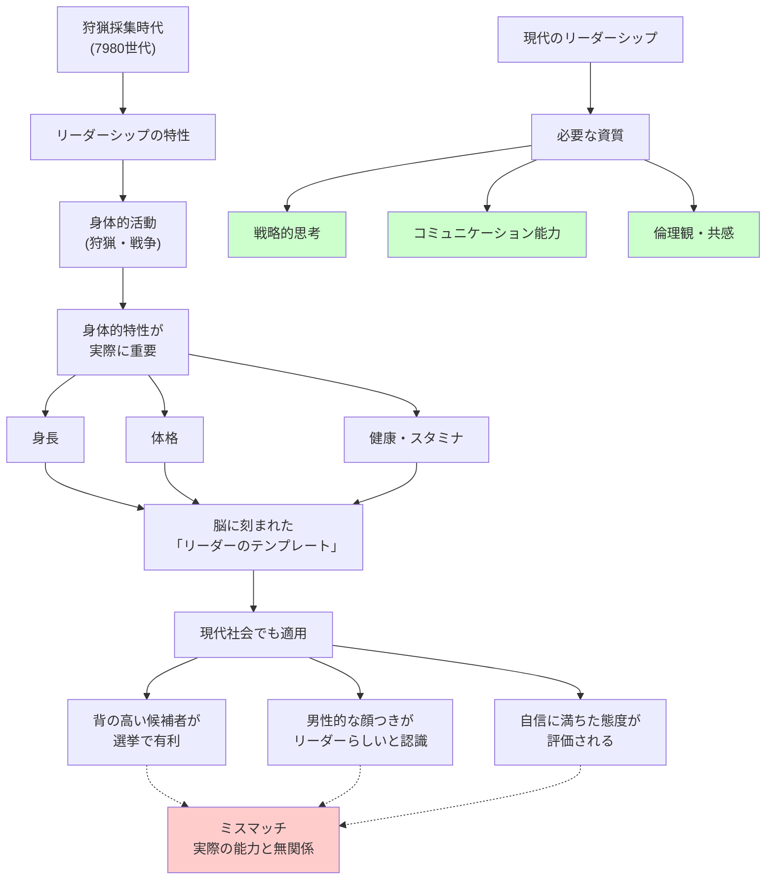

## 要約（Summary）

- 人間は身体的外見（身長、男性性、体格）を**リーダー選択の近道**として使う傾向がある
- これは進化的に形成された本能であり、狩猟採集時代にはリーダーの資質と身体的特性が相関していたため
- 現代でも、背の高い男性や男性的な顔つきの人が**リーダーとして選ばれやすい**が、これは実際の能力とは無関係

## 本文（Body）

### 背景・問題意識

プラトンは『国家』で、「無能ではあっても、他者よりも背が高くて力の強い船長が、愚か者たちの乗った船を率いている」様子を批判した。しかし、この問題は2400年以上経った現代でも解決されていない。

なぜ私たちは、**身体的外見**をリーダー選択の基準としてしまうのか？　これは進化的に形成された本能であり、「進化的リーダーシップ理論（Evolutionary Leadership Theory）」として理論化されている。

### アイデア・主張

#### 狩猟採集時代のリーダーシップ

過去20万年のうち約99.8%（7980世代）は狩猟採集社会だった。当時のリーダーシップは：

- **狩猟や戦争といった身体的活動で発揮された**
- リーダーは「模範を示し、先頭に立って指導した」
- したがって、**健康、スタミナ、堂々たる体躯**が実際にリーダーの資質と相関していた

このため、人間は「大きくて強いことが生存にとって主要な利点である社会」で長い時間を過ごした。

#### 現代社会への影響

現代では、リーダーシップは以下の要素が重要：

- 戦略的思考
- コミュニケーション能力
- 倫理観・共感
- 専門知識

身体的な強さや身長は**ほとんど関係ない**。しかし、私たちの脳は変わっていないため、以下の身体的特性を**無意識に**リーダーシップと結びつけてしまう：

1. **身長**：背の高い男性がリーダーとして選ばれやすい
2. **男性性**：男性的な顔つきの人が、特に危機時にリーダーとして選ばれやすい
3. **体格**：筋肉質で堂々とした人が、リーダーらしいと認識される

#### 具体的な研究結果

**身長と大統領選挙**：
- アメリカの大統領は、それぞれの時代の男性よりも一貫して背が高い
- 研究者が計算すると、**背の高い候補者が背の低い競争相手よりも多くの票を獲得**していることがわかった
- 背の高い大統領は、再選される率も高い

**身長の実験的検証**：
- デジタル処理で同一人物を「背が高く見える」「背が低く見える」ように操作した写真を参加者に見せた
- 結果：**背が高く見える男性のほうがリーダーらしいと認識された**
- 女性に関しては、身長がリーダーらしさの認識に与える影響は格段に小さかった

この発見は、「石器時代の脳仮説」にうまく当てはまる。身長は、**男性の狩人や戦士にとって**、より重要だっただろう。

### 内容を視覚化するMermaid図

### 具体例・ケース

**アメリカ大統領選挙**：
- 背の高い候補者が一貫して有利
- ジョージ・W・ブッシュ（182cm）、バラク・オバマ（185cm）、ドナルド・トランプ（190cm）など、多くの大統領が平均以上の身長

**企業のCEO**：
- フォーチュン500企業のCEOの平均身長は、一般男性よりも高い
- これは能力の差ではなく、選抜過程での偏見を反映している可能性が高い

**外科医の例**：
- もし外科医が手術前に腕立て伏せを20回やり、身体能力を誇示したら、私たちは異常だと感じる
- しかし、政治家が身体的な強さを誇示すると、多くの人がそれに惹かれる
- これは現代社会での不合理な反応である

### 反論・限界・条件

- **すべてのリーダー選択が身体的特性に依存するわけではない**：組織文化や選抜プロセスによって影響度は異なる
- **女性リーダーには異なる基準**：身長は女性のリーダーシップ評価にはあまり影響しない（これ自体がジェンダーバイアス）
- **教育と制度設計で緩和可能**：進化的バイアスを意識し、構造化面接や匿名評価を導入することで偏見を減らせる
- **文化的差異**：協調を重視する文化（例：北欧）では、身体的特性への依存度が低い可能性

## 関連ノート（Links）

- [[20251226093115-evolutionary-mismatch-leadership|進化的ミスマッチとリーダーシップ選択]] - 理論的背景
- [[20251226093415-savanna-hypothesis-crisis-leadership|サバンナ仮説：危機時に男性的リーダーを求める本能]] - 危機時に身体的特性への依存が増す現象
- [[20251226093545-gender-bias-leader-evaluation|ジェンダーバイアスとリーダー評価の歪み]] - 女性リーダーへの不当な評価
- [[20251223233758-power-seeking-self-selection-bias|権力への自己選択バイアス：不適切な人がリーダーになる構造]] - 表面的特性で選ばれる問題
- [[20251223234018-system-design-prevent-power-corruption|権力腐敗を防ぐシステム設計の3要素：選抜・責任・監視]] - 偏見を減らす制度設計

## To-Do / 次に考えること

- [ ] 自社のリーダー選抜プロセスで、身長や外見が無意識に影響していないか評価
- [ ] 面接官や評価者に対して、進化的リーダーシップ理論についての教育を実施
- [ ] 構造化面接や匿名評価など、身体的特性の影響を減らす仕組みを導入
- [ ] 「リーダーらしさ」の定義を見直し、実際の能力に基づく評価基準を設計
