## 要約（Summary）

- **サバンナ仮説**は、人間が危機や脅威に直面したときに、石器時代のリーダーシップのテンプレートを作動させるという理論
- 実験により、安全保障上の脅威や戦争のリスクがあるとき、人々は**より男性的な顔つきのリーダー**を選ぶ傾向が強まることが判明
- 権威主義的な有力者が恐怖を煽るのは、この本能を作動させて支持を得るためである

## 本文（Body）

### 背景・問題意識

人間は、平時と危機時でリーダー選択の基準を変える。これは合理的に見えるが、実際には**進化的ミスマッチ**に基づく不合理な判断である可能性が高い。

研究者マーク・ファン・フフトは、人間の脳に刻まれた「リーダーのテンプレート」が、**特定の状況（危機や対立）で作動する**ことを「サバンナ仮説」と呼んだ。

### アイデア・主張

#### サバンナ仮説の内容

ファン・フフトは以下のように説明する：

> 「進化は、私たちを導く者のテンプレートのセットを私たちの脳に焼きつけた。そして、（たとえば、戦時のように）協調が必要とされる具体的な問題に遭遇したときにはいつも、それらのテンプレートが作動する」

- **平時のリーダーシップ**：戦略的思考、協調性、共感が重視される
- **危機時のリーダーシップ**：身体的な強さ、男性性、権威主義的な態度が好まれる

#### 実験的証拠

研究者たちは、以下の実験を行った：

1. 参加者に同じ人物の顔写真を見せる
2. デジタル処理で「男性らしさ」の度合いを微妙に変化させる
3. 一部の参加者には「安全保障上の脅威や継続中の戦争に対抗するリーダーを選ぶ」という状況を設定

結果：

- 通常時でも、男性の顔のほうが女性の顔よりもリーダーとして選ばれやすい
- しかし、**危機時には男性らしさの効果が増大**する
- 脅威を感じたとき、人々はより男性的な顔つきのリーダーを無意識に好む

#### 権威主義者がこの本能を利用する理由

権威主義的な有力者が、恐怖を煽ったり対立を引き起こしたりして権力基盤を固めるのは、サバンナ仮説で説明できる：

- **恐怖の創出**：外国の脅威、テロリズム、移民などの恐怖を強調する
- **対立の扇動**：国内外の敵を作り出し、「私たちvs彼ら」という構図を作る
- **結果**：人々の脳に刻まれた「危機時には強いリーダーが必要」というテンプレートが作動し、権威主義的で男性的なリーダーへの支持が高まる

### 内容を視覚化するMermaid図

```mermaid
graph TD
    A["平時"] --> B["リーダー選択基準"]
    C["危機時<br/>(戦争・脅威)"] --> D["サバンナ仮説の作動"]

    B --> E["戦略的思考"]
    B --> F["協調性"]
    B --> G["共感能力"]

    D --> H["石器時代の<br/>リーダーテンプレート"]

    H --> I["身体的な強さ"]
    H --> J["男性的な顔つき"]
    H --> K["権威主義的態度"]

    I --> L["より男性的なリーダーを選ぶ"]
    J --> L
    K --> L

    M["権威主義者"] --> N["恐怖を煽る"]
    M --> O["対立を扇動"]

    N --> C
    O --> C

    L --> P["権威主義的リーダーへの<br/>支持が高まる"]

    style C fill:#ffcccc
    style L fill:#ffcccc
    style P fill:#ff9999
    style E fill:#ccffcc
    style F fill:#ccffcc
    style G fill:#ccffcc
```

### 具体例・ケース

**現代政治での事例**：
- 権威主義的な政治家が、テロリズムや移民の脅威を強調する
- 結果として、「強いリーダー」「毅然とした対応」といったレトリックへの支持が高まる
- 実際の政策能力よりも、「強そうに見える」ことが重視される

**歴史的事例**：
- 戦時中、各国で権威主義的で軍事的なリーダーが支持を集めた
- 平時に選ばれないようなタイプのリーダーが、危機時には歓迎される

**企業での例**：
- 企業が危機（業績悪化、競合との戦い）に直面すると、協調的なCEOよりも「強いリーダーシップ」を示すCEOが好まれる
- しかし、そのようなリーダーが実際に危機を解決するとは限らない

### 反論・限界・条件

- **すべての危機で男性的リーダーが好まれるわけではない**：危機の種類（自然災害vs戦争）によって、求められるリーダー像は異なる可能性
- **文化的差異**：協調を重視する文化では、危機時でも権威主義的リーダーが好まれない場合がある
- **教育で緩和可能**：サバンナ仮説を理解することで、不合理な選択を避けることができる
- **実際の能力との相関は不明**：男性的な顔つきのリーダーが、実際に危機対応能力が高いという証拠はない

## 関連ノート（Links）

- [[20251226093115-evolutionary-mismatch-leadership|進化的ミスマッチとリーダーシップ選択]] - サバンナ仮説の理論的背景
- [[20251226093245-evolutionary-leadership-theory|進化的リーダーシップ理論]] - 身体的特性がリーダー選択に影響するメカニズム
- [[20251226092824-honest-signaling-theory-cost|シグナリング理論における正直なシグナルとコスト]] - 危機時のシグナルとして男性性が機能する
- [[20251223233758-power-seeking-self-selection-bias|権力への自己選択バイアス：不適切な人がリーダーになる構造]] - 権威主義者が権力を求める理由
- [[20251226093545-gender-bias-leader-evaluation|ジェンダーバイアスとリーダー評価の歪み]] - 女性リーダーが危機時に不利になる理由

## To-Do / 次に考えること

- [ ] 自社が危機に直面したとき、どのようなリーダーシップが求められるかを事前に定義
- [ ] 危機対応計画において、「強そうに見える」リーダーではなく、実際の能力を持つリーダーを選ぶ基準を設計
- [ ] メディアや政治家が恐怖を煽る言説に対して、批判的に評価する習慣をつける
- [ ] 危機時でも、協調的で共感能力の高いリーダーシップが有効である事例を調査
