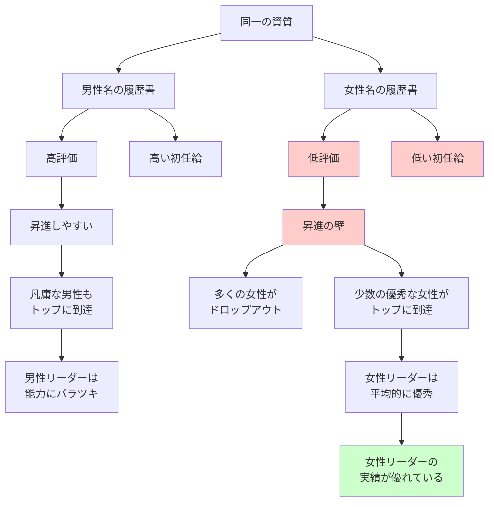

## 要約（Summary）

- 同一の資質を持つ候補者でも、**名前が女性か男性か**で評価が大きく変わる（実験で実証済み）
- 女性は平均して男性と同等以上のリーダーシップ能力を持つが、**昇進機会や評価は不当に低い**
- 女性リーダーのほうが独裁的になりにくく、民主的な方法での支配に熱心であることが研究で示されている

## 本文（Body）

### 背景・問題意識

進化的リーダーシップ理論やサバンナ仮説が示すように、人間は**男性をリーダーとして選びやすい**本能を持つ。しかし、これは現代社会では不合理であり、能力の高い女性リーダーの機会を奪っている。

実際、研究によれば、**女性のほうが優れたリーダーシップを発揮する**ケースが多い。にもかかわらず、女性は過小評価され、昇進の壁に直面している。

### アイデア・主張

#### 名前による評価の違い：実験的証拠

研究者たちは、大学の科学部門の教員を対象に、以下の実験を行った：

1. 架空の研究室管理者の求人に対する履歴書を作成
2. **同一の内容の履歴書に、男性名（デイヴィッド、ジェイムズ）または女性名（サラ、アン、ケルシー）をランダムに付ける**
3. 教員に評価を依頼

結果：

- **男性名の応募者は一貫して高く評価され、提案される初任給も多かった**
- 評価をしている教員が男性であろうと女性であろうと、違いはなかった（**女性教員も女性応募者に対する偏見を見せた**）

#### 女性リーダーの能力

多くの研究が、以下を示している：

1. **女性は男性よりも独裁的になりにくい**
2. **民主的な方法での支配に熱心**
3. **リーダーシップ指標のほぼすべてで、女性は男性と同等以上の成績**

#### 女性が優秀に見える理由の皮肉

興味深いことに、女性リーダーが優秀である理由の一つは、**昇進の壁が高いこと**である可能性がある：

- 女性は頂点に上り詰めるまでに**男性よりも多くの壁にぶつかる**
- したがって、出世した女性は「間違ってトップまで来てしまった凡庸な男性」よりも優秀である可能性が高い
- これはデータの偏りを生む：少数の優秀な女性と、平凡な人が少なくとも一部を占める男性との比較

#### 権力を振るうことに関して男性である利点はない

要するに、**権力を振るうことに関して、男性である利点がないことは明らか**である。それなのに、社会はそのような利点がたしかに存在しているかのように振る舞う。

### 内容を視覚化するMermaid図

### 具体例・ケース

**科学部門の採用実験**：
- 同一の履歴書で、名前だけを変えた実験
- 男性名（デイヴィッド、ジェイムズ）vs 女性名（サラ、アン、ケルシー）
- 結果：男性名が一貫して高評価

**企業のリーダーシップ研究**：
- 女性CEOは、民主的な意思決定を好む傾向
- 部下の意見を聞き、協調的なリーダーシップを発揮
- しかし、女性CEOの数は依然として少ない（フォーチュン500では数％）

**政治での例**：
- 女性政治家は、独裁的な傾向が男性よりも低い
- しかし、選挙では「強いリーダーシップ」を求める有権者から不利な評価を受けることがある

### 反論・限界・条件

- **すべての女性が優秀なリーダーではない**：個人差は大きい
- **ジェンダー本質主義を避けるべき**：「女性は協調的」という一般化は、新たなステレオタイプを生む危険がある
- **文化的差異**：ジェンダーバイアスの程度は、文化や組織によって異なる
- **制度設計で緩和可能**：匿名評価、多面評価、クォータ制などで偏見を減らせる

## 関連ノート（Links）

- [[20251226093115-evolutionary-mismatch-leadership|進化的ミスマッチとリーダーシップ選択]] - 女性が不利になる進化的背景
- [[20251226093245-evolutionary-leadership-theory|進化的リーダーシップ理論]] - 男性的特性が好まれる理由
- [[20251226093415-savanna-hypothesis-crisis-leadership|サバンナ仮説：危機時に男性的リーダーを求める本能]] - 危機時に女性リーダーがさらに不利になる
- [[20251223233758-power-seeking-self-selection-bias|権力への自己選択バイアス：不適切な人がリーダーになる構造]] - 女性が権力を求めにくい構造
- [[20251223234018-system-design-prevent-power-corruption|権力腐敗を防ぐシステム設計の3要素：選抜・責任・監視]] - ジェンダーバイアスを減らす制度設計

## To-Do / 次に考えること

- [ ] 自社の採用・昇進プロセスで、性別による評価の違いがないか定量的に分析
- [ ] 履歴書や評価資料から性別を示す情報を除外する（匿名化）仕組みを検討
- [ ] 女性リーダー候補の育成プログラムを設計し、昇進の壁を低くする
- [ ] 多面評価や360度フィードバックを導入し、偏見を減らす
