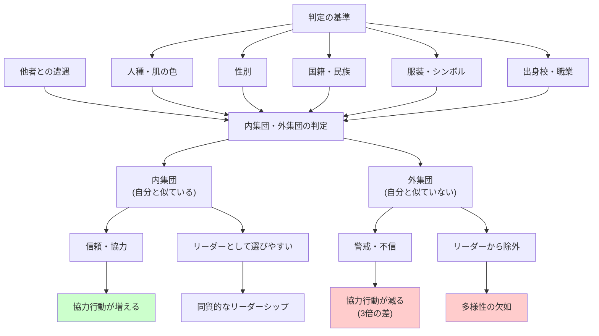

## 要約（Summary）

- 人間は**自分と似た人（内集団）を優遇し、似ていない人（外集団）を警戒する**本能を持つ
- これは狩猟採集時代に生き延びるために進化した生存メカニズムだが、現代では不合理な偏見を生む
- **極めてささいな違い**（サッカーチームのユニフォーム）でさえ、協力行動に3倍の差を生む

## 本文（Body）

### 背景・問題意識

社会学者は、人間が他者を「内集団（In-group）」と「外集団（Out-group）」に分類する傾向があることを長く指摘してきた。

- **内集団**：自分と似ていて、味方だと認識する人々
- **外集団**：自分と似ておらず、敵の可能性があると認識する人々

この分類は、狩猟採集時代には**生存に不可欠**だった。しかし、現代社会では**不合理で有害な偏見**を生み出している。

### アイデア・主張

#### 内集団・外集団バイアスの進化的起源

ヒトという社会的な種は、生き延びるために、以下の能力を進化させた：

1. **素早い分類**：誰かが自分と似ているか（味方）、似ていないか（敵）を瞬時に判断
2. **協力の選択的配分**：内集団の人には協力し、外集団の人は避ける・攻撃する

この能力は、狩猟採集時代には合理的だった。見知らぬ部族との遭遇は、しばしば暴力や資源をめぐる争いにつながったからだ。

#### 現代社会での不合理な影響

しかし、現代社会では、この本能が**不合理で有害な偏見**を生む：

- **人種差別**：肌の色や外見の違いで、外集団と判定される
- **ナショナリズム**：国籍や民族の違いで、敵対視される
- **組織内派閥**：同じ会社でも、部署や役職の違いで内集団・外集団が形成される

#### マンチェスター・ユナイテッドのユニフォーム実験

研究者たちは、以下の実験を行った：

1. マンチェスター・ユナイテッドのファンを集める
2. 実験参加者に、偽のケガ人（実験協力者）が助けを求める場面に遭遇させる
3. ケガ人が着ているシャツを操作する：
   - **マンチェスター・ユナイテッドのユニフォーム**
   - **ライバルのリヴァプールのユニフォーム**
   - **どちらのチームとも無関係のシャツ**

結果：

- マンチェスター・ユナイテッドのユニフォームを着ているとき：**92%が助けた**
- 無関係のシャツを着ているとき：35%が助けた
- ライバルのユニフォームを着ているとき：**わずか30%しか助けなかった**

**着ているものの違いで、助ける率に3倍の差**が出た。

#### 権力配分への影響

内集団・外集団バイアスは、リーダー選択にも影響する：

- **自分と似た人をリーダーとして選びやすい**（性別、人種、出身校、趣味など）
- 外集団の人は、能力が高くても「脅威」と見なされ、リーダーに選ばれにくい
- これが、組織や政治における**多様性の欠如**と**同質性の高いリーダーシップ**を生む

### 内容を視覚化するMermaid図

### 具体例・ケース

**マンチェスター・ユナイテッドの実験**：
- ユニフォームという**極めてささいな違い**で、助ける率が92%から30%に低下
- これは、内集団・外集団バイアスがいかに強力かを示す

**企業の採用・昇進**：
- 同じ大学出身者、同じ部署出身者が優遇されやすい
- 「カルチャーフィット」という名目で、実際には同質性を求めている

**政治での人種・民族対立**：
- 政治家が「私たち vs 彼ら」という構図を強調し、内集団の結束を高める
- 移民や少数民族が外集団として排斥される

**刑事司法での童顔効果**：
- 童顔の人は「無実」と見なされやすい（内集団的な親しみやすさ）
- ただし、人種によって効果が異なる（次のzettelで詳述）

### 反論・限界・条件

- **内集団・外集団バイアスは克服可能**：共通のアイデンティティ（例：国民、人類）を強調することで、バイアスを減らせる
- **教育と多様性の促進**：多様な人々との接触を増やすことで、外集団への警戒心を減らせる
- **制度設計で緩和可能**：匿名評価、多面評価、多様性のクォータ制などで偏見を減らせる
- **文化的差異**：集団主義的な文化では、内集団・外集団の境界がより明確になる可能性

## 関連ノート（Links）

- [[20251226093115-evolutionary-mismatch-leadership|進化的ミスマッチとリーダーシップ選択]] - 内集団・外集団バイアスの進化的背景
- [[20251226093545-gender-bias-leader-evaluation|ジェンダーバイアスとリーダー評価の歪み]] - 外集団（女性）への偏見
- [[20251226093830-babyface-effect-racial-difference|童顔効果の人種間差異]] - 内集団・外集団と童顔効果の相互作用
- [[20251223233758-power-seeking-self-selection-bias|権力への自己選択バイアス：不適切な人がリーダーになる構造]] - 内集団から選ばれやすい問題
- [[20251223234018-system-design-prevent-power-corruption|権力腐敗を防ぐシステム設計の3要素：選抜・責任・監視]] - 多様性を確保する制度設計

## To-Do / 次に考えること

- [ ] 自社の経営層や管理職の構成を分析し、同質性が高くないか確認（出身校、性別、人種など）
- [ ] 採用・昇進プロセスで「カルチャーフィット」という名目で同質性を求めていないか検討
- [ ] 多様性のある採用委員会や評価委員会を設置し、内集団バイアスを減らす
- [ ] 社内で共通のアイデンティティ（ミッション、価値観）を強調し、部署や役職による派閥形成を防ぐ
